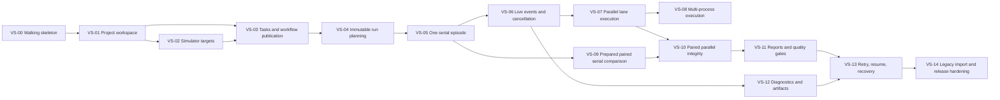

# MobileGym Test Platform Development Plan

## Document status

| Field | Value |
|---|---|
| Status | Ready for implementation sequencing |
| Requirements | [`PRD.md`](PRD.md) |
| Architecture | [`TECHNICAL_ARCHITECTURE.md`](TECHNICAL_ARCHITECTURE.md) |
| Detailed design | [`IMPLEMENTATION_DESIGN.md`](IMPLEMENTATION_DESIGN.md) |
| Delivery method | TDD |
| Decomposition | Vertical slices |

## 1. Delivery rules

### 1.1 Vertical slice definition

A vertical slice delivers one user-observable capability through every required
layer:

```text
UI or API entry
-> application service
-> domain behavior
-> persistence or execution adapter
-> observable result
```

A slice may depend on an earlier slice, but it must be independently verifiable
after those dependencies are present. It must not end with an unused database
table, an unreachable service, or a UI backed only by hard-coded data.

### 1.2 TDD workflow

Every slice follows:

1. **Red**: add focused tests and confirm the intended failure.
2. **Green**: implement the smallest end-to-end behavior.
3. **Refactor**: improve structure while focused tests stay green.
4. **Regression**: run affected existing benchmark and simulator tests.
5. **Demo**: perform the slice's observable acceptance scenario.

The pull request or change record for a slice must identify the test that was
used for the red step.

### 1.3 Definition of done

A slice is complete only when:

- focused unit and integration tests pass;
- user-visible behavior is reachable from the console or public API;
- API and event payloads match the documented schema;
- database migrations are reversible by recreating a fresh test database;
- errors are structured rather than exposed as raw server exceptions;
- artifacts are contained below the configured run root;
- relevant existing tests pass;
- documentation is updated when the implemented contract differs from design;
- no later slice is required merely to verify the current slice.

### 1.4 Slice size rule

A slice should contain one primary user capability. If its focused test list
cannot fit in one reviewable change or its demo contains multiple unrelated
workflows, split it by behavior rather than by technical layer.

## 2. Dependency map



VS-08 can proceed in parallel with VS-09 after VS-07 and VS-05 respectively.
VS-12 can proceed after the event pipeline is available.

## 3. Test suite conventions

### 3.1 Python test locations

```text
test_platform/tests/unit/test_<behavior>.py
test_platform/tests/integration/test_<slice>.py
test_platform/tests/contract/test_<external_contract>.py
bench_env/tests/common/test_<runner_extension>.py
```

### 3.2 Frontend test locations

```text
tests/testPlatform<SliceName>.test.ts
tests/testPlatform<SliceName>.test.tsx
```

### 3.3 Focused verification commands

```bash
pytest -c test_platform/pytest.ini test_platform/tests/<path>
pytest -c bench_env/tests/pytest.ini bench_env/tests/common/<file> -m "not live"
npx vitest run --config vitest.platform.config.ts <test-file>
npm test -- <existing-test-file>
```

Full regression commands are run at milestone boundaries, not necessarily after
every small red-green iteration.

## 4. Vertical slices

## VS-00: Walking skeleton

### User outcome

A user can open the Test Platform console, see an empty Runs workspace, and
confirm that the local service and SQLite database are ready.

### Vertical scope

- platform Python package and dependency files;
- settings and FastAPI application factory;
- migration runner and minimum `projects`/`runs` schema;
- `/health/live` and `/health/ready`;
- Vite `test-platform.html` entry;
- application shell and empty Runs route;
- API error envelope;
- development scripts.

### Red tests

Create:

```text
test_platform/tests/integration/test_health_api.py
test_platform/tests/integration/test_migrations.py
tests/testPlatformWalkingSkeleton.test.tsx
```

Required failing behaviors:

- readiness is false before database initialization and true afterward;
- migrations create `schema_migrations` and are idempotent;
- the console renders Runs navigation and the empty state from an API response;
- a failed readiness request renders an actionable error state.

### Green implementation

- implement `PlatformSettings`, `Database`, and migration runner;
- implement `create_app()` and health routes;
- create the minimum console entry, router, shell, and API client;
- add separate platform Vitest and TypeScript configs;
- add scripts:

```text
platform:api
platform:web
platform:test
platform:typecheck
```

### Independent verification

```bash
pytest -c test_platform/pytest.ini \
  test_platform/tests/integration/test_health_api.py \
  test_platform/tests/integration/test_migrations.py

npx vitest run --config vitest.platform.config.ts \
  tests/testPlatformWalkingSkeleton.test.tsx
```

### Acceptance demo

Start the API and Vite console, open `/test-platform/runs`, and observe:

- service-ready indicator;
- empty run list;
- no simulator or model dependency required.

### Dependencies

None.

## VS-01: Project workspace

### User outcome

A user can create a project, switch to it, reload the page, and see the same
selected project.

### Vertical scope

- project domain model and slug rules;
- project migration and repository;
- create/list/get/archive APIs;
- project switcher;
- empty project state;
- optimistic duplicate-name validation.

### Red tests

```text
test_platform/tests/unit/test_project_slug.py
test_platform/tests/integration/test_project_repository.py
test_platform/tests/integration/test_projects_api.py
tests/testPlatformProjects.test.tsx
```

Required failing behaviors:

- slug generation is deterministic and collision-safe;
- duplicate active project names are rejected;
- archived projects are hidden by default;
- the project switcher reloads the selected project's Runs route.

### Green implementation

- complete project repository and application service;
- implement routes and DTOs;
- add project switcher and create dialog;
- store only selected project ID in local browser storage.

### Independent verification

```bash
pytest -c test_platform/pytest.ini \
  test_platform/tests/unit/test_project_slug.py \
  test_platform/tests/integration/test_projects_api.py

npx vitest run --config vitest.platform.config.ts \
  tests/testPlatformProjects.test.tsx
```

### Acceptance demo

Create "Mobile App Regression", reload, switch away and back, and archive a
second project without affecting the active project.

### Dependencies

VS-00.

## VS-02: Register and verify simulator targets

### User outcome

A user can register a simulator endpoint, run a health check, and inspect the
resolved simulator build, App versions, data revision, and device profile.
A real-device configuration can be stored but clearly reports that execution is
disabled.

### Vertical scope

- `os/simMetadata.ts` and `__SIM__.getMetadata()`;
- installed App version fields in simulator state;
- target domain, repository, and revision persistence;
- simulator and reserved real-device adapters;
- target create/list/detail/health APIs;
- target list and detail UI;
- structured target errors.

### Red tests

```text
tests/simMetadata.test.ts
tests/simStateInstalledAppsMetadata.test.ts
test_platform/tests/unit/test_target_models.py
test_platform/tests/integration/test_targets_api.py
test_platform/tests/contract/test_simulator_adapter.py
tests/testPlatformTargets.test.tsx
```

Required failing behaviors:

- metadata builder includes every manifest's package and version;
- metadata is deterministic for the same build inputs;
- target secrets are absent from response DTOs;
- repeated identical health results reuse the same target revision;
- invalid metadata returns `TARGET_METADATA_INVALID`;
- real-device health returns `TARGET_KIND_NOT_EXECUTABLE`;
- UI shows App version and health warnings.

### Green implementation

- implement pure metadata builder and runtime API;
- add Vite build metadata values and safe fallbacks;
- implement target tables/repositories and adapter registry;
- implement a fake `MetadataProbe` for offline API tests;
- implement Playwright probe for contract/live use;
- build Targets routes and screens.

### Independent verification

```bash
npm test -- tests/simMetadata.test.ts

pytest -c test_platform/pytest.ini \
  test_platform/tests/integration/test_targets_api.py \
  -m "not live"

npx vitest run --config vitest.platform.config.ts \
  tests/testPlatformTargets.test.tsx
```

Optional live verification:

```bash
pytest -c test_platform/pytest.ini \
  test_platform/tests/contract/test_simulator_adapter.py \
  -m live --sim-url http://localhost:3000
```

### Acceptance demo

Register two simulator URLs and show:

- immutable revisions;
- App `version` and `versionCode`;
- whether the profiles and App revisions are equivalent;
- a stored real-device target marked non-executable.

### Dependencies

VS-01.

## VS-03: Browse tasks and publish a workflow

### User outcome

A user can browse existing `BaseTask` definitions, select tasks and a simulator
target, validate a workflow, preview episode counts, and publish an immutable
workflow version.

### Vertical scope

- task catalog snapshot and digest;
- task list/detail API;
- typed workflow nodes and pure validator;
- workflow draft/version repository;
- validation, compile-preview, and publication APIs;
- Tasks pages;
- structured workflow editor;
- immutable version display.

### Red tests

```text
test_platform/tests/unit/test_task_catalog.py
test_platform/tests/unit/test_workflow_validation.py
test_platform/tests/unit/test_compile_preview.py
test_platform/tests/integration/test_workflows_api.py
tests/testPlatformTaskCatalog.test.tsx
tests/testPlatformWorkflowEditor.test.tsx
```

Required failing behaviors:

- catalog filters match current registry taxonomy;
- registry digest is stable for stable metadata;
- cycles and missing dependencies return JSON-pointer errors;
- disabled or missing targets invalidate publication;
- compile preview shows task instance count, trial count, lanes, and total
  episodes;
- publishing freezes the version and later edits create a new draft.

### Green implementation

- implement task catalog adapter over `TaskRegistry`;
- implement Pydantic workflow node union;
- implement validator and structural compiler;
- implement workflow repositories and routes;
- build filterable task table, task detail, and workflow editor.

### Independent verification

```bash
pytest -c test_platform/pytest.ini \
  test_platform/tests/unit/test_workflow_validation.py \
  test_platform/tests/integration/test_workflows_api.py

npx vitest run --config vitest.platform.config.ts \
  tests/testPlatformTaskCatalog.test.tsx \
  tests/testPlatformWorkflowEditor.test.tsx
```

### Acceptance demo

Select two WeChat tasks, target one simulator, set repeat count to two, validate
the preview, publish version 1, edit the workflow, and show version 1 remains
unchanged.

### Dependencies

VS-01 and VS-02.

## VS-04: Create an immutable planned run

### User outcome

A user can launch a published workflow and immediately see a queued run with
frozen targets, task source, lanes, episode identities, and effective settings.

### Vertical scope

- canonical JSON and hash utilities;
- run-plan models and compiler;
- run, attempt, lane, and episode schema;
- atomic run-creation transaction;
- fake supervisor queue;
- create/list/detail run APIs;
- Runs table and run overview;
- run-plan artifact.

### Red tests

```text
test_platform/tests/unit/test_canonical_json.py
test_platform/tests/unit/test_run_plan_compiler.py
test_platform/tests/integration/test_run_creation_transaction.py
test_platform/tests/integration/test_runs_api.py
tests/testPlatformRunPlanning.test.tsx
```

Required failing behaviors:

- identical inputs produce identical plan fingerprints;
- lane or seed changes alter the fingerprint;
- run creation inserts the complete graph atomically;
- no secret value appears in plan JSON;
- duplicate idempotency keys return the original run;
- run detail shows target revisions and planned episode counts.

### Green implementation

- implement canonical hashing and run-plan models;
- compile task instances and repeat trials without calling `task.setup()`;
- add run-related tables and repositories;
- persist `platform/run-plan.json`;
- implement a fake supervisor that leaves the run queued;
- add run list and overview UI.

### Independent verification

```bash
pytest -c test_platform/pytest.ini \
  test_platform/tests/unit/test_run_plan_compiler.py \
  test_platform/tests/integration/test_run_creation_transaction.py

npx vitest run --config vitest.platform.config.ts \
  tests/testPlatformRunPlanning.test.tsx
```

### Acceptance demo

Launch the same workflow twice with the same explicit seed and show matching
episode identities and fingerprints, while each logical run retains a distinct
run ID.

### Dependencies

VS-03.

## VS-05: Execute one serial episode end to end

### User outcome

A user can launch a one-target, one-task serial run and receive a terminal
functional result with compatible benchmark artifacts.

### Vertical scope

- minimal `EventSink` and `CancellationToken` in `bench_env`;
- minimal single-lane task materialization and `prepared_tasks` persistence;
- initial-state artifact and prepared parameter fingerprint;
- prepared work-item injection for `SerialRunner`;
- lane executor and result ingestor;
- fixed lane-attempt artifact root;
- supervisor state transitions;
- functional summary;
- run detail episode row and Run Explorer link.

### Red tests

```text
bench_env/tests/common/test_runner_events.py
bench_env/tests/common/test_serial_prepared_work.py
test_platform/tests/integration/test_single_lane_materialization.py
test_platform/tests/unit/test_result_ingestor.py
test_platform/tests/integration/test_serial_run_execution.py
tests/testPlatformSerialRun.test.tsx
```

Required failing behaviors:

- null event sink preserves existing runner results;
- supplied work items execute once with the supplied trial and max steps;
- one sampled task instance materializes once before execution;
- materialized params and instruction are persisted with a fingerprint;
- explicit params are not resampled;
- run, lane, and episode states reach terminal values;
- lane root contains current required recorder files;
- UI distinguishes PASS, FAIL, and ERROR.

### Green implementation

- add low-level runner event and cancellation modules;
- implement the minimum materializer for one source lane;
- add optional work items to serial runner;
- implement `LaneExecutor` serial path with fake Agent/Env integration test;
- implement result ingestion and basic functional report;
- expose episodes and artifacts through API;
- render episode status and artifact link.

### Regression verification

```bash
pytest -c bench_env/tests/pytest.ini \
  bench_env/tests/common/test_config.py \
  bench_env/tests/common/test_recorder.py \
  bench_env/tests/common/test_serial_prepared_work.py \
  -m "not live"
```

### Independent verification

```bash
pytest -c test_platform/pytest.ini \
  test_platform/tests/integration/test_single_lane_materialization.py \
  test_platform/tests/integration/test_serial_run_execution.py

npx vitest run --config vitest.platform.config.ts \
  tests/testPlatformSerialRun.test.tsx
```

### Acceptance demo

Run one deterministic fake or lightweight simulator task, open its episode
result, and open the lane attempt in Run Explorer.

### Dependencies

VS-04.

## VS-06: Live progress and cooperative cancellation

### User outcome

A user can watch ordered run progress without refreshing and cancel a queued or
running serial run.

### Vertical scope

- durable event table and sequence allocation;
- buffered event writer;
- SSE broker and replay route;
- runner event insertion points around setup, step, action, and evaluation;
- cancellation API and token checks;
- frontend event reducer, reconnect logic, and cancel action;
- cancellation cleanup assertions.

### Red tests

```text
test_platform/tests/unit/test_event_sequence.py
test_platform/tests/integration/test_event_writer.py
test_platform/tests/integration/test_sse_replay.py
bench_env/tests/common/test_controller_cancellation.py
test_platform/tests/integration/test_cancel_run.py
tests/testPlatformRunEvents.test.ts
tests/testPlatformRunCancellation.test.tsx
```

Required failing behaviors:

- committed event sequences are gap-free per run;
- SSE reconnect replays only events after the requested sequence;
- an event arriving during backlog query is not lost;
- cancellation before inference prevents Agent execution;
- cancellation after a step runs teardown and closes the environment;
- repeated cancel requests are idempotent;
- UI reconnect does not duplicate counters.

### Green implementation

- implement event queue, writer, database repository, and JSONL mirror;
- add runner/controller event emissions and cancellation checks;
- implement SSE route and broker;
- implement cancel route and supervisor token map;
- build frontend event reducer and reconnecting stream client.

### Independent verification

```bash
pytest -c test_platform/pytest.ini \
  test_platform/tests/integration/test_sse_replay.py \
  test_platform/tests/integration/test_cancel_run.py

pytest -c bench_env/tests/pytest.ini \
  bench_env/tests/common/test_controller_cancellation.py \
  -m "not live"

npx vitest run --config vitest.platform.config.ts \
  tests/testPlatformRunEvents.test.ts \
  tests/testPlatformRunCancellation.test.tsx
```

### Acceptance demo

Start a deliberately slow fake run, watch setup and step events arrive, cancel
it, and verify the UI reaches cancelled without a page reload.

### Dependencies

VS-05.

## VS-07: Parallel lane execution

### User outcome

A user can run multiple episodes concurrently on one simulator target and see
per-worker progress without losing result ordering or artifact isolation.

### Vertical scope

- `RunnerConfig` viewport and DPR fields;
- full target profile propagation to `EnvPool`;
- prepared work-item path in `ParallelRunner`;
- worker lifecycle events;
- lane concurrency settings in workflow/UI;
- worker health display;
- parallel cancellation cleanup.

### Red tests

```text
bench_env/tests/common/test_runner_device_profile.py
bench_env/tests/common/test_parallel_prepared_work.py
bench_env/tests/common/test_parallel_events.py
test_platform/tests/integration/test_parallel_lane.py
tests/testPlatformParallelRun.test.tsx
```

Required failing behaviors:

- old metadata loads default viewport and DPR;
- `EnvPool` receives the exact target profile;
- prepared work results retain plan order despite completion order;
- each worker emits start and stop events;
- cancellation releases all fake environments;
- UI displays active worker count and lane progress.

### Green implementation

- extend `RunnerConfig`, factory, and pool wiring;
- add prepared queue path and event sink to `ParallelRunner`;
- integrate parallel selection in lane executor;
- expose worker snapshots;
- add workflow concurrency controls and run worker display.

### Regression verification

```bash
pytest -c bench_env/tests/pytest.ini \
  bench_env/tests/common/test_config.py \
  bench_env/tests/common/test_parallel_prepared_work.py \
  -m "not live"
```

### Independent verification

```bash
pytest -c test_platform/pytest.ini \
  test_platform/tests/integration/test_parallel_lane.py

npx vitest run --config vitest.platform.config.ts \
  tests/testPlatformParallelRun.test.tsx
```

### Acceptance demo

Execute at least four fake episodes with parallelism two and show stable planned
order, two active workers, isolated artifacts, and correct final counts.

### Dependencies

VS-06.

## VS-08: Multi-process execution

### User outcome

A user can select multi-process execution, observe shard health, cancel the run,
and receive explicit errors for any shard that exits without results.

### Vertical scope

- serializable prepared work specs;
- generalized child event envelope;
- external event sink support in `MultiProcessRunner`;
- multiprocessing cancellation event;
- shard and worker states;
- missing-result reconciliation;
- UI shard diagnostics.

### Red tests

```text
bench_env/tests/common/test_multiprocess_events.py
bench_env/tests/common/test_multiprocess_prepared_work.py
bench_env/tests/common/test_multiprocess_cancellation.py
test_platform/tests/integration/test_multiprocess_lane.py
tests/testPlatformMultiprocessRun.test.tsx
```

Required failing behaviors:

- child events preserve episode key, rank, and worker identity;
- a child reconstructs explicit task parameters;
- parent event draining remains bounded;
- cancel terminates children after the grace period;
- missing child results become `WORKER_CRASH`;
- UI shows shard exit errors.

### Green implementation

- replace result-only `ProgressEvent` with generic envelopes;
- shard work specs and reconstruct tasks in children;
- bridge parent events to platform sink;
- add process cancellation and cleanup;
- add shard diagnostics to the run detail.

### Regression verification

Run current multi-process-focused tests plus a short manual smoke command when
the benchmark environment is available.

### Independent verification

```bash
pytest -c bench_env/tests/pytest.ini \
  bench_env/tests/common/test_multiprocess_events.py \
  bench_env/tests/common/test_multiprocess_cancellation.py \
  -m "not live"

pytest -c test_platform/pytest.ini \
  test_platform/tests/integration/test_multiprocess_lane.py
```

### Acceptance demo

Run two child shards, force one fake shard to exit early, and show that the other
shard completes while missing episodes receive structured worker errors.

### Dependencies

VS-07.

## VS-09: Prepared baseline/candidate serial comparison

### User outcome

A user can compare two simulator targets with one task instance whose sampled
parameters and instruction are frozen once and reused by both lanes.

### Vertical scope

- reuse of the single-lane `PreparedTaskInstance` across two lanes;
- comparison-grade state projection and hashes;
- prepared task re-instantiation;
- two serial lane attempts;
- pair-key join;
- basic comparison classifications;
- side-by-side result view.

### Red tests

```text
test_platform/tests/unit/test_state_projection.py
test_platform/tests/unit/test_prepared_task_factory.py
test_platform/tests/integration/test_materializer.py
test_platform/tests/unit/test_pair_classification.py
test_platform/tests/integration/test_paired_serial_run.py
tests/testPlatformPairedResult.test.tsx
```

Required failing behaviors:

- one task instance with multiple trials materializes only once;
- explicit sampled params survive setup in both lanes;
- `_post_sample()` still runs;
- instruction mismatch becomes `PAIRING_VIOLATION`;
- PASS/FAIL becomes regression and FAIL/PASS becomes fixed;
- unpaired episodes are not included in aggregate deltas;
- UI shows prepared params and both target revisions.

### Green implementation

- implement preparation environment lifecycle;
- extend the existing prepared payload with comparison projection version 1;
- create two lane attempts and execute serially or concurrently under lane
  semaphore;
- implement comparison repository and basic report;
- build comparison route and episode columns.

### Independent verification

```bash
pytest -c test_platform/pytest.ini \
  test_platform/tests/integration/test_materializer.py \
  test_platform/tests/integration/test_paired_serial_run.py

npx vitest run --config vitest.platform.config.ts \
  tests/testPlatformPairedResult.test.tsx
```

### Acceptance demo

Use two fake simulator targets where candidate intentionally fails. Show equal
prepared parameters, equal pair key, and a regression classification.

### Dependencies

VS-05 and VS-02.

## VS-10: Paired parallel comparison integrity

### User outcome

A user can run baseline and candidate lanes concurrently with multiple prepared
episodes and receive explicit validation for same-App or same-device comparison
policies.

### Vertical scope

- target-revision constraint engine;
- concurrent lane scheduling;
- strict snapshot and task projection policies;
- pairing integrity report;
- paired parallel worker progress;
- App-version and device-profile comparison presets in workflow UI.

### Red tests

```text
test_platform/tests/unit/test_comparison_constraints.py
test_platform/tests/unit/test_pair_integrity.py
test_platform/tests/integration/test_paired_parallel_run.py
tests/testPlatformComparisonPolicy.test.tsx
```

Required failing behaviors:

- same-App policy rejects mismatched App revisions;
- same-device policy rejects mismatched profile hashes;
- same-data policy rejects missing or unequal revisions;
- strict snapshot detects initial-state mismatch;
- task projection tolerates unrelated version-added fields;
- concurrent lane results still pair by key, not arrival order;
- UI explains why a comparison is invalid before launch.

### Green implementation

- implement target revision comparison utilities;
- implement policy validation in workflow and run compilation;
- execute lanes concurrently after materialization;
- persist integrity details for every pair;
- add comparison presets and validation messages.

### Independent verification

```bash
pytest -c test_platform/pytest.ini \
  test_platform/tests/unit/test_comparison_constraints.py \
  test_platform/tests/integration/test_paired_parallel_run.py

npx vitest run --config vitest.platform.config.ts \
  tests/testPlatformComparisonPolicy.test.tsx
```

### Acceptance demo

Demonstrate both supported scenarios:

1. different profiles with identical App revision;
2. equivalent profiles with different App revisions.

Also show an intentionally invalid pairing blocked before execution.

### Dependencies

VS-07 and VS-09.

## VS-11: Functional, performance, comparison reports, and gates

### User outcome

A user can inspect deterministic reports, evaluate release gates, export JSON,
and promote a successful run as a named baseline.

### Vertical scope

- report attempt selection;
- functional and reliability metrics;
- stopwatch percentile report;
- monitor CSV ingestion;
- full comparison deltas;
- gate evaluation;
- report persistence and JSON/printable HTML export;
- Reports pages and run report tabs;
- named baseline.

### Red tests

```text
test_platform/tests/unit/test_report_selection.py
test_platform/tests/unit/test_functional_report.py
test_platform/tests/unit/test_performance_report.py
test_platform/tests/unit/test_comparison_report.py
test_platform/tests/unit/test_quality_gates.py
test_platform/tests/integration/test_reports_api.py
tests/testPlatformReports.test.tsx
```

Required failing behaviors:

- report input records selected attempt IDs;
- error episodes use the correct denominator;
- percentile algorithm matches golden values;
- zero baseline suppresses invalid percentage deltas;
- missing gate metrics produce gate error;
- report JSON is stable for identical input;
- printable HTML contains provenance and gate verdict;
- UI can filter regressions and export the report.

### Green implementation

- implement pure report modules and golden fixtures;
- ingest stopwatch and monitor values;
- implement report/gate tables and APIs;
- generate JSON and self-contained printable HTML;
- add report tabs, filters, and baseline action.

### Independent verification

```bash
pytest -c test_platform/pytest.ini \
  test_platform/tests/unit/test_functional_report.py \
  test_platform/tests/unit/test_performance_report.py \
  test_platform/tests/unit/test_comparison_report.py \
  test_platform/tests/unit/test_quality_gates.py \
  test_platform/tests/integration/test_reports_api.py

npx vitest run --config vitest.platform.config.ts \
  tests/testPlatformReports.test.tsx
```

### Acceptance demo

Open a paired run, inspect regression counts and p95 delta, fail a configured
gate, export JSON and printable HTML, then promote a passing run as a baseline.

### Dependencies

VS-10.

## VS-12: Structured diagnostics and artifact browsing

### User outcome

A user can filter normalized errors, inspect browser/page/network diagnostics,
and open the exact logs, screenshots, prompts, responses, and trajectories
associated with an episode.

### Vertical scope

- structured browser diagnostic callback;
- error classifier;
- recorder artifact events;
- artifact path resolver and indexer;
- error and artifact APIs;
- Errors and Artifacts tabs;
- secure media/log serving.

### Red tests

```text
bench_env/tests/common/test_browser_diagnostics.py
bench_env/tests/common/test_recorder_artifact_events.py
test_platform/tests/unit/test_error_classifier.py
test_platform/tests/unit/test_artifact_paths.py
test_platform/tests/integration/test_artifact_api.py
tests/testPlatformDiagnostics.test.tsx
```

Required failing behaviors:

- page errors, failed requests, and HTTP errors include current task context;
- artifact events occur only after files exist;
- path traversal and escaping symlinks are rejected;
- error filters distinguish assertion, model, environment, and judge failures;
- UI links an error to its episode and artifacts;
- large logs are fetched lazily.

### Green implementation

- add optional browser diagnostic sink to `MobileGymEnv`;
- emit recorder artifact events;
- implement error classification and persistence;
- implement artifact index and secure serving;
- build error filters and artifact browser.

### Independent verification

```bash
pytest -c bench_env/tests/pytest.ini \
  bench_env/tests/common/test_browser_diagnostics.py \
  bench_env/tests/common/test_recorder_artifact_events.py \
  -m "not live"

pytest -c test_platform/pytest.ini \
  test_platform/tests/unit/test_artifact_paths.py \
  test_platform/tests/integration/test_artifact_api.py

npx vitest run --config vitest.platform.config.ts \
  tests/testPlatformDiagnostics.test.tsx
```

### Acceptance demo

Run a task that emits a controlled page error and failed request, then filter by
error code and open the corresponding browser log and screenshot.

### Dependencies

VS-06. It may proceed in parallel with VS-09 through VS-11.

## VS-13: Retry, resume, and startup recovery

### User outcome

A user can retry selected failures, resume an interrupted run without
resampling, restart the service, and retain accurate run history.

### Vertical scope

- run/lane/episode attempt selection;
- retry and resume APIs;
- new artifact attempt roots;
- startup reconciliation;
- `SERVICE_RESTARTED` handling;
- compatibility checks;
- run-attempt history UI;
- resume eligibility reasons.

### Red tests

```text
test_platform/tests/unit/test_retry_selection.py
test_platform/tests/unit/test_resume_compatibility.py
test_platform/tests/integration/test_retry_run.py
test_platform/tests/integration/test_startup_recovery.py
tests/testPlatformRetryResume.test.tsx
```

Required failing behaviors:

- retry creates new attempts without changing original results;
- prepared fingerprints and target revisions are reused;
- incompatible target or task revisions block resume;
- active attempts become `SERVICE_RESTARTED` after startup reconciliation;
- missing episodes are selected while completed episodes are skipped;
- reports explicitly identify selected attempt IDs;
- UI shows attempt history and incompatibility reasons.

### Green implementation

- implement attempt selection and artifact attempt directories;
- implement retry/resume services and routes;
- implement startup recovery transaction;
- rebuild reports from selected attempts;
- add attempt history and actions.

### Independent verification

```bash
pytest -c test_platform/pytest.ini \
  test_platform/tests/integration/test_retry_run.py \
  test_platform/tests/integration/test_startup_recovery.py

npx vitest run --config vitest.platform.config.ts \
  tests/testPlatformRetryResume.test.tsx
```

### Acceptance demo

Interrupt a fake run, restart the API, show the failed attempt, resume only the
missing episode, and compare both attempt artifact roots.

### Dependencies

VS-11 and VS-12.

## VS-14: Legacy import, Run Explorer discovery, and release hardening

### User outcome

A user can discover existing CLI runs, import them without rewriting artifacts,
open nested platform lane attempts in Run Explorer, and operate the simulator-
first MVP with documented compatibility guarantees.

### Vertical scope

- recursive Run Explorer run-root discovery;
- legacy run importer;
- imported provenance warnings;
- retention-safe artifact indexing;
- complete API and console smoke test;
- security checks;
- full compatibility regression;
- documentation and operator commands.

### Red tests

```text
tests/runExplorerRecursiveRuns.test.ts
test_platform/tests/unit/test_legacy_import.py
test_platform/tests/integration/test_imported_run_api.py
test_platform/tests/integration/test_security_boundaries.py
test_platform/tests/e2e/test_mvp_smoke.py
tests/testPlatformImportedRuns.test.tsx
```

Required failing behaviors:

- Run Explorer discovers legacy roots and nested lane-attempt roots;
- importer does not modify source files;
- missing provenance is explicit;
- imported runs cannot become strict baselines without required metadata;
- non-loopback binding requires explicit opt-in;
- mutation origin checks reject invalid origins;
- exported reports contain no configured secret values.

### Green implementation

- refactor `runsExplorerPlugin` discovery into testable helpers;
- implement legacy importer and imported-run UI;
- complete security middleware;
- add operator documentation and smoke scripts;
- run full test and type-check suites.

### Independent verification

```bash
npm test -- tests/runExplorerRecursiveRuns.test.ts

pytest -c test_platform/pytest.ini \
  test_platform/tests/unit/test_legacy_import.py \
  test_platform/tests/integration/test_security_boundaries.py

npx vitest run --config vitest.platform.config.ts \
  tests/testPlatformImportedRuns.test.tsx
```

### Milestone regression

```bash
pytest -c test_platform/pytest.ini test_platform/tests
pytest -c bench_env/tests/pytest.ini bench_env/tests/common -m "not live"
npm test
npx vitest run --config vitest.platform.config.ts
npx tsc --noEmit -p tsconfig.test-platform.json
```

### Acceptance demo

Import an existing CLI run, open it in the platform and Run Explorer, then run
the complete one-lane and paired simulator workflows from the MVP acceptance
checklist.

### Dependencies

VS-13.

## 5. Milestones

### Milestone A: Operable control plane

Slices:

```text
VS-00 through VS-04
```

Exit criteria:

- console and API boot from a clean checkout;
- targets and workflows persist;
- target revisions contain App versions;
- published workflows compile into immutable run plans.

### Milestone B: One-target execution

Slices:

```text
VS-05 through VS-08
```

Exit criteria:

- serial, parallel, and multi-process execution work through the platform;
- live events and cancellation are durable;
- artifacts remain CLI/Run Explorer compatible.

### Milestone C: Paired comparison

Slices:

```text
VS-09 through VS-11
```

Exit criteria:

- prepared params are shared across lanes;
- both required comparison scenarios validate;
- reports and gates are deterministic.

### Milestone D: Operational MVP

Slices:

```text
VS-12 through VS-14
```

Exit criteria:

- errors and artifacts are diagnosable;
- retry, resume, and restart recovery work;
- legacy runs remain accessible;
- full acceptance and regression suites pass.

## 6. Cross-slice review checklist

For every slice, review:

- Does the user have a reachable capability at the end?
- Was the first behavioral test observed failing?
- Are state transitions compare-and-set?
- Are secrets absent from persisted/exported payloads?
- Are timestamps UTC and deterministic in tests?
- Can event failure affect runner success?
- Are file paths resolved below the run root?
- Does cancellation execute cleanup in `finally`?
- Are PASS, FAIL, ERROR, and CANCELLED distinct?
- Does comparison use pair keys rather than ordering?
- Are existing CLI paths unchanged when new arguments are omitted?
- Is the focused verification command documented and passing?

## 7. First implementation task

Implementation starts with **VS-00: Walking skeleton**.

The first red tests should be:

```text
test_platform/tests/integration/test_migrations.py
test_platform/tests/integration/test_health_api.py
tests/testPlatformWalkingSkeleton.test.tsx
```

No target, workflow, runner, or report implementation should be added before the
walking skeleton can create a temporary database, report readiness, and render
the API-backed empty Runs screen.
