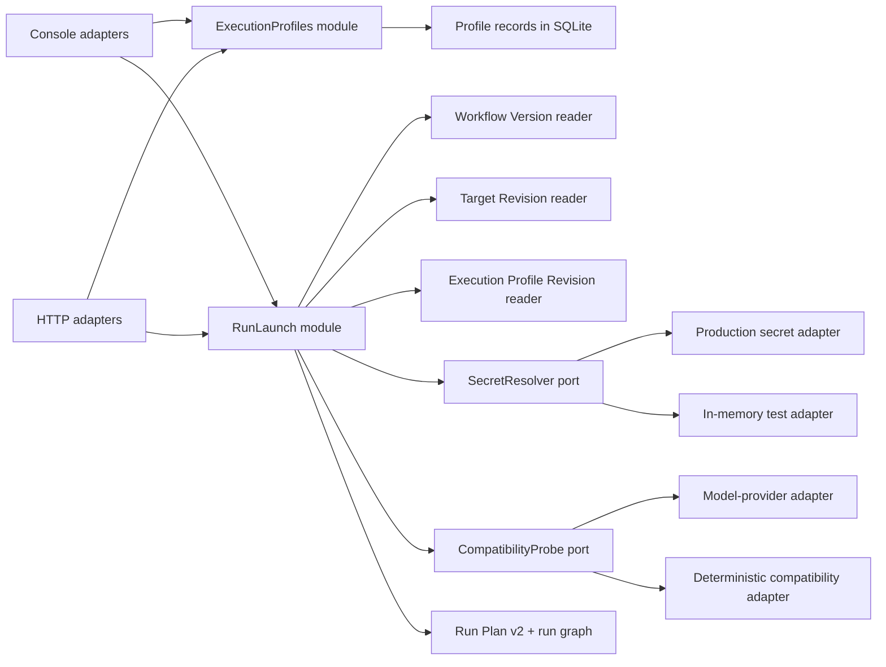

# Versioned Execution Profiles Architecture Review

## Document status

| Field | Value |
|---|---|
| Status | Accepted architecture for delivery planning on 2026-07-13 |
| Product requirements | [`EXECUTION_PROFILES_PRD.md`](EXECUTION_PROFILES_PRD.md) |
| Parent architecture | [`TECHNICAL_ARCHITECTURE.md`](TECHNICAL_ARCHITECTURE.md) |
| Approved delivery plan | [`EXECUTION_PROFILES_DELIVERY_PLAN.md`](EXECUTION_PROFILES_DELIVERY_PLAN.md) |
| Domain language | [`CONTEXT.md`](CONTEXT.md) |
| Deployment model | Existing single-host modular monolith |
| Implementation status | TP-EP00 through TP-EP04 implemented; TP-EP05 not started |

## 1. Purpose

This review places the Execution Profile seam, defines the interfaces of the
modules at that seam, and records the invariants required for exact Lane
Bindings, causal comparisons, secrets, Compatibility Preflight, Run Plan
fingerprints, follow-up attempts, and legacy compatibility.

It is intentionally narrower than an implementation design. Exact SQL, HTTP
payloads, file placement, migration numbers, and vertical task decomposition
belong to the future delivery plan and implementation design.

## 2. Current implementation pressure

The current platform has several correct foundations:

- [`RunPlanCompiler`](../../test_platform/domain/run_plans.py) freezes Workflow
  Version, Target Revision, task source, episodes, comparison policy, and a flat
  effective runner configuration.
- [`RunService.create_run()`](../../test_platform/services/runs.py) performs
  compatibility preflight after plan compilation and before durable Run side
  effects.
- Retry and Resume reject non-secret execution changes and use canonical preview
  tokens with transaction-time stale-state validation.
- Report and Strict Baseline provenance already records Workflow Version, Run
  Plan hash, task-source digest, selected Lane, and Target Revision.

The pressure comes from configuration ownership:

- Agent and model values are launch overrides merged into a Workflow Version's
  execute-node config.
- target connection, workflow execution policy, lane overrides, Agent/model
  behavior, and redacted secret flags are flattened into `runner_config`.
- `RunPlan.agent` and `RunPlan.judge` are global even though future subject
  configuration varies by Lane.
- the console's
  [`WorkflowsPage`](../../web/test-platform/features/workflows/WorkflowsPage.tsx)
  mixes workflow authoring with loose model launch fields.

Adding profile tables without changing this seam would spread profile
resolution, redaction, comparison, fingerprint, and compatibility behavior
across routes, repositories, the compiler, execution, reports, baselines, and
the console. The architecture instead concentrates that complexity in two deep
modules.

## 3. Accepted architecture decisions

| ID | Decision | Rationale |
|---|---|---|
| EP-AD-001 | Use separate `ExecutionProfiles` and `RunLaunch` modules. | Profile catalog lifecycle and launch transaction lifecycle change for different reasons; separating them preserves locality without exposing internal helpers. |
| EP-AD-002 | Make the `RunLaunch` interface consume exact revision IDs and a preview token. | Callers remain simple while revision resolution, validation, compilation, preflight, fingerprinting, and persistence stay behind one seam. |
| EP-AD-003 | Keep Judge and evaluation protocol in Workflow Version. | The measured Agent/model can vary without silently varying the scoring mechanism. |
| EP-AD-004 | Move exact Target/Profile bindings out of Workflow v2 authoring and into launch. | One Workflow Version can be reused across subjects and targets while its Lane Slots and protocol remain immutable. |
| EP-AD-005 | Permit one causal comparison axis in the first release. | Same-profile Target Comparison and same-target Execution Comparison are interpretable; changing both is confounded. |
| EP-AD-006 | Store a self-contained public execution snapshot in Run Plan v2. | Execution and artifact inspection must not depend on a mutable profile head or even on profile-table availability. |
| EP-AD-007 | Treat secret resolution and remote compatibility as internal ports. | Both have real production and test adapters and must not enlarge the external module interfaces. |
| EP-AD-008 | Record Compatibility Preflight on every Run Attempt. | It is time-bound execution evidence, not an immutable profile property or plan identity. |
| EP-AD-009 | Preserve legacy execution identity without synthesizing revisions. | Historical provenance must remain honest; missing identity cannot be reconstructed from current state. |
| EP-AD-010 | Add versioned readers rather than rewrite historical JSON. | Existing Workflow, Run Plan, report, baseline, and follow-up behavior remains readable and auditable. |

## 4. Module map



SQLite and the artifact filesystem are local-substitutable dependencies. They
remain internal seams tested with temporary real instances. Canonicalization,
fingerprinting, comparison validation, and legacy normalization are in-process
dependencies and need no adapter.

## 5. `ExecutionProfiles` module

### 5.1 Interface

The interface is product-oriented rather than repository-oriented:

```python
class ExecutionProfiles:
    def save_draft(command: SaveProfileDraft) -> ExecutionProfileView: ...
    def publish(command: PublishProfile) -> ExecutionProfileRevisionView: ...
    def clone(command: CloneProfileRevision) -> ExecutionProfileView: ...
    def archive(command: ArchiveProfile) -> ExecutionProfileView: ...
    def list(query: ListProfiles) -> ProfileCollection: ...
    def get_revision(revision_id: str) -> ExecutionProfileRevisionView: ...
```

The commands include Project identity, expected draft/head identity where
needed, and idempotency identity for writes. The interface exposes normalized
public specs, revision numbers, hashes, status, timestamps, and redacted
credential readiness. It never exposes secret values or sensitive backend
paths.

### 5.2 Responsibilities hidden behind the seam

- active-name normalization and uniqueness;
- draft validation and optimistic concurrency;
- typed public-spec normalization;
- secret-like value detection and rejection;
- Credential Reference binding validation and redaction;
- canonical public-spec and credential-binding digests;
- unchanged-publication idempotency;
- immutable revision publication;
- clone and archive semantics;
- project ownership and authorization-ready checks;
- v1/v2 profile-spec readers if the profile schema later evolves.

These are one cohesive profile-catalog responsibility. Run creation,
Prepared Episodes, remote preflight, run persistence, and execution dispatch do
not belong in this module.

### 5.3 Profile specification

The external profile spec uses typed namespaces rather than one flat config:

```python
class ExecutionProfileSpec:
    schema_version: Literal[1]
    agent: AgentSubjectSpec
    model: ModelSubjectSpec
    image_input: ImageInputSpec
    generation: GenerationSpec
    inference: InferenceSpec
    credentials: CredentialRequirements
```

The namespaces own:

- `agent`: supported Agent identity and behavior-visible implementation identity;
- `model`: protocol, canonical endpoint, and model name;
- `image_input`: Image Input Format and required screenshot capability;
- `generation`: temperature, top-p, token budget, and streaming behavior;
- `inference`: model-call timeout and other behavior-visible inference limits;
- `credentials`: required slot names plus immutable private Credential Reference
  binding identity.

URLs containing user-info credentials or secret query values are invalid.
Credential Reference backend paths are stored only in a private binding record;
public revision views expose slot status and an opaque binding digest.

The profile does not include:

- target device/App/data/connection settings;
- task selection, seeds, repeat, max steps, or preparation policy;
- Judge, evaluation mode, comparison, or gate settings;
- parallelism, process count, isolation, browser count, queue priority, or
  monitoring policy;
- artifact paths or raw secret values.

If an orchestration mode cannot honor behavior-visible profile settings, profile
preview or launch fails. It must not silently rewrite the published subject
configuration.

### 5.4 Publication invariants

Publication follows this order:

1. load and concurrency-check the draft;
2. validate Project ownership and active state;
3. validate and canonicalize the typed public spec;
4. reject secret values and invalid Credential References;
5. derive public-spec and private binding digests;
6. return the current head if both digests are unchanged;
7. atomically insert the immutable revision and advance the head.

Publication performs no remote provider call. Static compatibility such as
"screenshot-required Agent has an Image Input Format" is profile validation;
endpoint reachability and real model acceptance are Compatibility Preflight.

## 6. `RunLaunch` module

### 6.1 Interface

```python
class RunLaunch:
    def preview(command: PreviewRunLaunch) -> RunLaunchPreview: ...

    def create(
        command: CreateRunLaunch,
        *,
        expected_preview_token: str,
        secret_bindings: SecretBindings,
        idempotency_key: str,
    ) -> RunDetail: ...
```

The launch command carries:

- exact Workflow Version ID;
- run name and deterministic seed;
- explicit comparison intent;
- one exact Lane Binding per Workflow Lane Slot.

```python
class LaneBindingInput:
    lane_slot: str
    target_revision_id: str
    execution_profile_revision_id: str
```

The caller does not submit Agent, model, Target connection, Judge, effective
runner config, fingerprint payload, or `latest` selectors. HTTP and console
adapters may offer "select current" convenience, but they must resolve it to an
exact revision before preview.

### 6.2 Preview

Preview performs every deterministic validation that create will repeat:

- Workflow Version and Lane Slot shape;
- exact Target and Execution Profile Revision existence and Project ownership;
- profile archive and target health/current-executability policy;
- comparison classification and equality invariants;
- task-source availability;
- effective public configuration composition;
- static capability and orchestration conflicts;
- Prepared Episode count and shared-materialization policy;
- redacted credential requirements;
- expected Run Plan and Lane fingerprint inputs.

The canonical preview token covers:

- Workflow Version ID/hash;
- task-source digest;
- every Lane Slot, role, Target Revision ID/hash, and Execution Profile Revision
  ID/hash;
- comparison intent and constraints;
- deterministic episode-selection inputs;
- effective public configuration digests.

Preview performs no durable write, remote Compatibility Preflight, secret
resolution, or execution dispatch.

### 6.3 Create ordering

Create owns the full correctness sequence:

1. normalize the request without secret values and check idempotency;
2. repeat preview resolution and compare the canonical preview token;
3. compile an in-memory Run Plan v2 and compute Lane/plan fingerprints;
4. resolve only the credential slots declared by the frozen revisions;
5. perform Compatibility Preflight once per distinct effective subject tuple;
6. fail with zero Run, Run Attempt, artifact, event, or secret-store side effects
   if resolution or preflight fails;
7. write the temporary self-contained Run Plan artifact;
8. begin the write transaction and revalidate preview identity and idempotency;
9. insert Run, initial Run Attempt, Lanes, episodes, workflow-node runs,
   redacted preflight evidence, and idempotency record;
10. commit, finalize the artifact atomically, register only the short-lived
    secret lease/value, and dispatch execution.

Dispatch failure after durable commit leaves an auditable queued/recoverable Run
rather than pretending the transaction never happened.

### 6.4 Error modes

The external interface uses stable structured errors, including:

- `EXECUTION_PROFILE_NOT_FOUND`
- `EXECUTION_PROFILE_REVISION_NOT_FOUND`
- `EXECUTION_PROFILE_ARCHIVED`
- `RUN_LANE_BINDING_INCOMPLETE`
- `RUN_LANE_BINDING_CROSS_PROJECT`
- `RUN_REVISION_STALE`
- `RUN_COMPARISON_NO_VARIATION`
- `RUN_COMPARISON_CONFOUNDED`
- `RUN_COMPARISON_CONSTRAINT_VIOLATED`
- `RUN_EXECUTION_SECRET_MISSING`
- `RUN_EXECUTION_SECRET_SLOT_INVALID`
- `RUN_EXECUTION_SECRET_UNAVAILABLE`
- `RUN_COMPATIBILITY_CHECK_FAILED`
- `RUN_LAUNCH_PREVIEW_STALE`
- `IDEMPOTENCY_KEY_CONFLICT`

Error details may expose stable Project, Lane Slot, revision, provider, slot,
constraint, and compatibility identities. They may not expose a secret value,
raw sensitive backend path, provider response body, or credential-bearing URL.

### 6.5 Performance contract

Preview and the local part of create are linear in Lane Slot and episode-template
count. Remote Compatibility Preflight occurs once per distinct effective subject
tuple, never once per episode. The module may use the existing exact-match,
short-lived successful-result cache, but every Run Attempt records whether the
evidence came from cache.

## 7. Run Plan v2

### 7.1 Shape

Run Plan v2 keeps global evaluation and per-Lane subject identity separate:

```python
class FrozenExecutionSnapshot:
    execution_profile_id: str
    execution_profile_revision_id: str
    public_spec_hash: str
    credential_binding_digest: str
    public_spec: ExecutionProfileSpec

class PlannedLaneV2:
    lane_id: str
    lane_key: str
    role: str
    target_id: str
    target_revision_id: str
    target_revision_hash: str
    execution_profile_revision_id: str
    execution_profile_revision_hash: str
    execution_snapshot_key: str
    effective_runner_config: dict
    fingerprint: str

class RunPlanV2:
    schema_version: Literal[2]
    run_id: str
    workflow_version_id: str
    task_source: TaskSourceRevision
    execution_snapshots: dict[str, FrozenExecutionSnapshot]
    lanes: list[PlannedLaneV2]
    episodes: list[EpisodeTemplate]
    materialization: dict
    evaluation: dict
    comparison: dict
    gates: dict
    artifacts: dict
    created_at: str
    fingerprint: str
```

The frozen public snapshot intentionally duplicates revision data in the Run
Plan. This makes the artifact self-contained and lets readers verify the stored
revision ID/hash without resolving a mutable head.

`effective_runner_config` is a compatibility projection for `bench_env`, not the
primary product identity. It is composed from typed Target, Workflow,
Execution Profile, and internal platform namespaces with explicit precedence.
The current unrestricted `**execute_config` / lane-dict merge pattern must not
be extended to profile-aware plans.

### 7.2 Fingerprints

The Execution Profile Revision identity includes:

- schema version;
- canonical public spec;
- opaque Credential Reference binding digest.

The Lane fingerprint includes:

- Lane key and role;
- Target Revision ID/hash;
- Execution Profile Revision ID/hash;
- effective public execution and orchestration inputs.

The Run Plan fingerprint includes:

- Workflow Version ID;
- task-source identity and selection;
- Lane Slot order/roles and all Lane fingerprints;
- episode and Prepared Episode identities;
- preparation, evaluation, comparison, gate, and artifact policies.

All fingerprints exclude raw secret values, Compatibility Preflight outcome,
latency/cache metadata, wall-clock creation time, queue state, and artifact root
paths.

## 8. Comparison and Prepared Episode invariants

The comparison classifier derives the actual varying axes from exact bindings
and checks them against explicit intent.

### 8.1 Single

- exactly one Lane Binding;
- no comparison classification or paired gate.

### 8.2 Target Comparison

- exactly two Lane Bindings;
- identical Execution Profile Revision ID;
- different Target Revision IDs;
- existing enumerated `same_app`, `same_device`, and `same_data` constraints
  remain authoritative as selected by the Workflow Version;
- shared Prepared Episode parameters and pair-integrity evidence remain required.

### 8.3 Execution Comparison

- exactly two Lane Bindings;
- identical Target Revision ID;
- different Execution Profile Revision IDs;
- identical Workflow Version, evaluation/Judge protocol, orchestration policy,
  task source, seed, episodes, and prepared state;
- profile field differences are shown as subject differences, not represented
  as arbitrary comparison predicates.

### 8.4 Rejected shapes

- both revision axes differ: `RUN_COMPARISON_CONFOUNDED`;
- neither revision axis differs: `RUN_COMPARISON_NO_VARIATION`;
- more than two paired Lanes: unsupported in the first release;
- free-form comparison expressions or provider callbacks: unsupported.

Prepared Episodes remain Run-scoped and profile-independent. They are produced
once per materialization identity before subject execution and reused by every
Lane Binding and follow-up attempt. No Agent/model adapter participates in task
sampling, instruction generation, or initial-state preparation.

## 9. Secret and compatibility ports

### 9.1 `SecretResolver`

`SecretResolver` is an internal port because production and test behavior both
vary at a true-external seam:

```python
class SecretResolver(Protocol):
    def resolve(requirements, supplied_bindings) -> SecretLease: ...
```

Initial adapters are:

- a production local/request-backed adapter compatible with the platform's
  current process-local secret lifetime;
- an in-memory success/missing/unavailable test adapter.

The delivery design may add a durable OS-keychain or vault adapter later, but no
generic secret-provider plugin interface is required for the first release.

The lease exposes values only to execution factories and Compatibility
Preflight. It is never serialized. If a backend can expose an opaque,
non-sensitive value-version identity, the Run Attempt may record it as redacted
evidence; it is not required for revision identity.

### 9.2 `CompatibilityProbe`

The existing compatibility probe seam remains valid. RunLaunch supplies the
effective Agent, endpoint, model, Image Input Format, timeout, and transient
credential. The probe returns stable redacted classification.

Initial Run and every Retry/Resume store the same Run Attempt evidence shape.
Run Plan v2 no longer stores initial compatibility evidence under a global
`agent` object.

## 10. Retry and Resume

Retry and Resume remain operations on the existing logical Run, not alternate
launch paths.

Their interface accepts only:

- Run ID;
- follow-up kind;
- canonical expected preview token;
- allowed secret bindings for the original frozen credential slots;
- explicit preflight-skip policy where existing troubleshooting policy permits.

They do not accept Lane Bindings or non-secret execution overrides.

Follow-up ordering is:

1. load the original Run Plan through the versioned reader;
2. compute and expose the candidate episode selection;
3. validate that frozen task source, Target Revisions, subject implementations,
   and required adapters remain executable;
4. resolve only original credential slots;
5. run Compatibility Preflight against original frozen subject snapshots;
6. begin the transaction, recompute selection and preview token, and reject
   stale state;
7. create the new Run Attempt, Lane Attempts, selection, and redacted preflight
   evidence;
8. commit, register the transient secret lease, and dispatch.

Profile head changes and profile archival are irrelevant to frozen follow-up
identity. Target or subject unavailability produces a structured incompatibility
error; the platform never substitutes a newer revision.

## 11. Persistence and provenance model

The architecture requires these logical records; exact SQL remains a delivery
design decision:

| Logical record | Required identity |
|---|---|
| Execution Profile | ID, Project ID, normalized active name, draft, head revision, archive state |
| Execution Profile Revision | ID, profile ID, revision number, public spec, public hash, credential-binding digest, publication time |
| Private credential binding | revision ID, slot, backend kind, sensitive reference payload or opaque handle |
| Lane | existing identity plus nullable Execution Profile Revision ID/hash and Lane fingerprint for legacy compatibility |
| Run Attempt compatibility | one redacted evidence collection per initial/retry/resume attempt |
| Report provenance | per-Lane Target and Execution Profile Revision maps and Lane fingerprints |
| Strict Baseline | selected Lane's Target Revision, Execution Profile Revision, Lane fingerprint, Run Attempt, and strictness version |

Profile records and revision records are append-oriented; archive mutates only
the profile's discovery state. Revision rows referenced by a Run are never
deleted.

Report output advances to the next schema version because the provenance
meaning changes. Existing report readers and exporters retain v1/v2 support.
Existing baseline rows remain readable; new nullable fields or a companion
provenance payload distinguish legacy strictness from profile-aware strictness.

## 12. Compatibility and migration

### 12.1 Versioned readers

- Workflow v1 reader preserves target IDs and inline execute-node behavior.
- Workflow v2 reader exposes Lane Slots and launch-time exact bindings.
- Run Plan v1 reader preserves flat runner config as Legacy Execution Identity.
- Run Plan v2 reader exposes exact profile-aware Lane Bindings.
- Report v1/v2 readers remain unchanged; the next writer emits profile-aware
  provenance.

Readers normalize into internal discriminated models. They do not backfill the
database or write upgraded JSON while reading.

### 12.2 Legacy launch adapter

The existing create-run HTTP contract remains available for a documented
compatibility window and continues to create legacy-format execution identity.
It does not fabricate or persist an Execution Profile Revision.

The new console stops using loose inline execution fields. A user may explicitly
copy current non-secret launch preferences into a new profile draft, review the
result, bind Credential References, and publish. This is a product action, not
an automatic migration.

### 12.3 No false provenance

- Historical inline runner config is labeled Legacy Execution Identity.
- Existing Baselines keep their historical eligibility result and name.
- Missing profile provenance prevents new profile-aware promotion or strict
  execution comparability.
- Current profile state is never used to infer historical identity.

## 13. Console architecture

### 13.1 Execution Profiles feature

The console adds a dedicated feature with:

- active and archived lists;
- profile draft editor grouped by the typed spec namespaces;
- static validation and secret-value rejection;
- redacted credential-reference readiness;
- publication history and exact revision detail;
- public revision diff;
- clone and archive actions.

### 13.2 Run Launch feature

Workflow authoring and launch become separate routes and state owners.

Run Launch:

1. selects an exact Workflow Version;
2. renders its Lane Slots;
3. selects exact Target and Execution Profile revisions per slot;
4. selects Single, Target Comparison, or Execution Comparison intent;
5. displays public subject diffs and locked equal axes;
6. requests preview and renders exact fingerprints, credential requirements,
   episode counts, and structured violations;
7. collects transient secret bindings without browser persistence;
8. creates only with the preview token and navigates to the Run Observatory.

The UI may remember the last selected profile identity, but it always resolves
and submits an exact revision. It does not persist Agent, endpoint, model, or raw
secret fields as a substitute for product identity.

### 13.3 Run, report, and baseline views

Every identity view that already shows Target Revision adds:

- Execution Profile name and exact revision number/ID;
- public subject summary and hash;
- Lane fingerprint;
- Legacy Execution Identity marker when applicable.

Incident links remain identity-only. They select existing Run/Lane/Attempt/
Episode evidence and never embed profile specs, Credential References, or
secret-resolution details.

## 14. Test seams

The interface is the test surface.

### 14.1 `ExecutionProfiles` interface tests

Use temporary real SQLite persistence and assert observable lifecycle behavior:

- name normalization and conflicts;
- draft concurrency;
- static validation and secret-value rejection;
- immutable publication and unchanged-content idempotency;
- clone without secret values;
- archive discovery and historical revision readability;
- redacted response/export behavior.

### 14.2 `RunLaunch` interface tests

Use temporary SQLite/filesystem, deterministic catalog/target/profile fixtures,
an in-memory SecretResolver adapter, and deterministic compatible/incompatible
CompatibilityProbe adapters. Assert:

- exact revision binding and preview/create stale protection;
- Single, Target Comparison, and Execution Comparison plans;
- rejection of no-variation and confounded comparisons;
- shared Prepared Episode identity and profile-independent materialization;
- fingerprint stability and change sensitivity;
- zero-side-effect secret/preflight failures;
- initial Run Attempt preflight provenance;
- idempotency and transaction behavior;
- report and Strict Baseline provenance.

### 14.3 Compatibility tests

- Run Plan v1 remains readable and follow-up-capable.
- legacy create-run remains behaviorally stable during its compatibility window.
- report v1/v2 and existing Baselines remain readable/exportable.
- profile-aware strictness never appears on missing provenance.
- deterministic browser smoke covers profile lifecycle, launch preview, Single
  launch, Execution Comparison, reload, report/baseline identity, and immutable
  historical links without a live external model.

Tests should not reach past these module interfaces to assert repository helper,
canonicalization helper, or internal adapter implementation details.

## 15. Rejected alternatives

### 15.1 One `ExecutionContract` module for publication and launch

This offers a very small interface but combines profile catalog changes and Run
transaction changes in one module. The implementation would accumulate
unrelated lifecycle reasons and recreate the current oversized orchestration
pressure. Rejected in favor of two deep modules.

### 15.2 Generic Agent/model/Judge/runtime provider registry in v1

Adapter-owned arbitrary JSON and provider-defined capability graphs maximize
future flexibility but introduce a plugin platform before two production
implementations justify each seam. Rejected. The first release uses a typed
Execution Profile spec and the existing Agent/model factories.

### 15.3 Judge inside Execution Profile

This makes a profile look self-contained but lets an Agent/model comparison
silently change its scorer. Rejected. Judge and evaluation protocol remain in
the Workflow Version.

### 15.4 Mixed target and subject comparison

Changing both Lane identities produces a confounded result and complicates
classification, gates, and Strict Baseline meaning. Rejected for the first
release instead of hiding it behind an advanced switch.

### 15.5 Synthetic legacy Execution Profile Revisions

Content-addressed synthetic revisions could make every old Run fit the new
shape, but they would invent product identity and credential provenance that did
not exist. Rejected. Versioned readers preserve honest Legacy Execution
Identity.

## 16. Delivery-planning gate

Implementation may begin only after a reviewed delivery plan defines:

- migration and schema ordering;
- exact versioned HTTP and TypeScript contracts;
- secret adapter chosen for the first production delivery;
- independently verifiable vertical slices;
- legacy compatibility-window exit criteria;
- report/baseline schema migration and strictness rules;
- deterministic backend, frontend, and browser acceptance commands;
- rollback and partial-migration behavior;
- final product and architecture acceptance evidence.
