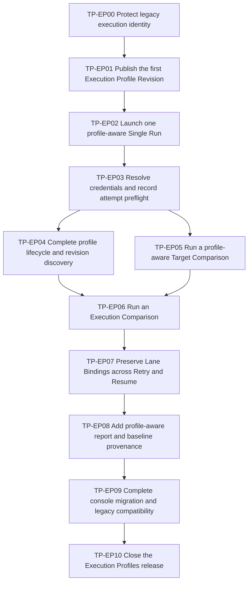

# Versioned Execution Profiles Delivery Plan

## Document status

| Field | Value |
|---|---|
| Status | TP-EP02 complete on 2026-07-15; TP-EP03 not started |
| Product requirements | [`EXECUTION_PROFILES_PRD.md`](EXECUTION_PROFILES_PRD.md) |
| Accepted architecture | [`EXECUTION_PROFILES_ARCHITECTURE.md`](EXECUTION_PROFILES_ARCHITECTURE.md) |
| Domain language | [`CONTEXT.md`](CONTEXT.md) |
| Delivery method | TDD vertical slices |
| Issue publication | Not published; user approved slice granularity and dependencies |
| Implementation authorization | TP-EP00 through TP-EP02 authorized and complete; TP-EP03 requires a separate start request |

## 1. Delivery rules

### 1.1 Tracer-bullet rule

Every task delivers one narrow, observable behavior across all layers needed by
that behavior:

```text
Console or HTTP adapter
-> deep module interface
-> domain invariant
-> SQLite/artifact/external adapter
-> durable public result
```

A task is incomplete if it leaves an unused table, unreachable module, hard-coded
console screen, unconsumed DTO, or compatibility reader that no public behavior
exercises.

### 1.2 TDD record

Every implementation task records:

1. the first focused failing interface test and expected failure;
2. the smallest end-to-end green behavior;
3. any shallow helper tests replaced by tests at the deep module interface;
4. focused backend and frontend results;
5. the observable demo or durable HTTP evidence;
6. affected legacy, runner, report, and simulator regression results.

### 1.3 Interface test surfaces

- Profile lifecycle behavior is tested through the `ExecutionProfiles`
  interface and its HTTP/console adapters.
- Profile-aware initial launch is tested through the `RunLaunch` preview/create
  interface.
- Retry and Resume are tested through public follow-up preview/create behavior
  against a frozen Run Plan.
- Reports and Strict Baselines are tested through their public read/promotion
  interfaces.
- Temporary real SQLite databases and artifact roots are used instead of mocked
  repositories.
- Secret and model-provider behavior varies through deterministic adapters at
  the existing true-external seams.

Tests do not reach past those interfaces merely to assert private normalization,
repository, fingerprint-helper, or adapter implementation details.

### 1.4 Compatibility rule

- Existing `bench_env` CLI and artifact behavior remains the execution baseline.
- Existing Workflow v1 and Run Plan v1 behavior remains readable and
  follow-up-capable.
- Existing report v1/v2 and Strict Baseline records remain readable/exportable.
- Existing run, workflow, target, lane, episode, attempt, report, and baseline
  identities do not change.
- Historical inline execution remains Legacy Execution Identity; no slice may
  synthesize an Execution Profile Revision for it.
- Test-only deterministic secret/model adapters remain disabled in normal
  production startup.

### 1.5 Security rule

No slice may persist or expose raw secret values in an Execution Profile
Revision, Run Plan, SQLite row, artifact, event, report, incident link, log,
error, idempotency payload, browser persistence, snapshot, or test fixture
committed to the repository.

### 1.6 Slice size and sequencing

- P0 establishes honest compatibility and the first complete profile-aware
  Single Run.
- P1 completes product lifecycle and both causal comparison modes.
- P2 applies frozen identity to follow-ups, reports, and Strict Baselines.
- P3 completes operator migration and the documented compatibility window.
- Release work begins only after all behavior slices have durable evidence.

TP-EP04 and TP-EP05 may proceed in parallel after TP-EP03. All other arrows in
the dependency graph are ordering constraints.

## 2. Dependency map



## 3. Task summary

| ID | Priority | Title | Blocked by | Requirements |
|---|---:|---|---|---|
| TP-EP00 | P0 | Protect legacy execution identity | None | EP-FR-014 |
| TP-EP01 | P0 | Publish the first Execution Profile Revision | TP-EP00 | EP-FR-001, EP-FR-002 |
| TP-EP02 | P0 | Launch one profile-aware Single Run | TP-EP01 | EP-FR-002, EP-FR-003, EP-FR-004, EP-FR-015 |
| TP-EP03 | P0 | Resolve credentials and record attempt preflight | TP-EP02 | EP-FR-010, EP-FR-011, EP-FR-015 |
| TP-EP04 | P1 | Complete profile lifecycle and revision discovery | TP-EP03 | EP-FR-001, EP-FR-002 |
| TP-EP05 | P1 | Run a profile-aware Target Comparison | TP-EP03 | EP-FR-003, EP-FR-005, EP-FR-008, EP-FR-009 |
| TP-EP06 | P1 | Run an Execution Comparison | TP-EP04, TP-EP05 | EP-FR-003, EP-FR-005, EP-FR-006, EP-FR-007, EP-FR-008, EP-FR-009 |
| TP-EP07 | P2 | Preserve Lane Bindings across Retry and Resume | TP-EP06 | EP-FR-011, EP-FR-012 |
| TP-EP08 | P2 | Add profile-aware report and baseline provenance | TP-EP07 | EP-FR-013, EP-FR-014 |
| TP-EP09 | P3 | Complete console migration and legacy compatibility | TP-EP08 | EP-FR-004, EP-FR-010, EP-FR-014 |
| TP-EP10 | Release | Close the Execution Profiles release | TP-EP09 | All EP-FR requirements |

## 4. Detailed tasks

## TP-EP00: Protect legacy execution identity

### What to build

Introduce version-aware Workflow and Run Plan reading through a public legacy
identity path before new profile-aware data exists. Existing inline execution
must continue to render, report, Retry, and Resume while being identified
honestly as Legacy Execution Identity.

This task is the permitted prefactor: it replaces implicit shape assumptions
with a deeper versioned-reader seam and proves parity through observable
existing-run behavior in the same task.

Current evidence:
[`evidence/2026-07-13-tp-ep00-legacy-execution-identity.md`](evidence/2026-07-13-tp-ep00-legacy-execution-identity.md).
Versioned Workflow/Run Plan readers, explicit Legacy Execution Identity DTOs,
unknown-version conflicts, and legacy follow-up/report/baseline compatibility
are complete. TP-EP01 and TP-EP02 are also complete; TP-EP03 has not started.

### Acceptance criteria

- [x] Run Plan v1 and existing Workflow Version responses are read without data
      rewrite or identity change.
- [x] Run detail and Observatory views display Legacy Execution Identity instead
      of a missing, inferred, or synthetic Execution Profile Revision.
- [x] Existing Retry and Resume continue to use frozen inline runner config and
      accept only the currently permitted secret reinjection.
- [x] Existing report v1/v2 and Strict Baseline views remain readable and
      exportable.
- [x] Version dispatch rejects an unknown future schema with a stable structured
      error instead of partial interpretation.
- [x] No Execution Profile table or fake revision is required to demonstrate the
      complete behavior.

### Test seam

Exercise existing public Run, report, baseline, Retry, Resume, and console read
interfaces over legacy fixture databases and artifacts. Do not test a private
version-switch helper directly.

### First red

An existing Run Plan v1 response has no explicit execution-identity kind, so the
console cannot distinguish honest legacy provenance from missing new data.

### Observable demo

Open an existing or imported Run, observe the Legacy Execution Identity marker,
reload it, inspect its report/baseline, and preview a follow-up without any
profile record being created.

### Focused verification

```bash
python -m pytest -c test_platform/pytest.ini \
  test_platform/tests/integration/test_runs_api.py \
  test_platform/tests/integration/test_retry_run.py \
  test_platform/tests/integration/test_reports_api.py -q
npx vitest run --config vitest.platform.config.ts \
  tests/testPlatformImportedRuns.test.tsx \
  tests/testPlatformRunObservatory.test.tsx
```

## TP-EP01: Publish the first Execution Profile Revision

### What to build

Deliver the smallest complete `ExecutionProfiles` vertical slice for a public,
no-secret subject configuration: create/save a project-scoped draft, validate
it, publish one immutable revision, discover it, and inspect its redacted public
spec in the console.

Current evidence:
[`evidence/2026-07-15-tp-ep01-first-execution-profile-revision.md`](evidence/2026-07-15-tp-ep01-first-execution-profile-revision.md).
The typed no-secret draft, static validation, immutable revision 1, canonical
public hash, project isolation, and console create/publish/reload flow are
complete. TP-EP02 is also complete; TP-EP03 has not started.

### Acceptance criteria

- [x] A Project can create one named Execution Profile draft containing typed
      Agent, model, Image Input Format, generation, streaming, and inference
      timeout settings.
- [x] Static validation rejects missing required subject settings, unsupported
      Image Input Format, credential-bearing URLs, and raw secret-like fields.
- [x] Publish creates immutable revision 1 with canonical public hash and no
      remote provider call.
- [x] List/detail interfaces return normalized public settings and never return a
      secret value field.
- [x] The Execution Profiles console route creates, publishes, reloads, and
      displays the exact revision ID/hash.
- [x] A profile from another Project is not discoverable or publishable through
      the selected Project.

### Test seam

Use the `ExecutionProfiles` interface over temporary SQLite, then exercise the
same behavior through HTTP and the real console adapter.

### First red

Creating a profile draft through the public entry fails because no product
identity, persistence, or route exists.

### Observable demo

Create "Generic v2 / local model", publish revision 1, reload the page, and see
the exact immutable public settings and hash without contacting a model.

### Focused verification

```bash
python -m pytest -c test_platform/pytest.ini \
  test_platform/tests/integration/test_execution_profiles_service.py \
  test_platform/tests/integration/test_execution_profiles_api.py -q
npx vitest run --config vitest.platform.config.ts \
  tests/testPlatformExecutionProfiles.test.tsx
```

## TP-EP02: Launch one profile-aware Single Run

### What to build

Deliver the first complete `RunLaunch` tracer bullet using a no-secret,
deterministic subject: a Workflow v2 with one Lane Slot, exact Target and
Execution Profile revision selection, preview token, Run Plan v2, durable Single
Run, dedicated launch console, and Observatory identity display.

Current evidence:
[`evidence/2026-07-15-tp-ep02-profile-aware-single-run.md`](evidence/2026-07-15-tp-ep02-profile-aware-single-run.md).
Workflow v2 Lane Slots, exact revision resolution, canonical preview and plan
fingerprints, durable Run Plan v2 identity, transactional create, and the
console preview/create/reload flow are complete. TP-EP03 has not started.

### Acceptance criteria

- [x] Workflow v2 publishes one `candidate` Lane Slot without embedding mutable
      Target or Execution Profile heads.
- [x] Launch preview accepts exact same-Project revision IDs and returns the
      resolved Lane Binding, public hashes, episode count, fingerprint inputs,
      and canonical preview token without writes.
- [x] `latest`, drafts, cross-Project revisions, stale Target
      Revisions, missing Lane Slots, and token drift fail structurally.
- [x] Create persists Run Plan v2 with one exact Lane Binding and a self-contained
      public execution snapshot before dispatch.
- [x] Run Plan and Lane fingerprints are stable for the same semantic inputs and
      change when either revision changes.
- [x] The dedicated Run Launch console previews, creates, navigates to the Run,
      reloads, and shows exact Workflow/Target/Profile identities.
- [x] Failure before commit creates no Run, Run Attempt, artifact, event, or
      idempotency record.

### Test seam

Test `RunLaunch.preview/create` over temporary SQLite/artifacts and a
deterministic no-secret execution adapter. The HTTP and console tests consume the
same public preview shape and structured errors.

### First red

A launch command with an exact Execution Profile Revision cannot be represented
or compiled into the current Run Plan v1 Lane.

### Observable demo

Select one Workflow Version, exact Target Revision, and exact Execution Profile
Revision; preview and launch a deterministic Single Run; reload Observatory and
see the same identities and fingerprint.

### Focused verification

```bash
python -m pytest -c test_platform/pytest.ini \
  test_platform/tests/unit/test_run_plan_compiler.py \
  test_platform/tests/integration/test_run_launch_api.py -q
npx vitest run --config vitest.platform.config.ts \
  tests/testPlatformRunLaunch.test.tsx \
  tests/testPlatformRunObservatory.test.tsx
```

## TP-EP03: Resolve credentials and record attempt preflight

### What to build

Add immutable private Credential Reference bindings to profile publication,
resolve only declared slots at launch through the `SecretResolver` port, run
Compatibility Preflight on the frozen effective subject, and store redacted
evidence on the initial Run Attempt.

### Acceptance criteria

- [ ] A profile draft binds declared credential slots to non-secret reference
      identity without exposing sensitive backend paths in public responses.
- [ ] Credential Reference binding identity participates in the frozen revision
      identity; rotating the value behind the same reference does not change it.
- [ ] The console shows credential readiness and accepts transient launch
      bindings without browser persistence.
- [ ] Missing, extra, unavailable, or cross-Project credential bindings fail with
      stable errors before durable side effects.
- [ ] Compatible subject tuples create the initial Run Attempt with redacted
      preflight outcome, checked model/Image Input Format, cache status, and Lane
      keys.
- [ ] Incompatible and indeterminate subjects fail before Run/artifact creation;
      provider text and secret values never appear in errors or logs.
- [ ] Initial preflight is no longer stored as mutable/global Run Plan agent
      identity.

### Test seam

Use one production-shaped request/local SecretResolver adapter and deterministic
success/missing/unavailable test adapters, plus the existing compatible,
incompatible, timeout, and cache CompatibilityProbe adapters.

### First red

A profile-aware launch requiring a credential cannot resolve a declared slot or
record preflight consistently with Retry/Resume without persisting the raw key.

### Observable demo

Publish a credential-requiring profile, preview its readiness, launch with a
deterministic compatible adapter, inspect redacted attempt evidence, then show
that missing and incompatible cases create no Run.

### Focused verification

```bash
python -m pytest -c test_platform/pytest.ini \
  test_platform/tests/unit/test_compatibility_preflight.py \
  test_platform/tests/integration/test_compatibility_preflight_api.py \
  test_platform/tests/integration/test_execution_profile_secrets.py -q
npx vitest run --config vitest.platform.config.ts \
  tests/testPlatformExecutionProfiles.test.tsx \
  tests/testPlatformModelCompatibility.test.tsx
```

## TP-EP04: Complete profile lifecycle and revision discovery

### What to build

Complete the Execution Profile product around the working launch seam: active
name uniqueness, draft concurrency, multiple revisions, unchanged-publication
idempotency, public diff, clone, archive, archived discovery, and historical
revision readability.

### Acceptance criteria

- [ ] Active normalized profile names are unique per Project and reusable only
      after archive under the accepted naming policy.
- [ ] Concurrent draft/head changes return structured stale-state conflicts.
- [ ] Publishing changed canonical content advances revision number; publishing
      unchanged public and private binding identity returns the current head.
- [ ] Changing Credential Reference binding identity advances revision identity;
      rotating the value behind the same reference does not.
- [ ] Public revision diff identifies subject fields without exposing private
      Credential Reference payloads.
- [ ] Clone creates a new editable profile draft from one exact revision and
      copies no secret value.
- [ ] Archive removes the profile from default launch discovery and blocks new
      initial Runs while preserving revision detail and historical Run views.
- [ ] A newer head or archive does not change an already frozen Run Plan.

### Test seam

Exercise all lifecycle behavior through `ExecutionProfiles` and verify launch
selection/archive behavior through `RunLaunch`; avoid separate tests for raw
repository CRUD.

### First red

Publishing a second revision currently has no head concurrency, canonical
idempotency, discovery, diff, clone, or archive behavior.

### Observable demo

Publish revisions 1 and 2, inspect their redacted diff, clone revision 1 into a
new draft, archive the original, and confirm an old Run remains exact while a
new launch cannot select the archive.

### Focused verification

```bash
python -m pytest -c test_platform/pytest.ini \
  test_platform/tests/integration/test_execution_profiles_api.py \
  test_platform/tests/integration/test_run_launch_api.py -q
npx vitest run --config vitest.platform.config.ts \
  tests/testPlatformExecutionProfiles.test.tsx \
  tests/testPlatformRunLaunch.test.tsx
```

## TP-EP05: Run a profile-aware Target Comparison

### What to build

Move the existing paired Target Comparison onto Workflow v2 Lane Slots and exact
Lane Bindings. Two Target Revisions use one identical Execution Profile Revision
while preserving existing target constraints, shared Prepared Episodes, pair
integrity, comparison results, gates, replay, and attempt-level preflight.

### Acceptance criteria

- [ ] A paired Workflow v2 exposes baseline and candidate Lane Slots without
      embedding mutable resource heads.
- [ ] Target Comparison requires different Target Revision IDs and one identical
      Execution Profile Revision ID.
- [ ] Existing enumerated `same_app`, `same_device`, and `same_data` constraints
      are advisory in preview and authoritative in create against frozen target
      metadata.
- [ ] Both Lanes share exact task source, seed, Prepared Episode identity,
      parameters, instruction, time/location, and evaluation/Judge protocol.
- [ ] Compatibility Preflight deduplicates the identical subject tuple and records
      both Lane keys on the initial Run Attempt.
- [ ] Comparison, gate, replay, incident, and Run detail views retain exact
      Target/Profile identities after reload.
- [ ] Existing target-comparison deterministic acceptance remains green through
      the profile-aware path.

### Test seam

Use public paired launch and report/replay interfaces with deterministic target
revisions and the shared Prepared Episode adapter. Do not test Lane assembly as
an isolated helper.

### First red

The current paired workflow owns target IDs and cannot bind one exact published
Execution Profile Revision to both frozen target Lanes.

### Observable demo

Preview and launch two allowed Target Revisions with one profile revision,
observe shared Prepared Episode identity and a deterministic regression, then
reload and switch replay Lanes without identity drift.

### Focused verification

```bash
python -m pytest -c test_platform/pytest.ini \
  test_platform/tests/integration/test_paired_serial_run.py \
  test_platform/tests/integration/test_run_launch_api.py -q
npx vitest run --config vitest.platform.config.ts \
  tests/testPlatformComparisonPolicy.test.tsx \
  tests/testPlatformPairedResult.test.tsx
```

## TP-EP06: Run an Execution Comparison

### What to build

Deliver the primary product opportunity: compare two exact Execution Profile
Revisions on one exact Target Revision with one shared prepared state. Add
explicit comparison intent, public profile diff, deterministic subject-specific
outcomes, causal classification, and rejection of no-variation or confounded
bindings.

### Acceptance criteria

- [ ] Execution Comparison requires one identical Target Revision and two
      different Execution Profile Revisions.
- [ ] Workflow Version, evaluation/Judge protocol, orchestration policy, task
      source, seed, episode identities, and Prepared Episodes are identical.
- [ ] The deterministic test adapter varies subject behavior only from the frozen
      profile snapshot and is unavailable in normal production startup.
- [ ] Preview shows the public profile revision diff and locks the Target
      Revision equality axis.
- [ ] Create rejects identical Lane Bindings as no variation and rejects both
      axes changing as confounded, with zero durable side effects.
- [ ] Comparison classification, gates, diagnostics, replay, incident links, and
      reload preserve both exact profile identities.
- [ ] Changing Agent/model settings never re-samples parameters, changes
      instruction, or re-prepares initial state.

### Test seam

Exercise public launch, prepared-state, comparison, report, replay, and console
interfaces with two deterministic Execution Profile Revision snapshots. Do not
introduce provider-defined comparison callbacks.

### First red

The current console and Run Plan cannot assign a different frozen subject
identity to each Lane while sharing one Target Revision.

### Observable demo

Launch profile A and profile B against one Target Revision, observe one stable
pair and one regression from identical Prepared Episodes, inspect the profile
diff, and prove a mixed-axis request is rejected before Run creation.

### Focused verification

```bash
python -m pytest -c test_platform/pytest.ini \
  test_platform/tests/integration/test_execution_comparison_launch.py \
  test_platform/tests/integration/test_paired_lane_outcome_committer.py -q
npx vitest run --config vitest.platform.config.ts \
  tests/testPlatformExecutionComparison.test.tsx \
  tests/testPlatformPairedResult.test.tsx \
  tests/testPlatformRunObservatory.test.tsx
```

## TP-EP07: Preserve Lane Bindings across Retry and Resume

### What to build

Apply exact profile-aware Lane Binding invariants to follow-ups. Retry and Resume
must reuse the original Run Plan v2, resolve only original credential slots,
rerun preflight on frozen subjects, validate executability, and create a new Run
Attempt without consulting profile heads.

### Acceptance criteria

- [ ] Follow-up preview exposes original exact Target/Profile identities and
      selected Lane Episodes without a configurable revision selector.
- [ ] Retry and Resume reject Target, profile, Agent, model, generation, Judge,
      scheduling, or other non-secret overrides.
- [ ] Publishing a newer profile revision or archiving its profile does not alter
      or block a follow-up by itself.
- [ ] Missing original credentials, unavailable subject implementation, stale
      Target Revision, or changed task source fails before a new Run Attempt.
- [ ] Every successful initial/retry/resume Run Attempt has its own redacted
      Compatibility Preflight evidence for the frozen subject tuples.
- [ ] Canonical preview token is revalidated inside the transaction; a changed
      selection creates no attempt and returns the current token.
- [ ] Historical attempt replay/incident links remain immutable after newer
      attempts exist.

### Test seam

Use public follow-up preview/create, report, and replay interfaces. Reuse the
same deterministic SecretResolver and CompatibilityProbe adapters as initial
launch so the attempt contract has one test surface.

### First red

Run Plan v2 profile bindings are not yet enforced by the existing follow-up
compatibility and secret-reinjection paths.

### Observable demo

Publish profile revision 2 and archive the profile after a run used revision 1;
Retry a failed Lane Episode with revision 1, inspect new attempt preflight, and
prove a request to substitute revision 2 is rejected.

### Focused verification

```bash
python -m pytest -c test_platform/pytest.ini \
  test_platform/tests/integration/test_retry_run.py \
  test_platform/tests/integration/test_execution_profile_followup.py -q
npx vitest run --config vitest.platform.config.ts \
  tests/testPlatformRetryResume.test.tsx \
  tests/testPlatformRunObservatory.test.tsx
```

## TP-EP08: Add profile-aware report and baseline provenance

### What to build

Advance report provenance and Strict Baseline identity for profile-aware Runs
while preserving every existing reader. Reports expose per-Lane Target/Profile
revisions and Lane fingerprints; new Strict Baselines freeze the selected
profile-aware Lane and strictness contract.

### Acceptance criteria

- [ ] The next report schema records per-Lane Target Revision IDs, Execution
      Profile Revision IDs/hashes, Lane fingerprints, and the completed Run
      Attempt's redacted preflight identity.
- [ ] Functional, reliability, infrastructure, sequence, comparison, replay, and
      export views remain consistent with the selected Run Attempt.
- [ ] Profile-aware Strict Baseline promotion requires complete selected-Lane
      revision/fingerprint provenance and the existing all-PASS completeness
      rule.
- [ ] Baseline list/detail and comparison views show exact Execution Profile
      Revision identity and legacy strictness distinctly.
- [ ] Existing report v1/v2 and Baselines remain readable, named, archivable, and
      exportable without backfill.
- [ ] A legacy report cannot be newly promoted or described as profile-aware
      strict provenance.
- [ ] No current profile state is consulted to render historical report or
      baseline identity.

### Test seam

Exercise report generation/read/export and baseline eligibility/promotion/read
interfaces for Run Plan v1 and v2 fixtures. UI tests consume the same provenance
DTOs and structured eligibility reasons.

### First red

Current report and baseline provenance identifies Target Revision but has no
selected-Lane Execution Profile Revision or Lane fingerprint.

### Observable demo

Promote the passing Lane of a completed Execution Comparison, inspect exact
Target/Profile/Lane fingerprint provenance, then open a legacy baseline and see
honest legacy strictness without missing-data inference.

### Focused verification

```bash
python -m pytest -c test_platform/pytest.ini \
  test_platform/tests/integration/test_reports_api.py \
  test_platform/tests/integration/test_report_input.py \
  test_platform/tests/integration/test_baselines_api.py -q
npx vitest run --config vitest.platform.config.ts \
  tests/testPlatformReports.test.tsx \
  tests/testPlatformExecutionComparison.test.tsx
```

## TP-EP09: Complete console migration and legacy compatibility

### What to build

Finish the operator transition from loose launch fields to product identity.
Make the dedicated Run Launch route the normal console path, retain the legacy
create-run HTTP adapter for a documented compatibility window, and offer an
explicit reviewed conversion from saved non-secret launch preferences into a
new profile draft.

### Acceptance criteria

- [ ] Workflow authoring no longer owns Agent/model/base URL/Image Input Format
      or raw API-key launch state.
- [ ] The normal console flow selects exact published Target and Execution
      Profile revisions through Run Launch.
- [ ] Browser persistence stores at most recent identity preference and no raw
      subject settings, Credential Reference payload, or secret value.
- [ ] Existing non-secret launch preferences can be copied into a visible draft
      only after explicit user action and review; no automatic publication occurs.
- [ ] The legacy create-run contract continues to create/read/follow up Legacy
      Execution Identity during the documented compatibility window.
- [ ] Legacy import, report, baseline, replay, and incident views never display a
      synthetic profile.
- [ ] Operator and compatibility documentation names the new path, legacy path,
      security limits, and future exit criteria.

### Test seam

Test the new console flow, explicit conversion, browser-storage contract, and
legacy create-run adapter through public interfaces. Preserve existing v1 launch
fixtures as compatibility tests rather than duplicating them into v2 expectations.

### First red

The current Workflows page still owns loose execution fields and browser-local
Agent/model preferences instead of selecting published identity.

### Observable demo

Open a legacy workflow with saved non-secret preferences, explicitly create a
draft, review and publish it, launch through the dedicated route, and then prove
the original legacy HTTP request remains readable as Legacy Execution Identity.

### Focused verification

```bash
python -m pytest -c test_platform/pytest.ini \
  test_platform/tests/integration/test_runs_api.py \
  test_platform/tests/integration/test_execution_profile_legacy.py -q
npx vitest run --config vitest.platform.config.ts \
  tests/testPlatformWorkflowEditor.test.tsx \
  tests/testPlatformRunLaunch.test.tsx \
  tests/testPlatformImportedRuns.test.tsx
```

## TP-EP10: Close the Execution Profiles release

### What to build

Run the complete compatibility and product acceptance suite from a clean
temporary environment, reconcile implementation with the accepted PRD and
architecture, record every task's evidence, document accepted debt, and mark the
release complete only when all TP-EP00 through TP-EP09 outcomes are reproducible.

### Acceptance criteria

- [ ] TP-EP00 through TP-EP09 are complete or explicitly removed by an accepted
      product/architecture change.
- [ ] Every EP-FR-001 through EP-FR-015 requirement and PRD acceptance scenario
      has mechanical evidence.
- [ ] Full Test Platform backend, relevant `bench_env`, platform frontend,
      simulator, type-check, and lint suites pass.
- [ ] Deterministic browser smoke covers profile publication, Single launch,
      Target Comparison, Execution Comparison, secret/preflight failures,
      follow-up, report/baseline provenance, reload, and historical links.
- [ ] The deterministic acceptance path requires no live commercial or local
      model and test-only adapters are disabled in normal startup.
- [ ] Run Plan v1/v2, report v1/v2/next, legacy create-run, existing Baselines,
      Retry/Resume, and imported-run compatibility gates pass.
- [ ] Secret scans and response/artifact snapshots contain no secret values or
      sensitive Credential Reference paths.
- [ ] Product, architecture, context, implementation, operator, compatibility,
      and docs-index status reflects the released behavior.
- [ ] Remaining warnings, compatibility-window debt, and deferred provider/
      multi-axis directions are recorded with owners or backlog entries.

### Test seam

The release seam is the union of the two deep module interfaces, public
follow-up/report/baseline interfaces, deterministic browser acceptance, and
official compatibility commands. No live provider is part of release acceptance.

### Observable demo

From a clean checkout, follow one acceptance record to publish two profiles,
launch Single/Target/Execution cases, observe a structured preflight failure,
Retry an exact historical Lane Binding, promote a Strict Baseline, inspect a
Legacy Execution Identity, and reproduce every green command.

### Verification

```bash
python -m pytest -c test_platform/pytest.ini test_platform/tests -q
python -m pytest -c bench_env/tests/pytest.ini bench_env/tests/common -m "not live" -q
npm run platform:test
npm test
npm run platform:typecheck
npx tsc --noEmit
npm run lint
```

## 5. Approval record

On 2026-07-13, the user approved the slice granularity and dependency
relationships with these consequences:

- TP-EP00 remains a separate parity-proving prefactor.
- TP-EP02 remains the minimum complete profile-aware Single Run tracer bullet.
- credential resolution and attempt preflight remain separate in TP-EP03.
- TP-EP04 lifecycle and TP-EP05 Target Comparison may proceed in parallel after
  TP-EP03.
- report and Strict Baseline provenance remain in the same release.
- TP-EP00 through TP-EP10 retain the dependency graph in this document.

No external issue has been published. TP-EP00 through TP-EP02 were implemented
only after their separate explicit start requests. TP-EP03 has not started and
still requires a separate explicit start request.
