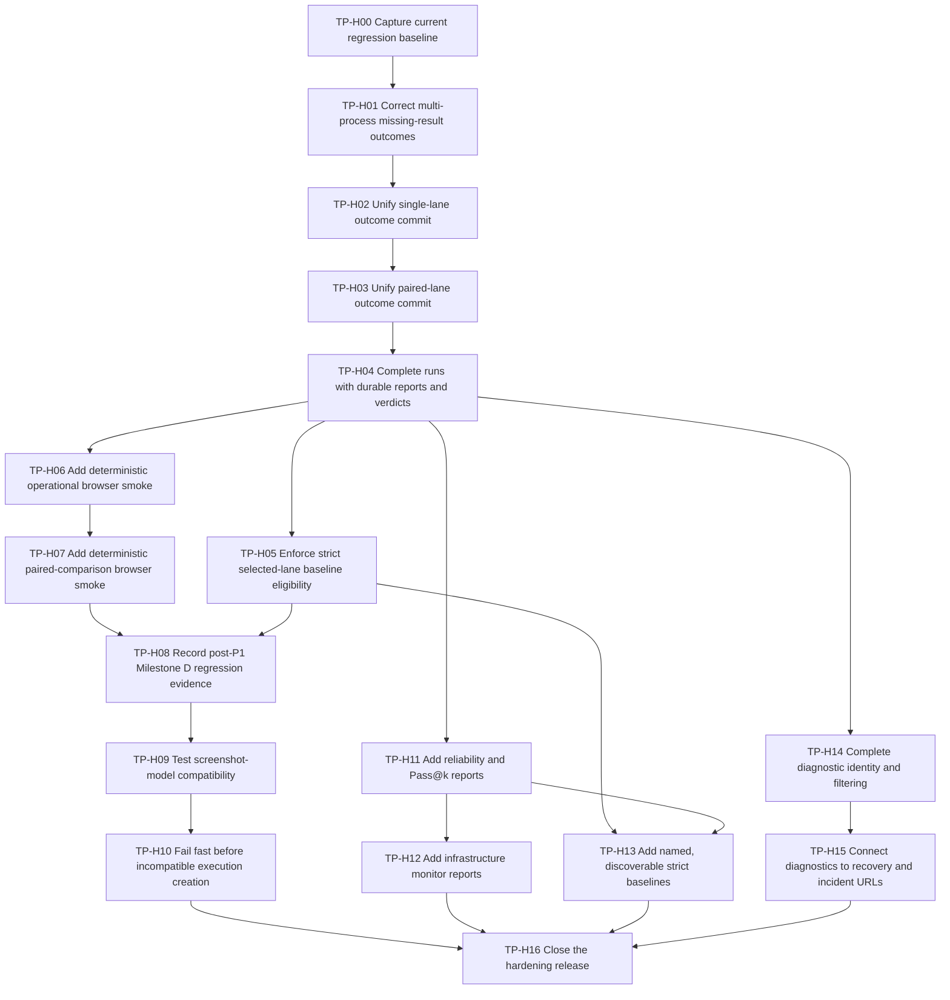

# Test Platform Hardening and Completion Plan

## Document status

| Field | Value |
|---|---|
| Status | Draft task breakdown for review |
| Product requirements | [`HARDENING_PRD.md`](HARDENING_PRD.md) |
| Delivery method | TDD tracer-bullet vertical slices |
| Issue publication | Not published; user approval of granularity and dependencies is required first |
| Deferred direction | [`PRODUCT_BACKLOG.md`](PRODUCT_BACKLOG.md#tp-future-01-versioned-execution-profiles-and-execution-aware-lanes) |

## 1. Delivery rules

### 1.1 Priority is a release constraint

Tasks are implemented in priority order. Work within one priority may proceed in
parallel only when the dependency graph permits it.

- P0 and P1 are the minimum hardening release.
- P2 may begin only after the deterministic Manual Sequence smoke is green.
- P3 report work builds on durable completion and canonical outcome facts.
- P4 must not delay P0 through P3.
- TP-FUTURE-01 is not part of this plan.

### 1.2 TDD record

Every implementation task records:

1. the focused red test and its expected failure;
2. the smallest end-to-end green behavior;
3. any replaced tests deleted after a deeper module interface becomes the test
   seam;
4. focused verification output;
5. the observable demo or API evidence;
6. regression commands run for the affected runner and console paths.

### 1.3 Vertical-slice rule

Each task must finish one observable behavior across every required layer. A
task is not complete if it leaves only an internal module, schema, route, or UI
stub for a later task to make useful.

Prefactoring tasks are allowed only when they replace duplicated behavior with a
deeper interface and prove parity through observable outcomes in the same task.

### 1.4 Compatibility rule

- Existing `bench_env` CLI behavior and artifact formats remain the compatibility
  baseline.
- Existing report versions remain readable after a report schema version bump.
- Existing anonymous baselines remain readable after named baselines are added.
- Existing run, workflow, target, lane, episode, and attempt identities do not
  change.
- Test-only deterministic adapters are disabled in normal production startup.

## 2. Dependency map



## 3. Task summary

| ID | Priority | Title | Blocked by | User stories |
|---|---:|---|---|---|
| TP-H00 | P0 | Capture current regression baseline | None | 15, 31 |
| TP-H01 | P0 | Correct multi-process missing-result outcomes | TP-H00 | 1, 2, 5 |
| TP-H02 | P0 | Unify single-lane outcome commit | TP-H01 | 1-5, 31 |
| TP-H03 | P0 | Unify paired-lane outcome commit | TP-H02 | 3-5, 31 |
| TP-H04 | P0 | Complete runs with durable reports and verdicts | TP-H03 | 6-9 |
| TP-H05 | P0 | Enforce strict selected-lane baseline eligibility | TP-H04 | 10, 11 |
| TP-H06 | P1 | Add deterministic operational browser smoke | TP-H04 | 12, 13 |
| TP-H07 | P1 | Add deterministic paired-comparison browser smoke | TP-H03, TP-H06 | 12, 14 |
| TP-H08 | P1 | Record post-P1 Milestone D regression evidence | TP-H05, TP-H07 | 15, 31 |
| TP-H09 | P2 | Test screenshot-model compatibility | TP-H08 | 16-19 |
| TP-H10 | P2 | Fail fast before incompatible execution creation | TP-H09 | 17-20 |
| TP-H11 | P3 | Add reliability and Pass@k reports | TP-H04 | 21-23 |
| TP-H12 | P3 | Add infrastructure monitor reports | TP-H11 | 24 |
| TP-H13 | P3 | Add named, discoverable strict baselines | TP-H05, TP-H11 | 10, 11, 25 |
| TP-H14 | P4 | Complete diagnostic identity and filtering | TP-H04 | 26, 30 |
| TP-H15 | P4 | Connect diagnostics to recovery and incident URLs | TP-H14 | 27-29 |
| TP-H16 | Release | Close the hardening release | TP-H10, TP-H12, TP-H13, TP-H15 | 15, 31 |

## 4. Detailed tasks

## TP-H00: Capture current regression baseline

Current evidence: [`evidence/2026-07-11-tp-h00-regression-baseline.md`](evidence/2026-07-11-tp-h00-regression-baseline.md)
and [`evidence/2026-07-11-tp-h00-blocker-repair.md`](evidence/2026-07-11-tp-h00-blocker-repair.md).
The unmodified base revision failed its baseline. Repair commit `972fba6`
resolves the discovered blockers and was reproduced in a new Python 3.11
environment installed only from declared dependencies: 267 Test Platform tests
and 226 `bench_env` common tests passed. TP-H00 is complete.

### What to build

Create a dated, reproducible verification record for the current main branch
before behavior changes. This is an acceptance task, not a code-cleanup task.
Classify any failure as an existing product defect, environment limitation, or
test-infrastructure problem. Do not weaken or skip a failing assertion merely to
produce a green record.

### Acceptance criteria

- [ ] The current commit and working-tree status are recorded.
- [ ] All Test Platform Python tests run without a live model.
- [ ] Relevant `bench_env` common tests run with live tests excluded.
- [ ] Platform frontend tests and type checking run.
- [ ] Repository runtime lint and the relevant simulator regression suite run.
- [ ] Every failure has a stable reproduction command and classification.
- [ ] The record distinguishes permission or environment failures from product
      failures.
- [ ] No generated caches, secrets, run artifacts, or local machine paths are
      committed.

### Test seam

The existing public test commands are the seam. This task does not introduce a
new adapter.

### Observable demo

Open the dated verification record and reproduce each reported command from a
clean checkout using the documented environment.

### Verification

```bash
python -m pytest -c test_platform/pytest.ini test_platform/tests -q
python -m pytest -c bench_env/tests/pytest.ini bench_env/tests/common -m "not live" -q
npm run platform:test
npm run platform:typecheck
npm test
npx tsc --noEmit
npm run lint
```

## TP-H01: Correct multi-process missing-result outcomes

Current evidence: [`evidence/2026-07-11-tp-h01-multiprocess-missing-result.md`](evidence/2026-07-11-tp-h01-multiprocess-missing-result.md)
(`Complete`: the canonical missing-result matrix and full Test Platform
regression pass).

### What to build

Correct the non-cancelled multi-process missing-result path so an absent shard
result produces a canonical error result, `ERROR` outcome, `WORKER_CRASH` error
code, error terminal event, and retry-error selection. Preserve the existing
user-cancellation path as `CANCELLED`.

### Acceptance criteria

- [x] A non-cancelled missing shard result persists `outcome=ERROR` and
      `error_code=WORKER_CRASH`.
- [x] Its result body declares an execution error and contains a stable stop
      reason.
- [x] Functional and sequence reports count it as an error, not a failure or
      incomplete episode.
- [x] Retry selection labels it `retry_error`.
- [x] A user-cancelled missing shard result remains `CANCELLED` and is never
      labelled `WORKER_CRASH`.
- [x] The regression test asserts outcome, error code, result body, report
      counts, event type, and follow-up selection together.

### Test seam

Exercise a real multi-process executor adapter against temporary persistence and
the public report/follow-up read models. Do not test the synthetic-result helper
directly.

### Red tests

- Tighten the existing shard-crash integration scenario to assert the complete
  observable result matrix.
- Add report and retry assertions to that scenario or a focused integration
  scenario that consumes the persisted attempt.

### Observable demo

Run a deterministic shard-crash fixture and inspect one episode showing
`ERROR / WORKER_CRASH`, an error report count, and retry-error selection.

### Focused verification

```bash
python -m pytest -c test_platform/pytest.ini \
  test_platform/tests/integration/test_multiprocess_lane.py \
  test_platform/tests/unit/test_functional_report.py \
  test_platform/tests/unit/test_sequence_report.py \
  test_platform/tests/unit/test_retry_selection.py -q
```

## TP-H02: Unify single-lane outcome commit

Current evidence: [`evidence/2026-07-11-tp-h02-lane-outcome-committer.md`](evidence/2026-07-11-tp-h02-lane-outcome-committer.md)
(`Complete`: all single-lane executors use the canonical committer; contract,
adapter parity, focused, and full regressions pass).

### What to build

Replace the serial, parallel, and multi-process result-reconciliation variants
with one `LaneOutcomeCommitter` interface. Each executor adapts its raw result
shape and calls that interface once. The module commits all expected episode
facts and finalizes the lane exactly once.

### Acceptance criteria

- [x] Serial, parallel, and multi-process executors call the same outcome-commit
      interface.
- [x] Object results, dictionary results, and serial positional results are
      normalized before canonical reconciliation.
- [x] Ingestion occurs in immutable plan order regardless of delivery order.
- [x] Missing, cancelled, unknown, and duplicate result semantics match the PRD.
- [x] Synthetic terminal events and persisted attempts describe the same
      outcome and error code.
- [x] Artifact roots remain compatible with existing Run Explorer and replay
      discovery.
- [x] Lane finalization occurs exactly once after every planned lane episode has
      a terminal interpretation.
- [x] Replaced shallow reconciliation tests are removed once interface-level
      coverage proves the same behavior.

### Test seam

Test `LaneOutcomeCommitter` through its one operation with temporary SQLite and
an in-memory event adapter. Retain one adapter integration matrix across the
three executors.

### Red tests

- Add a table-driven contract for ordered, unordered, missing, cancelled,
  unknown, duplicate, object, and dictionary observations.
- Add executor parity assertions that compare persisted attempts and events for
  the same logical fixture.

### Observable demo

Execute the same three-episode fixture through serial, parallel, and
multi-process modes and compare identical terminal attempts, events, and report
counts.

### Focused verification

```bash
python -m pytest -c test_platform/pytest.ini \
  test_platform/tests/integration/test_lane_outcome_committer.py \
  test_platform/tests/integration/test_serial_run_execution.py \
  test_platform/tests/integration/test_parallel_lane.py \
  test_platform/tests/integration/test_multiprocess_lane.py \
  test_platform/tests/integration/test_result_ingestor_split.py -q
```

## TP-H03: Unify paired-lane outcome commit

Current evidence: [`evidence/2026-07-11-tp-h03-paired-lane-outcome-commit.md`](evidence/2026-07-11-tp-h03-paired-lane-outcome-commit.md)
(`Complete`: paired serial and parallel adapters share the canonical committer;
lane execution and Agent-start failure/cancellation parity, ordering guards,
focused, and full regressions pass).

### What to build

Adapt paired serial and paired parallel execution to the canonical
`LaneOutcomeCommitter` while preserving prepared-state identity, sibling
cancellation, comparison creation, per-lane finalization, and one run-level
finalization.

### Acceptance criteria

- [x] Baseline and candidate lanes use the same episode outcome semantics as
      single-lane executors.
- [x] A sibling failure or cancellation produces a complete, correctly labelled
      episode grid for both lanes.
- [x] Per-lane finalization occurs once per lane.
- [x] Comparison creation occurs only after both lanes have canonical terminal
      facts.
- [x] Run finalization occurs once after comparison persistence.
- [x] Pair integrity, prepared projection hashes, and classification outputs do
      not change for successful existing fixtures.
- [x] Serial and parallel paired adapters produce equivalent comparison facts
      for equivalent observations.

### Test seam

Use the outcome-commit interface plus the public comparison and report read
models. Do not expose paired-run internal reconciliation as another interface.

### Observable demo

Run paired serial and paired parallel fixtures with one missing candidate result
and show the same error classification, pair coverage, and terminal lane facts.

### Focused verification

```bash
python -m pytest -c test_platform/pytest.ini \
  test_platform/tests/integration/test_paired_lane_outcome_committer.py \
  test_platform/tests/integration/test_paired_serial_run.py \
  test_platform/tests/integration/test_paired_parallel_run.py \
  test_platform/tests/unit/test_pair_integrity.py \
  test_platform/tests/unit/test_pair_classification.py -q
```

## TP-H04: Complete runs with durable reports and verdicts

Current evidence: [`evidence/2026-07-11-tp-h04-run-completion.md`](evidence/2026-07-11-tp-h04-run-completion.md).
The completion pipeline, immediate report/gate availability, lifecycle failure
semantics, event ownership, and run list/detail completion facts are implemented.
TP-H04 is complete.

### What to build

Introduce `RunCompletionPipeline` so successful execution proceeds through
evaluation, report and gate persistence, reporting, and terminal completion.
Expose lifecycle state, quality verdict, and outcome counts together on run list
and detail surfaces.

### Acceptance criteria

- [x] A run cannot enter `completed` before its report and gate result commit.
- [x] A newly completed run has a non-null gate verdict without a prior report
      GET request.
- [x] A report with no configured thresholds has verdict `not_configured`, not
      `passed`.
- [x] Completion is idempotent for the same immutable report input.
- [x] Report or gate failure produces a stable lifecycle error while preserving
      episode attempts and raw artifacts.
- [x] Run list and Run Detail display lifecycle state and gate verdict as
      separate labelled facts.
- [x] Terminal pass, fail, error, cancelled, and incomplete counts are visible
      without opening the full report panel.
- [x] Existing report GET remains a read operation with an idempotent repair
      fallback for historical rows.
- [x] Run, report, gate, and failure events are persisted before live fanout.
- [x] `RunSupervisor` remains the only terminal run-event owner and emits exactly
      one terminal run event after the completion result is durable.

### Test seam

Test the completion module through its one operation and public run/report/event
interfaces. Frontend tests consume real DTO shapes but may use HTTP fakes until
the browser smoke slice.

### Red tests

- Add success, idempotency, report-failure, and gate-failure completion cases.
- Add an API case proving a completed run already has a report and verdict.
- Add list/detail UI cases for `completed + failed`, `completed + passed`, and
  lifecycle failure.

### Observable demo

Complete a Manual Sequence containing an error and show `Execution: completed`,
`Verdict: failed`, error counts, and an immediately available report.

### Focused verification

```bash
python -m pytest -c test_platform/pytest.ini \
  test_platform/tests/integration/test_reports_api.py \
  test_platform/tests/integration/test_serial_run_execution.py \
  test_platform/tests/integration/test_cancel_run.py -q
npx vitest run --config vitest.platform.config.ts \
  tests/testPlatformRunObservatory.test.tsx \
  tests/testPlatformReports.test.tsx \
  tests/testPlatformSerialRun.test.tsx
```

## TP-H05: Enforce strict selected-lane baseline eligibility

Current evidence: [`evidence/2026-07-11-tp-h05-strict-baseline-eligibility.md`](evidence/2026-07-11-tp-h05-strict-baseline-eligibility.md).
The selected-lane eligibility read model, strict promotion guard, structured
reasons, and eligibility-aware promotion UI are implemented. TP-H05 is complete.

### What to build

Evaluate strict baseline eligibility for the lane selected for promotion. Return
structured reasons and align the promotion UI with that result. Do not use the
overall run lifecycle state or paired-run gate verdict as a proxy for lane
success.

### Acceptance criteria

- [x] Eligibility requires a completed run attempt, durable report, complete
      strict provenance, complete selected-lane episode grid, and successful
      outcomes for every selected-lane episode.
- [x] A single-lane run containing FAIL, ERROR, CANCELLED, or incomplete work is
      rejected with structured reasons.
- [x] Every planned episode in the selected lane has terminal outcome `PASS`;
      no configured quality threshold may relax this strict-baseline rule.
- [x] A successful baseline lane may be promoted even when the candidate lane
      causes the paired-run gate to fail.
- [x] An unsuccessful selected lane cannot be promoted even when the overall
      gate configuration is empty or passes.
- [x] The UI disables promotion or displays the exact rejection reasons.
- [x] Imported runs with missing strict provenance remain ineligible.
- [x] There is no force or override flag for strict baseline promotion.

### Test seam

Test `BaselineEligibility` through baseline creation and read-only eligibility
interfaces. The UI consumes the same structured reasons.

### Observable demo

Show one paired run with a healthy baseline lane and failing candidate lane:
baseline-lane promotion succeeds, candidate-lane promotion is rejected with
outcome reasons.

### Focused verification

```bash
python -m pytest -c test_platform/pytest.ini \
  test_platform/tests/integration/test_reports_api.py \
  test_platform/tests/integration/test_imported_run_api.py -q
npx vitest run --config vitest.platform.config.ts tests/testPlatformReports.test.tsx
```

## TP-H06: Add deterministic operational browser smoke

Current evidence: [`evidence/2026-07-11-tp-h06-deterministic-browser-smoke.md`](evidence/2026-07-11-tp-h06-deterministic-browser-smoke.md).
The explicitly enabled deterministic composition and real API/Vite/browser
smoke cover Manual Sequence, replay, cancellation, recovery, Resume eligibility,
and SSE reconnect. TP-H06 is complete.

### What to build

Add a test-only deterministic execution adapter and the missing end-to-end smoke
path. Start the real API and console with temporary storage, create the required
project/target/workflow through public interfaces, and exercise completion,
cancellation, startup recovery, and a three-step Manual Sequence in a real
browser. Inspect live events, replay, diagnostics, reports, and follow-up
eligibility through public interfaces.

### Acceptance criteria

- [x] The deterministic adapter is available only in tests or explicitly
      enabled development startup.
- [x] It crosses production runner-event, attempt, artifact, replay, report, and
      gate seams rather than directly seeding final database rows.
- [x] The smoke creates a three-step Manual Sequence and preserves the authored
      task order.
- [x] Each step starts from isolated state.
- [x] At least one deterministic pass and one deterministic fail or error are
      represented without aborting later sequence steps.
- [x] The browser observes live progress, opens a screenshot replay, reads judge
      evidence, and sees all three sequence report rows in order.
- [x] A deterministic slow run can be cancelled through the public interface;
      browser and worker resources close and terminal state remains cancelled.
- [x] A non-terminal run present at service restart is reconciled with a stable
      service-restarted error and becomes eligible for the documented Resume
      path.
- [x] SSE reconnect resumes after the last durable sequence without double
      counting terminal work.
- [x] No external model, API key, network service, or pre-existing run directory
      is required.
- [x] Production startup cannot select the deterministic adapter accidentally.

### Test seam

The test seam is the built browser console plus public HTTP, SSE, artifact,
replay, diagnostic, and report interfaces. The deterministic adapter is an
internal test adapter, not an alternate public workflow contract.

### Red tests

- Add the previously planned MVP end-to-end smoke and prove it fails before the
  deterministic adapter and harness exist.
- Add a startup safety test proving normal production composition rejects or
  omits the adapter.

### Observable demo

Run one command on a machine without a model server and watch the browser
complete a run, cancel a run, recover a restarted run, and execute/replay the
ordered three-step workflow.

### Focused verification

```bash
python -m pytest -c test_platform/pytest.ini test_platform/tests/e2e/test_mvp_smoke.py -q
```

## TP-H07: Add deterministic paired-comparison browser smoke

Current evidence: [`evidence/2026-07-12-tp-h07-deterministic-paired-smoke.md`](evidence/2026-07-12-tp-h07-deterministic-paired-smoke.md).
The deterministic paired batch yields one stable_pass and one regression with
shared prepared identity, OK pair integrity, a failed `max_regressions: 0` gate,
and browser replay that switches baseline/candidate lanes without identity drift.
TP-H07 is complete.

### What to build

Extend the deterministic acceptance harness with a paired baseline/candidate
scenario that proves shared prepared identity, lane-specific outcomes,
comparison classification, quality-gate evaluation, and paired replay through
the browser.

### Acceptance criteria

- [x] Both lanes execute the same prepared episode identities and seeds.
- [x] The deterministic fixture produces at least one regression and one stable
      result classification.
- [x] The browser displays both lane attempts, pair coverage, classifications,
      report deltas, and gate verdict.
- [x] Replay selects the candidate lane by default and can switch to the baseline
      attempt without identity drift.
- [x] The scenario uses the same test-only adapter and temporary public-service
      composition as TP-H06.
- [x] No external model or target deployment is required.

### Test seam

Use the same browser/public-interface seam as TP-H06. Extend the adapter fixture,
not the production workflow schema.

### Observable demo

Run the paired smoke and inspect a deterministic regression from Runs page to
comparison detail and both lane replays.

### Focused verification

```bash
python -m pytest -c test_platform/pytest.ini test_platform/tests/e2e/test_mvp_smoke.py -q
python -m pytest -c test_platform/pytest.ini \
  test_platform/tests/integration/test_paired_serial_run.py \
  test_platform/tests/integration/test_paired_parallel_run.py -q
```

## TP-H08: Record post-P1 Milestone D regression evidence

### What to build

Run and record the official operational-MVP regression after P0 correctness and
P1 deterministic acceptance land. Update the operator-facing acceptance record
with commands, platform, commit, results, warnings, and any explicitly deferred
live dependency.

### Acceptance criteria

- [ ] All commands required by TP-H00 are rerun at the P1 completion commit.
- [ ] The deterministic Manual Sequence and paired browser smoke tests pass.
- [ ] Any warning is classified and linked to an owner or accepted-debt entry.
- [ ] No live model result is claimed by this record.
- [ ] The acceptance record is reproducible and contains no local credentials or
      private paths.
- [ ] P2 work does not begin until this gate is green or an explicit blocker is
      accepted.

### Test seam

The public release commands and deterministic browser smoke form the acceptance
seam.

### Observable demo

Follow the acceptance record from a clean checkout and reproduce the green P1
hardening baseline.

## TP-H09: Test screenshot-model compatibility

### What to build

Add a typed `ModelCompatibility` interface, an OpenAI-compatible production
adapter, a fake provider adapter, a public compatibility-check endpoint, and a
Test connection action on the run launch form. The first required capability is
the exact screenshot message used by `generic_v2`.

### Acceptance criteria

- [ ] The check validates endpoint URL, authentication, model identity, image
      transport format, and a bounded minimal image request.
- [ ] The image request uses the same message-building implementation as real
      inference.
- [ ] Results use stable codes for compatible, unreachable, authentication
      failure, missing model, unsupported vision, unsupported image format,
      timeout, and indeterminate provider response.
- [ ] The console displays the code, concise explanation, latency, checked model,
      and checked image format.
- [ ] Secrets never appear in the compatibility snapshot, logs, errors, events,
      exports, or browser storage.
- [ ] The fake provider adapter covers success and every stable failure without
      live network access.
- [ ] The feature does not persist or version an Execution Profile.

### Test seam

Test the module through its typed compatibility interface with a local fake
OpenAI-compatible adapter, then test the public endpoint and launch-form action.

### Observable demo

Point the form at one compatible fake provider and one vision-rejecting fake
provider and see actionable results without creating a run.

### Focused verification

```bash
python -m pytest -c test_platform/pytest.ini \
  test_platform/tests/unit/test_model_compatibility.py \
  test_platform/tests/integration/test_model_compatibility_api.py -q
npx vitest run --config vitest.platform.config.ts tests/testPlatformModelCompatibility.test.tsx
python -m pytest -c bench_env/tests/pytest.ini \
  bench_env/tests/common/test_llm_image_url_format.py -q
```

## TP-H10: Fail fast before incompatible execution creation

### What to build

Require a compatible exact-match check before creating a run for an Agent with a
known screenshot requirement and before creating a Retry or Resume attempt for
the same frozen execution settings. Perform or reuse a short-lived check before
the relevant creation transaction and record a redacted compatibility summary
in run or attempt provenance.

### Acceptance criteria

- [ ] Incompatible or indeterminate required checks return a structured
      creation error before run or follow-up-attempt persistence.
- [ ] Failure creates no run, lane, episode, attempt, event, artifact root, or
      runtime secret-store entry.
- [ ] Failed Retry or Resume preflight creates no new run attempt, lane attempt,
      episode attempt, event, artifact root, or runtime secret-store entry.
- [ ] A successful exact-match recent check may be reused only for the same
      endpoint, model, Agent requirement, and image format.
- [ ] API clients may explicitly skip the check only through a documented
      troubleshooting field; the console does not default to skip.
- [ ] A skipped check is redacted and recorded as skipped in provenance.
- [ ] Provider timeouts are bounded and do not leave a partially created run.
- [ ] Existing non-screenshot Agents retain their current launch behavior until
      their requirements are explicitly declared.

### Test seam

Test through public run creation against the fake compatibility adapter and
assert both the HTTP result and absence or presence of durable resources.

### Observable demo

Launch with a vision-rejecting endpoint and show a structured error with zero new
runs, then launch the same workflow with a compatible endpoint and show the
redacted compatibility provenance.

### Focused verification

```bash
python -m pytest -c test_platform/pytest.ini \
  test_platform/tests/integration/test_model_compatibility_api.py \
  test_platform/tests/integration/test_run_creation_transaction.py \
  test_platform/tests/integration/test_security_boundaries.py -q
npx vitest run --config vitest.platform.config.ts \
  tests/testPlatformModelCompatibility.test.tsx \
  tests/testPlatformRunPlanning.test.tsx
```

## TP-H11: Add reliability and Pass@k reports

### What to build

Add a versioned reliability report derived from stable materialization identity
and repeated trials. Reuse the benchmark framework's canonical unbiased Pass@k
estimator, report valid and invalid trial denominators, and annotate flakiness
only with sufficient evidence.

### Acceptance criteria

- [ ] Trials group by stable materialization identity and never by display order.
- [ ] Pass@k values match the benchmark framework's canonical estimator.
- [ ] Valid successes and functional failures contribute to Pass@k; error,
      cancelled, and missing trials are reported separately.
- [ ] Per-task output includes planned, attempted, valid, success, failure,
      error, cancelled, and missing counts.
- [ ] Flakiness requires at least two valid trials with both success and
      functional failure.
- [ ] Single-trial workflows return an explicit insufficient-trials state rather
      than a misleading flakiness result.
- [ ] The report schema version advances and existing report versions remain
      readable and exportable.
- [ ] Report UI and export show aggregate and per-task reliability results.

### Test seam

Keep the report builder a pure immutable-input to versioned-output module. API
and frontend tests consume the public report shape.

### Observable demo

Run a deterministic repeated-trial workflow containing a stable pass, stable
fail, flaky task, and infrastructure error; inspect Pass@k and denominators.

### Focused verification

```bash
python -m pytest -c test_platform/pytest.ini \
  test_platform/tests/unit/test_reliability_report.py \
  test_platform/tests/integration/test_report_input.py \
  test_platform/tests/integration/test_reports_api.py -q
npx vitest run --config vitest.platform.config.ts tests/testPlatformReports.test.tsx
```

## TP-H12: Add infrastructure monitor reports

### What to build

Ingest versioned monitor artifacts into report input and add separately labelled
infrastructure distributions for host, process, GPU, TCP, and supported
model-server metrics. Missing collectors or dimensions remain explicit and do
not fail functional reporting.

### Acceptance criteria

- [ ] Monitor ingestion is path-contained, size-bounded, and tolerant of missing
      optional files.
- [ ] Host, process, GPU, TCP, and model-server dimensions use stable names and
      units.
- [ ] Infrastructure metrics are not mixed with Agent or simulator execution
      phases.
- [ ] Malformed samples are counted and excluded with structured reasons.
- [ ] Reports identify unavailable collectors and empty sample windows.
- [ ] Existing reports without monitor artifacts remain readable.
- [ ] The console renders concise infrastructure summaries and keeps raw samples
      lazy-loaded or artifact-linked.

### Test seam

Use versioned monitor fixtures as a local-substitutable adapter. Test pure report
output plus public report and artifact interfaces.

### Observable demo

Open one run with monitor fixtures and one without; compare labelled
infrastructure summaries and explicit availability states.

### Focused verification

```bash
python -m pytest -c test_platform/pytest.ini \
  test_platform/tests/unit/test_infrastructure_report.py \
  test_platform/tests/integration/test_report_input.py \
  test_platform/tests/integration/test_reports_api.py -q
npx vitest run --config vitest.platform.config.ts tests/testPlatformReports.test.tsx
```

## TP-H13: Add named, discoverable strict baselines

### What to build

Turn strict baseline promotion into a complete product capability: require a
display name, list, inspect, and archive baselines by project, preserve
provenance and lane eligibility, and migrate existing anonymous records with
deterministic legacy labels.

### Acceptance criteria

- [ ] New strict baselines require a non-empty bounded display name.
- [ ] Active names are unique within a project and duplicate errors are
      structured.
- [ ] Operators can list baselines with source run, selected lane, target
      revision, workflow version, report version, and creation time.
- [ ] Baseline detail links back to the immutable source report and replay.
- [ ] Existing anonymous baseline rows remain readable with deterministic legacy
      labels.
- [ ] Operators can archive a baseline without deleting its immutable source
      report or provenance, and an archived name may be reused.
- [ ] Eligibility is always delegated to `BaselineEligibility`.
- [ ] Imported runs with incomplete provenance remain visibly ineligible.
- [ ] Trend charts and automatic current-vs-baseline runs remain out of scope.

### Test seam

Test baseline create/list/detail through public interfaces and the console. Use
fresh and migrated temporary databases.

### Observable demo

Name and promote an eligible lane, find it in the project baseline list, inspect
its provenance, archive it, reuse the released name, and observe a clear active
duplicate-name rejection.

### Focused verification

```bash
python -m pytest -c test_platform/pytest.ini \
  test_platform/tests/integration/test_reports_api.py \
  test_platform/tests/integration/test_migrations.py -q
npx vitest run --config vitest.platform.config.ts tests/testPlatformReports.test.tsx
```

## TP-H14: Complete diagnostic identity and filtering

### What to build

Connect browser, page, network, and runner diagnostic events to the platform
event pipeline, persist their normalized identity, and expose complete diagnostic
filters and scoped evidence through the public diagnostic interface. This task
establishes the data contract required before recovery buttons or exact incident
links can be authoritative.

### Acceptance criteria

- [ ] Browser, page, network, and runner diagnostics reach the durable platform
      event and diagnostic pipeline.
- [ ] Events carry stable run-attempt, lane-attempt, episode, worker, and step
      identity when the producer knows it; unavailable identity remains explicit.
- [ ] Diagnostic rows display category, severity, retryability, recommended
      action, target, App, task, lane, episode, attempt, and artifact facts when
      present.
- [ ] Public diagnostic queries support category, severity, target, App, task,
      retryability, lane, episode, and attempt filters with stable pagination.
- [ ] Browser/page/network failures link to captured logs or artifacts without
      exposing raw filesystem paths.
- [ ] Evidence Dock diagnostics are scoped to the selected episode attempt when
      identity is available and clearly labelled run-wide otherwise.
- [ ] Existing episode, comparison, and gate diagnostic classifications remain
      compatible.
- [ ] Diagnostic identity is sufficient for TP-H15 to navigate without matching
      raw message text or display order.

### Test seam

Use runner/browser diagnostic producers, durable events, diagnostic persistence,
and public filtered query interfaces. Frontend tests consume those identities and
filters without reclassifying raw messages.

### Observable demo

Open a run containing browser, network, assertion, worker, and gate diagnostics;
combine category/task/retryability filters and inspect correctly scoped evidence
for one episode diagnostic and one run-wide diagnostic.

### Focused verification

```bash
python -m pytest -c test_platform/pytest.ini \
  test_platform/tests/integration/test_diagnostic_input.py \
  test_platform/tests/integration/test_diagnostics_api.py \
  test_platform/tests/integration/test_event_writer.py -q
python -m pytest -c bench_env/tests/pytest.ini \
  bench_env/tests/common/test_browser_diagnostics.py -q
npx vitest run --config vitest.platform.config.ts tests/testPlatformDiagnostics.test.tsx
```

## TP-H15: Connect diagnostics to recovery and incident URLs

### What to build

Expose server-authoritative Retry and Resume selection previews, present
retryability and recommended actions, and define a validated Run Observatory URL
contract for lane, episode, attempt, step, screenshot mode, and evidence tab.
Link diagnostics, report rows, comparison rows, and attempt history to that
contract and provide Copy incident link.

### Acceptance criteria

- [ ] Retry preview lists every selected lane episode and reason using the
      existing retry selector.
- [ ] Resume preview lists missing or service-restarted lane episodes and reason
      using the existing resume selector.
- [ ] Empty Retry or Resume selections disable the action and explain the empty
      state.
- [ ] Confirmed actions create exactly the previewed follow-up selections unless
      a structured stale-state conflict is returned.
- [ ] Diagnostic rows display retryability and recommended action and focus the
      most exact matching observatory evidence available.
- [ ] A URL round trip restores lane, episode, attempt, step, screenshot mode,
      and evidence tab.
- [ ] Manual UI selection updates the URL without losing run identity.
- [ ] Invalid, missing, or stale values fall back deterministically and display a
      concise explanation when evidence no longer exists.
- [ ] Diagnostics, sequence rows, comparison pairs, and attempt history open the
      correct replay selection.
- [ ] Copy incident link copies only stable public identities and contains no
      secrets or filesystem paths.
- [ ] Historical attempt links remain immutable after Retry or Resume creates a
      newer attempt.

### Test seam

Use public diagnostic, read-only follow-up preview, follow-up mutation, replay,
and router interfaces. The deterministic browser harness covers preview,
mutation, copy, and reload behavior.

### Observable demo

Preview and launch a retry from a worker-crash diagnostic, then copy a link for
sequence step 2, attempt 2, replay step 7, Response tab; open it in a clean
browser session and observe the same immutable evidence.

### Focused verification

```bash
npx vitest run --config vitest.platform.config.ts \
  tests/testPlatformRunObservatory.test.tsx \
  tests/testPlatformDiagnostics.test.tsx \
  tests/testPlatformRetryResume.test.tsx \
  tests/testPlatformReports.test.tsx
python -m pytest -c test_platform/pytest.ini \
  test_platform/tests/integration/test_diagnostics_api.py \
  test_platform/tests/integration/test_retry_run.py -q
python -m pytest -c test_platform/pytest.ini test_platform/tests/e2e/test_mvp_smoke.py -q
```

## TP-H16: Close the hardening release

### What to build

Run the complete acceptance and compatibility suite, reconcile implemented
behavior with prescriptive documentation, record remaining accepted debt, and
mark the hardening program complete only when every required task has evidence.

### Acceptance criteria

- [ ] TP-H00 through TP-H15 are complete or explicitly removed from scope by a
      reviewed PRD change.
- [ ] The full Test Platform, relevant `bench_env`, platform frontend, simulator,
      type-check, and lint suites pass.
- [ ] Deterministic Manual Sequence and paired browser smoke tests pass from a
      clean temporary environment.
- [ ] A fake compatible and fake incompatible model provider pass preflight and
      fail-fast acceptance respectively.
- [ ] Report v1 compatibility, report v2 reliability/infrastructure, named
      baseline migration, diagnostic filters, recovery previews, and incident
      links are demonstrated.
- [ ] Product, architecture, implementation, operator, and documentation-index
      status text reflects current behavior.
- [ ] Remaining warnings and deferred work are recorded with owners or backlog
      entries.
- [ ] TP-FUTURE-01 remains deferred and has not acquired accidental schema or
      implementation commitments.

### Test seam

The release seam is the union of public API/browser acceptance and the official
compatibility commands. No live commercial or local model is required for this
gate.

### Observable demo

Follow the final acceptance record from a clean checkout, reproduce the full
green suite, and inspect links to each task's demo evidence.

### Verification

```bash
python -m pytest -c test_platform/pytest.ini test_platform/tests -q
python -m pytest -c bench_env/tests/pytest.ini bench_env/tests/common -m "not live" -q
npm run platform:test
npm test
npm run platform:typecheck
npx tsc --noEmit
npm run lint
```

## 5. Review gate before issue publication

Before these tasks are published to an issue tracker, confirm:

1. Is TP-H01 small enough as the immediate correctness fix, with TP-H02 and
   TP-H03 retaining the deeper refactor separately?
2. Should TP-H06 and TP-H07 remain separate operational/Manual Sequence and
   paired browser smoke slices?
3. Should required screenshot preflight allow the documented API-only skip, or
   should all known screenshot Agents be unconditionally blocked on failure?
4. Is strict baseline eligibility correctly scoped to the selected lane rather
   than the overall paired-run gate verdict?
5. Should infrastructure reporting remain in the current program or move behind
   named baselines and actionable diagnostics?
6. Is the TP-H14 diagnostic identity/filter slice sufficiently complete before
   TP-H15 adds recovery previews and exact incident links?

After approval, publish tasks in dependency order and preserve these IDs in the
issue titles or bodies for traceability.
