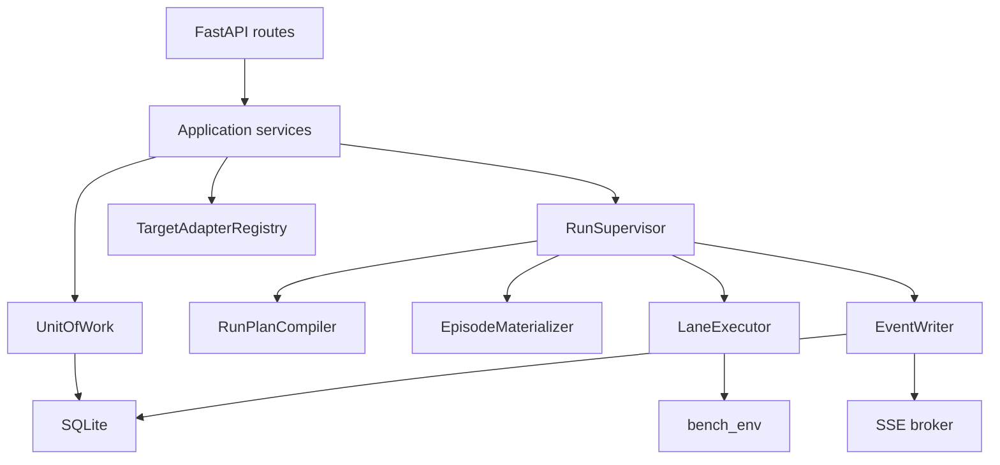

# MobileGym Test Platform Implementation Design

## Document status

| Field | Value |
|---|---|
| Status | Implemented reference design; hardening and Execution Profiles releases accepted through 2026-07-17 |
| Product requirements | [`PRD.md`](PRD.md) |
| Technical architecture | [`TECHNICAL_ARCHITECTURE.md`](TECHNICAL_ARCHITECTURE.md) |
| Delivery method | Test-driven development |
| Task decomposition | Independently verifiable vertical slices |
| Scope | Simulator-first MVP through hardening and Versioned Execution Profiles releases |
| Current extension | [`EXECUTION_PROFILES_ARCHITECTURE.md`](EXECUTION_PROFILES_ARCHITECTURE.md), [`EXECUTION_PROFILES_DELIVERY_PLAN.md`](EXECUTION_PROFILES_DELIVERY_PLAN.md) |
| Current evidence | [`evidence/2026-07-17-tp-ep10-execution-profiles-release-acceptance.md`](evidence/2026-07-17-tp-ep10-execution-profiles-release-acceptance.md) |

## 1. Purpose

This document specifies the first implementation of the MobileGym Test
Platform at code level. It defines concrete modules, typed contracts, database
columns, transaction boundaries, algorithms, runner changes, API DTOs, frontend
state, and test seams.

The design follows these rules:

- tests are written before production behavior;
- every production dependency has a fake or in-memory test boundary;
- vertical slices produce a user-observable capability;
- existing `bench_env` CLI behavior remains the compatibility baseline;
- platform execution uses Python APIs, not terminal-output parsing;
- raw benchmark artifacts stay append-only after an attempt is terminal;
- comparisons join by stable episode identity, never list position.

## 2. Concrete MVP scope

The first implementation includes:

- local projects;
- simulator targets and immutable target revisions;
- task catalog browsing;
- workflow draft, validation, publication, and compile preview;
- one-lane serial, parallel, and multi-process runs;
- durable run events and SSE;
- cancellation;
- prepared task parameters;
- baseline/candidate paired runs;
- functional, performance, and comparison reports;
- quality gates;
- retry, resume, and startup reconciliation;
- artifact browsing and Run Explorer links;
- stored but non-executable real-device targets.

The first implementation does not include:

- user accounts or permissions;
- distributed workers;
- object storage;
- scheduled runs;
- App deployment;
- real-device execution;
- arbitrary workflow code;
- browser UI performance metrics beyond existing timing sources.

## 3. Repository changes

### 3.1 New Python package

```text
test_platform/
  __init__.py
  main.py
  config.py
  requirements.txt
  requirements-dev.txt
  pytest.ini
  api/
    __init__.py
    app.py
    dependencies.py
    errors.py
    middleware.py
    routes/
      __init__.py
      health.py
      projects.py
      tasks.py
      targets.py
      workflows.py
      runs.py
      reports.py
      artifacts.py
      events.py
    schemas/
      __init__.py
      common.py
      projects.py
      targets.py
      workflows.py
      runs.py
      reports.py
  application/
    __init__.py
    projects.py
    targets.py
    workflows.py
    runs.py
    reports.py
  domain/
    __init__.py
    ids.py
    json.py
    enums.py
    errors.py
    projects.py
    targets.py
    workflows.py
    run_plan.py
    events.py
    reports.py
    transitions.py
  execution/
    __init__.py
    cancellation.py
    event_sink.py
    event_writer.py
    compiler.py
    task_factory.py
    materializer.py
    lane_executor.py
    supervisor.py
    error_classifier.py
    recovery.py
  targets/
    __init__.py
    base.py
    registry.py
    simulator.py
    real_device.py
  persistence/
    __init__.py
    database.py
    migrations.py
    repositories.py
    unit_of_work.py
    migrations/
      0001_initial.sql
      0002_reporting.sql
      0003_baselines_and_imports.sql
  artifacts/
    __init__.py
    paths.py
    indexer.py
    importer.py
  reporting/
    __init__.py
    selection.py
    functional.py
    performance.py
    comparison.py
    gates.py
    export.py
  tests/
    conftest.py
    unit/
    integration/
    contract/
```

### 3.2 New frontend entry

```text
test-platform.html
tsconfig.test-platform.json
vitest.platform.config.ts
web/test-platform/
  main.tsx
  App.tsx
  api/
    client.ts
    events.ts
    types.ts
  app/
    router.tsx
    shell.tsx
    queryClient.ts
  components/
    DataTable.tsx
    EmptyState.tsx
    StatusBadge.tsx
    ErrorPanel.tsx
  features/
    projects/
    runs/
    targets/
    tasks/
    workflows/
    reports/
  test/
    server.ts
    render.tsx
```

Tests remain under the repository `tests/` directory so Vitest discovery is
consistent:

```text
tests/testPlatform*.test.ts
tests/testPlatform*.test.tsx
```

`vitest.platform.config.ts` uses `jsdom` and includes both `.test.ts` and
`.test.tsx`. Existing simulator tests continue to use `vitest.config.ts`.

### 3.3 Existing modules changed incrementally

```text
bench_env/config.py
bench_env/factory.py
bench_env/runner/base.py
bench_env/runner/serial.py
bench_env/runner/parallel.py
bench_env/runner/multiprocess.py
bench_env/env/pool.py
bench_env/env/mobile_gym.py
bench_env/env/recorder.py
bench_env/monitor.py
os/OSContext.tsx
os/simState.ts
os/simMetadata.ts
os/types/globals.d.ts
vite.config.ts
package.json
```

## 4. Development and test dependencies

### 4.1 Runtime dependencies

`test_platform/requirements.txt`:

```text
fastapi>=0.115,<1
uvicorn>=0.30,<1
pydantic>=2.8,<3
aiosqlite>=0.20,<1
```

### 4.2 Python test dependencies

`test_platform/requirements-dev.txt`:

```text
-r requirements.txt
pytest>=8,<9
pytest-asyncio>=0.24,<1
httpx>=0.27,<1
```

### 4.3 Frontend test dependencies

Add as development dependencies:

```text
@testing-library/react
@testing-library/user-event
jsdom
```

No state-management library is required initially. Server-state behavior is
small enough to implement with typed fetch functions, route loaders, React
context, and an event reducer. TanStack Query may be added later through a
separate decision.

## 5. Application composition

### 5.1 Settings

`test_platform/config.py` defines:

```python
class PlatformSettings(BaseModel):
    host: str = "127.0.0.1"
    port: int = 8787
    database_path: Path = Path("runs/platform.sqlite3")
    runs_dir: Path = Path("runs")
    max_active_runs: int = 1
    max_active_lanes: int = 2
    event_queue_size: int = 10_000
    event_batch_size: int = 100
    event_flush_interval_ms: int = 50
    cancel_grace_seconds: float = 10.0
    sse_heartbeat_seconds: float = 15.0
    auth_token: SecretStr | None = None
    allow_non_loopback: bool = False
    simulator_metadata_timeout_seconds: float = 15.0
```

`PlatformSettings.from_env()` is the only environment-variable parser. Tests
construct settings directly.

### 5.2 Application factory

`test_platform/api/app.py` exposes:

```python
def create_app(
    settings: PlatformSettings,
    *,
    database: Database | None = None,
    adapter_registry: TargetAdapterRegistry | None = None,
    supervisor: RunSupervisor | None = None,
) -> FastAPI:
    ...
```

The FastAPI lifespan performs:

1. create directories;
2. open database connections;
3. apply migrations;
4. start `EventWriter`;
5. run startup reconciliation;
6. start `RunSupervisor`;
7. yield;
8. stop accepting new runs;
9. request active-run cancellation;
10. stop the event writer after draining;
11. close database connections.

Tests inject fakes and do not launch Playwright or real runners unless the test
explicitly requests that contract.

### 5.3 Dependency graph



Application services depend on protocols. Route modules never import concrete
SQLite repositories, Playwright, or runner classes directly.

## 6. Domain primitives

### 6.1 IDs

The MVP uses UUID4 hex strings:

```python
def new_id() -> str:
    return uuid.uuid4().hex
```

Pydantic fields use an `Annotated[str, StringConstraints(...)]` alias:

```python
EntityId = Annotated[str, StringConstraints(pattern=r"^[a-f0-9]{32}$")]
```

External imported runs may receive generated platform IDs while preserving their
original directory name in metadata.

### 6.2 Canonical JSON

`test_platform/domain/json.py`:

```python
def canonical_json(value: Any) -> str:
    return json.dumps(
        value,
        ensure_ascii=False,
        sort_keys=True,
        separators=(",", ":"),
        allow_nan=False,
    )

def sha256_json(value: Any) -> str:
    return "sha256:" + hashlib.sha256(
        canonical_json(value).encode("utf-8")
    ).hexdigest()
```

Before hashing:

- `Path` becomes a POSIX string;
- tuples become arrays;
- enums become values;
- secrets are replaced by secret references;
- timestamps are normalized to UTC with milliseconds;
- dictionaries with absent optional values omit those keys.

Hash tests use fixed golden strings.

### 6.3 Enums

`test_platform/domain/enums.py` defines string enums:

```text
TargetKind: simulator, real_device
WorkflowVersionStatus: draft, published, archived
RunState: queued, preparing, running, evaluating, reporting, completed, failed, cancelled
AttemptState: queued, preparing, running, evaluating, reporting, completed, failed, cancelled
EpisodeState: queued, materializing, prepared, running, evaluating, completed, error, cancelled, skipped
EpisodeOutcome: pass, fail, error, cancelled, skipped
LaneRole: primary, baseline, candidate, matrix
ReportType: functional, reliability, performance, comparison, gate, printable
GateVerdict: passed, failed, error
PairClassification: regression, fixed, stable_pass, stable_fail, baseline_error, candidate_error, unpaired, pairing_violation
```

### 6.4 State transitions

`domain/transitions.py` contains pure transition maps:

```python
RUN_TRANSITIONS: dict[RunState, frozenset[RunState]]
ATTEMPT_TRANSITIONS: dict[AttemptState, frozenset[AttemptState]]
EPISODE_TRANSITIONS: dict[EpisodeState, frozenset[EpisodeState]]
```

`ensure_transition(current, next_state)` raises
`InvalidStateTransition`. Repository updates use compare-and-set SQL:

```sql
UPDATE runs
SET state = ?, updated_at = ?
WHERE id = ? AND state = ?;
```

`rowcount != 1` becomes `ConcurrentModification`.

## 7. Target domain

### 7.1 Configuration models

```python
class SimulatorConnection(BaseModel):
    env_url: AnyHttpUrl
    proxy_secret_ref: str | None = None

class DeviceProfile(BaseModel):
    name: str
    viewport_width: int = Field(ge=240, le=2048)
    viewport_height: int = Field(ge=320, le=4096)
    physical_width: int = Field(ge=240, le=8192)
    physical_height: int = Field(ge=320, le=8192)
    device_scale_factor: float = Field(gt=0, le=8)

    @model_validator(mode="after")
    def validate_aspect_and_scale(self) -> Self:
        ...

class SimulatorRuntimeConfig(BaseModel):
    headless: bool = True
    isolation_default: Literal["pages", "contexts", "browsers"] = "pages"
    time: dict[str, Any] | None = None
    location: dict[str, Any] | None = None
    os_patch: dict[str, Any] | None = None

class SimulatorTargetConfig(BaseModel):
    kind: Literal["simulator"] = "simulator"
    connection: SimulatorConnection
    device_profile: DeviceProfile
    runtime: SimulatorRuntimeConfig = SimulatorRuntimeConfig()
    labels: dict[str, str] = {}

class RealDeviceTargetConfig(BaseModel):
    kind: Literal["real_device"] = "real_device"
    connection: RealDeviceConnection
    device_profile: RealDeviceProfile = RealDeviceProfile()
    app_artifact: RealDeviceAppArtifact | None = None
    runtime: RealDeviceRuntimeConfig = RealDeviceRuntimeConfig()
    labels: dict[str, str] = {}

TargetConfig = Annotated[
    SimulatorTargetConfig | RealDeviceTargetConfig,
    Field(discriminator="kind"),
]
```

Mutable defaults use `Field(default_factory=...)` in production code.

### 7.2 Target revision

```python
class AppRevision(BaseModel):
    id: str
    package_name: str
    display_name: str
    display_name_en: str | None = None
    version: str
    version_code: int
    type: str

class SimulatorBuildRevision(BaseModel):
    product: str
    version: str
    build_id: str
    source_revision: str | None = None
    bundle_hash: str | None = None

class TargetRevisionData(BaseModel):
    schema_version: Literal[1] = 1
    target_kind: TargetKind
    simulator: SimulatorBuildRevision | None
    apps: list[AppRevision]
    data_revision: str | None
    data_bundle_hash: str | None
    device_profile: DeviceProfile
    runtime_config_hash: str
    capabilities: list[str]
    resolved_at: datetime
```

The revision hash is calculated over all fields except `resolved_at`.

### 7.3 Adapter protocol

```python
class TargetAdapter(Protocol):
    kind: TargetKind

    async def health(self, config: TargetConfig) -> TargetHealth:
        ...

    async def resolve_revision(
        self,
        config: TargetConfig,
    ) -> TargetRevisionData:
        ...

    async def create_environment(
        self,
        config: TargetConfig,
        worker: WorkerContext,
    ) -> BaseMobileEnv:
        ...
```

The initial adapter registry is a dictionary keyed by `TargetKind`.

### 7.4 Simulator metadata implementation

Create `os/simMetadata.ts` with pure functions:

```typescript
export type SimBuildInfo = {
  version: string;
  buildId: string;
  sourceRevision?: string;
  bundleHash?: string;
  dataRevision?: string;
  dataBundleHash?: string;
};

export function buildSimMetadata(
  manifests: readonly AppManifest[],
  build: SimBuildInfo,
): SimMetadata;
```

`OSContext.tsx` passes `PackageManagerService.getInstalledPackages()` and build
values from `import.meta.env`. The pure builder is tested without rendering
React.

Supported environment values:

```text
VITE_MOBILEGYM_BUILD_ID
VITE_MOBILEGYM_SOURCE_REVISION
VITE_MOBILEGYM_BUNDLE_HASH
VITE_MOBILEGYM_DATA_REVISION
VITE_MOBILEGYM_DATA_BUNDLE_HASH
```

Fallbacks:

- product version: root `package.json` version exposed at build time;
- build ID: `"dev-unversioned"`;
- data revision: `null`.

Comparison target health rejects fallback build IDs or missing required data
revision when strict comparison is requested. A normal one-lane diagnostic run
may proceed with a warning.

### 7.5 Simulator adapter algorithm

`SimulatorTargetAdapter.resolve_revision()`:

1. validate URL and allowed scheme;
2. create one headless `MobileGymEnv`-compatible Playwright page using the target
   device profile;
3. navigate with the configured timeout;
4. wait until `window.__SIM__?.getMetadata` exists;
5. evaluate `window.__SIM__.getMetadata()`;
6. validate the payload with Pydantic;
7. add the service-side target profile and runtime hash;
8. close the page, context, browser, and Playwright in `finally`;
9. return a revision or a normalized target error.

Tests inject a `MetadataProbe` protocol so API integration tests do not launch a
browser.

## 8. Workflow domain

### 8.1 Typed nodes

Pydantic uses a discriminated union on `type`:

```python
class TaskSelectionNode(BaseNode):
    type: Literal["task_selection"]
    config: TaskSelectionConfig

class MatrixNode(BaseNode):
    type: Literal["matrix"]
    config: MatrixConfig

class ExecuteNode(BaseNode):
    type: Literal["execute"]
    config: ExecuteConfig

class CompareNode(BaseNode):
    type: Literal["compare"]
    config: CompareConfig

class QualityGateNode(BaseNode):
    type: Literal["quality_gate"]
    config: QualityGateConfig

class PublishReportNode(BaseNode):
    type: Literal["publish_report"]
    config: PublishReportConfig
```

Each config forbids unknown fields. Schema evolution increments
`workflow.schema_version`.

### 8.2 Compiler output

The compiler has two pure stages and one I/O stage:

```python
class WorkflowValidator:
    def validate(
        self,
        definition: WorkflowDefinition,
        catalog: TaskCatalogSnapshot,
        targets: Mapping[str, TargetSummary],
    ) -> ValidationResult:
        ...

class RunPlanCompiler:
    def compile_structure(
        self,
        definition: WorkflowDefinition,
        context: CompileContext,
    ) -> RunPlanDraft:
        ...

    async def resolve_revisions(
        self,
        draft: RunPlanDraft,
        target_service: TargetService,
    ) -> RunPlan:
        ...
```

Validation errors contain:

```python
class ValidationIssue(BaseModel):
    code: str
    pointer: str
    node_id: str | None = None
    message: str
```

### 8.3 Task catalog snapshot

The task catalog reads `TaskRegistry` and emits stable metadata:

```python
class TaskCatalogItem(BaseModel):
    task_base_id: str
    suite: str
    class_name: str
    apps: list[str]
    templates: list[str]
    parameters: dict[str, Any]
    difficulty: str
    scope: str
    objective: str
    composition: str
    capabilities: list[str]
    max_steps: int | None
    answer_fields: bool
    optimal_path_lengths: list[int]
```

The registry digest hashes sorted catalog items plus:

- repository source revision when available;
- Python module file hashes for selected task classes.

Module hashing is implemented after the basic catalog API is usable. Until then,
the digest contains repository revision and canonical metadata.

## 9. Run plan

### 9.1 Models

```python
class PlannedLane(BaseModel):
    lane_id: EntityId
    lane_key: str
    role: LaneRole
    target_id: EntityId
    target_revision_id: EntityId
    runner_config: dict[str, Any]

class EpisodeTemplate(BaseModel):
    episode_key: str
    materialization_key: str
    pair_key: str
    task_base_id: str
    task_id: str
    instance_id: int
    instance_seed: int
    template_index: int | None
    trial_id: int
    max_steps: int

class RunPlan(BaseModel):
    schema_version: Literal[1] = 1
    run_id: EntityId
    workflow_version_id: EntityId
    task_source: TaskSourceRevision
    lanes: list[PlannedLane]
    episodes: list[EpisodeTemplate]
    materialization: MaterializationPolicy
    comparison: ComparisonPolicy
    agent: AgentPlan
    judge: JudgePlan
    artifacts: ArtifactPlan
    created_at: datetime
    fingerprint: str
```

`runner_config` is the secret-free output of `RunnerConfig.to_dict()` plus
target profile fields. Model and judge API keys are represented by
`SecretReference`.

### 9.2 Episode identity

```python
materialization_key = (
    f"{task_base_id}|i{instance_id}|s{instance_seed}|r{instruction_revision}"
)
episode_key = f"{materialization_key}|t{trial_id}"
pair_key = episode_key
```

All trials of one sampled task instance share one materialization record. The
database stores prepared payload data once per `materialization_key`, while
episode rows reference it. This preserves pass@k semantics and avoids repeating
setup solely to discover identical parameters.

### 9.3 Plan compilation algorithm

1. Load task instances with the workflow seed using existing
   `factory.load_tasks()`.
2. Preserve task ordering from the sorted registry result.
3. Extract task base ID, sampled instance ID, seed, and template index.
4. Expand each task instance into `repeat_n` episode templates.
5. Resolve max steps with `RunnerConfig.get_max_steps(task)`.
6. Expand matrix lanes in deterministic `lane_key` order.
7. Resolve target revisions.
8. Validate comparison constraints over revisions.
9. Remove secrets from effective configs.
10. Calculate the fingerprint.
11. Persist plan, lanes, episodes, and the initial run attempt in one
    transaction.

The compiler never calls `task.setup()`.

## 10. Prepared task materialization

### 10.1 Prepared data

```python
class PreparedTaskInstance(BaseModel):
    schema_version: Literal[1] = 1
    materialization_key: str
    task_base_id: str
    instance_id: int
    instance_seed: int
    template_index: int | None
    params: dict[str, Any]
    instruction: str
    source_target_revision_id: EntityId
    initial_state_relative_path: str
    initial_state_hash: str
    projection_hash: str
    data_revision: str | None
    scenario_hash: str
    fingerprint: str
```

### 10.2 Materializer protocol

```python
class EpisodeMaterializer(Protocol):
    async def materialize(
        self,
        run_plan: RunPlan,
        lane: PlannedLane,
        templates: list[EpisodeTemplate],
        token: CancellationToken,
        events: EventSink,
    ) -> list[PreparedTaskInstance]:
        ...
```

### 10.3 Materialization algorithm

For each unique `materialization_key`:

1. check cancellation;
2. instantiate the task with `_seed`;
3. restore `_instance_id` and `_template_index`;
4. create or lease one source-lane preparation environment;
5. call `Controller.setup()` with the planned evaluation mode;
6. copy `task.params`;
7. read `task.description` after grounded-mode adjustment;
8. read the complete initial state;
9. write the initial state artifact atomically;
10. compute full and projected state hashes;
11. create the immutable prepared record;
12. call `task.teardown()` in `finally`;
13. reset or discard the environment on any setup failure.

Materialization emits lifecycle events but does not create an `EpisodeResult`.

### 10.4 State projection

`state_projection.py` provides pure functions:

```python
def project_initial_state(
    state: dict[str, Any],
    *,
    apps: list[str],
    policy: InitialStatePolicy,
) -> dict[str, Any]:
    ...
```

`strict_snapshot`:

- uses all App and OS data;
- removes volatile task stack, active App, clock timestamp, notifications,
  keyboard, and other `BaseTask.always_ignore` paths.

`task_projection`:

- includes `apps[app_id]` for task Apps;
- includes OS build, telephony, settings, hardware, permissions, providers, time
  mode/value, and location mode/value;
- excludes launcher arrangement unless the task includes the launcher App or
  suite;
- excludes runtime task stacks and transient services.

The exact projection schema has a version field and golden tests.

### 10.5 Re-instantiation for execution

`execution/task_factory.py`:

```python
def instantiate_prepared_task(
    template: EpisodeTemplate,
    prepared: PreparedTaskInstance,
    registry: TaskRegistry,
) -> BaseTask:
    task_cls = registry.get_by_id(template.task_base_id)
    task = task_cls(_seed=template.instance_seed, **prepared.params)
    task._instance_id = template.instance_id
    task._template_index = template.template_index
    return task
```

Passing `**prepared.params` marks every value as a user parameter in the current
`BaseTask` constructor, so setup sampling cannot overwrite it. The instruction
is verified after setup. It is not assigned as `_instruction_override`, because
that field intentionally skips `_post_sample()` and would change task behavior.

If the post-setup description differs from the prepared instruction, the lane
attempt fails with `PAIRING_VIOLATION`.

## 11. Runner contracts

### 11.1 Event types in `bench_env`

Create `bench_env/runner/events.py`:

```python
@dataclass(frozen=True)
class ExecutionEvent:
    type: str
    timestamp: str
    phase: str | None = None
    worker_id: str | None = None
    task_id: str | None = None
    trial_id: int | None = None
    payload: dict[str, Any] = field(default_factory=dict)

class EventSink(Protocol):
    def emit(self, event: ExecutionEvent) -> None: ...

class NullEventSink:
    def emit(self, event: ExecutionEvent) -> None:
        return None
```

The platform wraps this low-level event with run/lane/episode IDs. `bench_env`
does not import `test_platform`.

### 11.2 Cancellation

Create `bench_env/runner/cancellation.py`:

```python
class RunCancelled(Exception):
    pass

class CancellationToken:
    def __init__(self) -> None:
        self._event = threading.Event()

    def cancel(self) -> None:
        self._event.set()

    @property
    def cancelled(self) -> bool:
        return self._event.is_set()

    def raise_if_cancelled(self) -> None:
        if self.cancelled:
            raise RunCancelled()
```

The token is safe to check from asyncio and worker threads. It is passed to
child processes as a multiprocessing event through a small compatible token
wrapper.

### 11.3 Controller insertion points

`Controller.setup()`:

- check before `task.setup()`;
- emit `episode.setup_started`;
- emit `episode.setup_completed`;
- classify and emit setup errors.

`Controller.run()`:

- check before creating recorder episode;
- check at the start of every step;
- check before `agent.act`;
- check immediately after `agent.act`;
- emit `episode.step_recorded` after recorder flush/reference creation;
- check before `env.step`;
- emit `episode.action_completed`;
- check before final-state fetch.

`BaseRunner.run_episode()`:

- emit `episode.started`;
- emit `episode.evaluating`;
- check before evaluator call;
- emit `episode.completed` or `episode.error`.

`RunCancelled` is handled separately from generic exceptions and produces a
cancelled outcome rather than an execution error.

### 11.4 Prepared work item

Create:

```python
@dataclass(frozen=True)
class EpisodeWorkItem:
    episode_key: str
    task: BaseTask
    trial_id: int
    max_steps: int
```

Runners accept `work_items: list[EpisodeWorkItem] | None`.

- CLI path: `None`, preserving current task/repeat expansion.
- Platform path: explicit ordered work items.

The first implementation keeps existing runner scheduling and adds a conversion
layer rather than replacing all queue logic.

### 11.5 Serial runner behavior

When work items are supplied:

- iterate work items exactly once;
- do not perform internal repeat cloning;
- use item trial and max-step values;
- use the supplied task object;
- retain current recorder and evaluator behavior.

### 11.6 Parallel runner behavior

When work items are supplied:

- queue `(index, EpisodeWorkItem)`;
- instantiate one Agent per worker;
- execute each item independently;
- results retain input order;
- event worker IDs use `W0..Wn`;
- existing `progress_callback` remains supported and is called from terminal
  result handling.

The current optimized trial-zero repeat path remains for CLI-created task lists.
Platform work items bypass it because parameter sharing has already happened.

### 11.7 Multi-process runner behavior

The parent shards serialized work item specifications, not live task objects:

```python
@dataclass(frozen=True)
class EpisodeWorkSpec:
    episode_key: str
    task_base_id: str
    instance_id: int
    instance_seed: int
    template_index: int | None
    params: dict[str, Any]
    trial_id: int
    max_steps: int
```

Each child reconstructs tasks with `TaskRegistry`. Shard assignment uses stable
round-robin or contiguous chunks over ordered specs. Results and events include
`episode_key`.

The child queue transports `ExecutionEvent`, terminal result summaries, and
fatal shard errors. Large result payloads remain in artifact files.

## 12. Runner configuration changes

Add to `RunnerConfig`:

```python
viewport_size: tuple[int, int] = (360, 800)
device_scale_factor: float = 3.0
```

Validation:

- both viewport dimensions are positive;
- DPR is positive;
- `physical_size` must approximately equal viewport multiplied by DPR.

The final check allows a tolerance of one pixel per dimension because profile
values may be rounded.

`from_args()`, `to_dict()`, and `from_meta()` preserve old metadata defaults.
`factory.create_env()` and `ParallelRunner.from_config()` pass all three profile
fields to `MobileGymEnv` or `EnvPool`.

## 13. Platform event pipeline

### 13.1 Draft and persisted events

```python
class PlatformEventDraft(BaseModel):
    type: str
    run_id: EntityId
    run_attempt_id: EntityId
    lane_id: EntityId | None = None
    lane_attempt_id: EntityId | None = None
    episode_id: EntityId | None = None
    episode_attempt_id: EntityId | None = None
    worker_id: str | None = None
    timestamp: datetime
    payload_version: int = 1
    payload: dict[str, Any] = {}

class PersistedEvent(PlatformEventDraft):
    event_id: EntityId
    sequence: int
```

### 13.2 Non-blocking sink

`PlatformEventSink.emit()` calls `queue.put_nowait()`.

Queue-full behavior:

- lifecycle, terminal, error, and artifact events fall back to a thread-safe
  critical queue and are never intentionally dropped;
- step and metric events increment coalescing counters;
- the writer later emits `stream.events_coalesced`.

`emit()` catches all exceptions and writes only to a fallback logger. Runner
execution cannot fail because event publication failed.

### 13.3 Event writer transaction

The `runs` table stores `next_event_sequence`.

For one batch grouped by run:

```sql
SELECT next_event_sequence FROM runs WHERE id = ?;
UPDATE runs
SET next_event_sequence = next_event_sequence + ?
WHERE id = ?;
```

The same transaction:

- inserts events;
- updates denormalized run/lane/episode snapshots where applicable;
- inserts normalized error rows;
- commits.

After commit:

- append canonical events to `platform/events.jsonl`;
- publish to SSE subscribers.

If JSONL append fails, emit `ARTIFACT_IO_ERROR` in a later transaction. SQLite
state remains authoritative.

### 13.4 SSE broker

The broker maintains:

```python
dict[run_id, set[asyncio.Queue[PersistedEvent]]]
```

Each subscriber queue is bounded. A slow subscriber is disconnected with
`stream.reset_required`; it cannot block event persistence.

SSE route behavior:

1. parse `Last-Event-ID` header or `after` query;
2. load committed backlog from SQLite;
3. subscribe before sending the backlog;
4. de-duplicate by sequence;
5. send backlog;
6. stream new events and heartbeats;
7. unsubscribe in `finally`.

Subscribing before backlog delivery closes the race between query and live
publication.

## 14. SQLite implementation

### 14.1 Database wrapper

`Database` owns:

- database path;
- a single writer connection;
- a small read-connection pool implemented with an asyncio queue;
- migration lock;
- connection initialization.

Every connection executes:

```sql
PRAGMA foreign_keys = ON;
PRAGMA journal_mode = WAL;
PRAGMA synchronous = NORMAL;
PRAGMA busy_timeout = 5000;
```

### 14.2 Migration runner

Migration files start with an integer version. `schema_migrations`:

```sql
CREATE TABLE IF NOT EXISTS schema_migrations (
  version INTEGER PRIMARY KEY,
  name TEXT NOT NULL,
  applied_at TEXT NOT NULL
);
```

Each migration executes inside `BEGIN IMMEDIATE`. A failed statement rolls back
the complete migration.

### 14.3 Initial schema

`0001_initial.sql` contains:

```sql
CREATE TABLE projects (
  id TEXT PRIMARY KEY,
  name TEXT NOT NULL,
  slug TEXT NOT NULL UNIQUE,
  archived_at TEXT,
  created_at TEXT NOT NULL,
  updated_at TEXT NOT NULL
);

CREATE TABLE targets (
  id TEXT PRIMARY KEY,
  project_id TEXT NOT NULL REFERENCES projects(id),
  name TEXT NOT NULL,
  kind TEXT NOT NULL CHECK (kind IN ('simulator', 'real_device')),
  enabled INTEGER NOT NULL DEFAULT 1 CHECK (enabled IN (0, 1)),
  config_json TEXT NOT NULL,
  created_at TEXT NOT NULL,
  updated_at TEXT NOT NULL,
  UNIQUE(project_id, name)
);

CREATE TABLE target_revisions (
  id TEXT PRIMARY KEY,
  target_id TEXT NOT NULL REFERENCES targets(id),
  metadata_json TEXT NOT NULL,
  metadata_hash TEXT NOT NULL,
  health_status TEXT NOT NULL,
  resolved_at TEXT NOT NULL,
  UNIQUE(target_id, metadata_hash)
);

CREATE TABLE workflows (
  id TEXT PRIMARY KEY,
  project_id TEXT NOT NULL REFERENCES projects(id),
  name TEXT NOT NULL,
  current_draft_version_id TEXT,
  latest_published_version_id TEXT,
  archived_at TEXT,
  created_at TEXT NOT NULL,
  updated_at TEXT NOT NULL,
  UNIQUE(project_id, name)
);

CREATE TABLE workflow_versions (
  id TEXT PRIMARY KEY,
  workflow_id TEXT NOT NULL REFERENCES workflows(id),
  version_no INTEGER NOT NULL,
  status TEXT NOT NULL CHECK (status IN ('draft', 'published', 'archived')),
  definition_json TEXT NOT NULL,
  definition_hash TEXT NOT NULL,
  created_at TEXT NOT NULL,
  published_at TEXT,
  UNIQUE(workflow_id, version_no)
);

CREATE TABLE runs (
  id TEXT PRIMARY KEY,
  project_id TEXT NOT NULL REFERENCES projects(id),
  workflow_version_id TEXT NOT NULL REFERENCES workflow_versions(id),
  name TEXT,
  state TEXT NOT NULL,
  run_plan_json TEXT NOT NULL,
  run_plan_hash TEXT NOT NULL,
  artifact_root TEXT NOT NULL,
  next_event_sequence INTEGER NOT NULL DEFAULT 1,
  cancel_requested_at TEXT,
  created_at TEXT NOT NULL,
  updated_at TEXT NOT NULL,
  started_at TEXT,
  ended_at TEXT
);

CREATE TABLE run_attempts (
  id TEXT PRIMARY KEY,
  run_id TEXT NOT NULL REFERENCES runs(id),
  attempt_no INTEGER NOT NULL,
  reason TEXT NOT NULL,
  state TEXT NOT NULL,
  error_code TEXT,
  created_at TEXT NOT NULL,
  started_at TEXT,
  ended_at TEXT,
  UNIQUE(run_id, attempt_no)
);

CREATE TABLE workflow_node_runs (
  id TEXT PRIMARY KEY,
  run_attempt_id TEXT NOT NULL REFERENCES run_attempts(id),
  node_id TEXT NOT NULL,
  node_type TEXT NOT NULL,
  state TEXT NOT NULL,
  input_json TEXT,
  output_json TEXT,
  started_at TEXT,
  ended_at TEXT,
  UNIQUE(run_attempt_id, node_id)
);

CREATE TABLE lanes (
  id TEXT PRIMARY KEY,
  run_id TEXT NOT NULL REFERENCES runs(id),
  lane_key TEXT NOT NULL,
  role TEXT NOT NULL,
  target_revision_id TEXT NOT NULL REFERENCES target_revisions(id),
  reproducibility_fingerprint TEXT NOT NULL,
  UNIQUE(run_id, lane_key)
);

CREATE TABLE lane_attempts (
  id TEXT PRIMARY KEY,
  lane_id TEXT NOT NULL REFERENCES lanes(id),
  run_attempt_id TEXT NOT NULL REFERENCES run_attempts(id),
  state TEXT NOT NULL,
  artifact_root TEXT NOT NULL,
  started_at TEXT,
  ended_at TEXT,
  UNIQUE(lane_id, run_attempt_id)
);

CREATE TABLE prepared_tasks (
  id TEXT PRIMARY KEY,
  run_id TEXT NOT NULL REFERENCES runs(id),
  materialization_key TEXT NOT NULL,
  payload_json TEXT NOT NULL,
  payload_hash TEXT NOT NULL,
  created_at TEXT NOT NULL,
  UNIQUE(run_id, materialization_key)
);

CREATE TABLE episodes (
  id TEXT PRIMARY KEY,
  run_id TEXT NOT NULL REFERENCES runs(id),
  prepared_task_id TEXT REFERENCES prepared_tasks(id),
  episode_key TEXT NOT NULL,
  pair_key TEXT NOT NULL,
  task_base_id TEXT NOT NULL,
  task_id TEXT NOT NULL,
  instance_id INTEGER NOT NULL,
  instance_seed INTEGER NOT NULL,
  template_index INTEGER,
  trial_id INTEGER NOT NULL,
  max_steps INTEGER NOT NULL,
  UNIQUE(run_id, episode_key)
);

CREATE TABLE episode_attempts (
  id TEXT PRIMARY KEY,
  episode_id TEXT NOT NULL REFERENCES episodes(id),
  lane_attempt_id TEXT NOT NULL REFERENCES lane_attempts(id),
  attempt_no INTEGER NOT NULL,
  state TEXT NOT NULL,
  outcome TEXT,
  error_code TEXT,
  result_json TEXT,
  artifact_root TEXT NOT NULL,
  started_at TEXT,
  ended_at TEXT,
  UNIQUE(episode_id, lane_attempt_id, attempt_no)
);

CREATE TABLE workers (
  id TEXT PRIMARY KEY,
  lane_attempt_id TEXT NOT NULL REFERENCES lane_attempts(id),
  process_rank INTEGER NOT NULL,
  worker_index INTEGER NOT NULL,
  state TEXT NOT NULL,
  pid INTEGER,
  heartbeat_at TEXT,
  UNIQUE(lane_attempt_id, process_rank, worker_index)
);

CREATE TABLE events (
  id TEXT PRIMARY KEY,
  run_id TEXT NOT NULL REFERENCES runs(id),
  run_attempt_id TEXT NOT NULL REFERENCES run_attempts(id),
  sequence INTEGER NOT NULL,
  type TEXT NOT NULL,
  timestamp TEXT NOT NULL,
  lane_id TEXT,
  lane_attempt_id TEXT,
  episode_id TEXT,
  episode_attempt_id TEXT,
  worker_id TEXT,
  payload_version INTEGER NOT NULL,
  payload_json TEXT NOT NULL,
  UNIQUE(run_id, sequence)
);

CREATE TABLE errors (
  id TEXT PRIMARY KEY,
  run_id TEXT NOT NULL REFERENCES runs(id),
  run_attempt_id TEXT NOT NULL REFERENCES run_attempts(id),
  lane_attempt_id TEXT,
  episode_attempt_id TEXT,
  code TEXT NOT NULL,
  category TEXT NOT NULL,
  phase TEXT,
  retryable INTEGER NOT NULL CHECK (retryable IN (0, 1)),
  message TEXT NOT NULL,
  raw_type TEXT,
  raw_message TEXT,
  artifact_refs_json TEXT NOT NULL,
  created_at TEXT NOT NULL
);

CREATE TABLE artifacts (
  id TEXT PRIMARY KEY,
  run_id TEXT NOT NULL REFERENCES runs(id),
  run_attempt_id TEXT,
  lane_attempt_id TEXT,
  episode_attempt_id TEXT,
  kind TEXT NOT NULL,
  relative_path TEXT NOT NULL,
  media_type TEXT,
  size_bytes INTEGER,
  sha256 TEXT,
  created_at TEXT NOT NULL,
  UNIQUE(run_id, relative_path)
);

CREATE INDEX idx_runs_project_created
  ON runs(project_id, created_at DESC);
CREATE INDEX idx_runs_state ON runs(state);
CREATE INDEX idx_events_run_sequence ON events(run_id, sequence);
CREATE INDEX idx_episode_attempts_lane_outcome
  ON episode_attempts(lane_attempt_id, outcome);
CREATE INDEX idx_errors_run_code ON errors(run_id, code);
CREATE INDEX idx_artifacts_episode_kind
  ON artifacts(episode_attempt_id, kind);
```

Foreign keys from `workflows` to version pointers are added in a later migration
or enforced in repository transactions because SQLite cannot add them with
`ALTER TABLE`.

### 14.4 Reporting schema

`0002_reporting.sql` adds:

```sql
CREATE TABLE reports (
  id TEXT PRIMARY KEY,
  run_id TEXT NOT NULL REFERENCES runs(id),
  run_attempt_id TEXT NOT NULL REFERENCES run_attempts(id),
  type TEXT NOT NULL,
  version INTEGER NOT NULL,
  status TEXT NOT NULL,
  summary_json TEXT,
  artifact_path TEXT,
  content_hash TEXT,
  created_at TEXT NOT NULL,
  completed_at TEXT,
  UNIQUE(run_attempt_id, type, version)
);

CREATE TABLE comparisons (
  id TEXT PRIMARY KEY,
  run_id TEXT NOT NULL REFERENCES runs(id),
  run_attempt_id TEXT NOT NULL REFERENCES run_attempts(id),
  baseline_lane_id TEXT NOT NULL REFERENCES lanes(id),
  candidate_lane_id TEXT NOT NULL REFERENCES lanes(id),
  policy_json TEXT NOT NULL,
  summary_json TEXT NOT NULL,
  created_at TEXT NOT NULL
);

CREATE TABLE comparison_pairs (
  id TEXT PRIMARY KEY,
  comparison_id TEXT NOT NULL REFERENCES comparisons(id),
  pair_key TEXT NOT NULL,
  baseline_episode_attempt_id TEXT,
  candidate_episode_attempt_id TEXT,
  classification TEXT NOT NULL,
  integrity_json TEXT NOT NULL,
  delta_json TEXT NOT NULL,
  UNIQUE(comparison_id, pair_key)
);

CREATE TABLE quality_gate_results (
  id TEXT PRIMARY KEY,
  run_id TEXT NOT NULL REFERENCES runs(id),
  run_attempt_id TEXT NOT NULL REFERENCES run_attempts(id),
  node_id TEXT NOT NULL,
  verdict TEXT NOT NULL,
  thresholds_json TEXT NOT NULL,
  observations_json TEXT NOT NULL,
  reasons_json TEXT NOT NULL,
  created_at TEXT NOT NULL,
  UNIQUE(run_attempt_id, node_id)
);
```

## 15. Repository and transaction design

### 15.1 Unit of work

```python
class UnitOfWork:
    async def __aenter__(self) -> "UnitOfWork": ...
    async def __aexit__(self, exc_type, exc, tb) -> None: ...
    async def commit(self) -> None: ...
    async def rollback(self) -> None: ...

    projects: ProjectRepository
    targets: TargetRepository
    workflows: WorkflowRepository
    runs: RunRepository
    events: EventRepository
    reports: ReportRepository
```

One unit of work owns one writer transaction. Read-only queries use repository
methods backed by read connections and do not construct a write transaction.

### 15.2 Row mapping

Repositories return Pydantic domain records, not raw `aiosqlite.Row`. JSON is
parsed at the repository boundary. Invalid persisted JSON raises
`PersistenceCorruption` with the table and row ID.

### 15.3 Run creation transaction

`RunService.create_run()`:

1. load published workflow version;
2. compile and resolve `RunPlan`;
3. create artifact directories with temporary names;
4. start transaction;
5. insert run, run attempt, node runs, lanes, lane attempts, and episodes;
6. insert `run.created` as sequence 1;
7. set `next_event_sequence = 2`;
8. commit;
9. atomically rename the temporary artifact directory to the final run ID;
10. enqueue the run in the supervisor.

If directory rename fails after commit, mark the run failed with
`ARTIFACT_IO_ERROR`.

## 16. Run supervisor

### 16.1 Public protocol

```python
class RunSupervisor:
    async def start(self) -> None: ...
    async def stop(self) -> None: ...
    async def submit(self, run_id: str) -> None: ...
    async def request_cancel(self, run_id: str) -> bool: ...
    def snapshot(self) -> SupervisorSnapshot: ...
```

### 16.2 Scheduling

- one priority queue ordered by run creation time;
- semaphore for active logical runs;
- semaphore for active lanes;
- one asyncio task per active run attempt;
- a map from run ID to cancellation token and task;
- duplicate `submit()` calls are idempotent.

### 16.3 Attempt execution

```text
queued
-> materialize unique task instances
-> execute lane(s)
-> ingest terminal results
-> build reports
-> evaluate gates
-> complete
```

One-lane runs skip comparison. Two-lane runs may execute lanes concurrently only
after all required prepared tasks are persisted.

### 16.4 Failure policy

- one episode error does not fail the run;
- one worker crash produces missing episode errors and continues where possible;
- target preparation failure fails only that lane;
- a required comparison with a failed lane completes reports with lane errors,
  then the run may be `failed` if no valid comparison report can be produced;
- report-generation failure sets run state `failed`;
- cancellation wins over later failures once requested.

## 17. Lane executor

### 17.1 Protocol

```python
class LaneExecutor(Protocol):
    async def execute(
        self,
        context: LaneExecutionContext,
        token: CancellationToken,
        events: EventSink,
    ) -> LaneExecutionResult:
        ...
```

### 17.2 Runner selection

```text
processes > 1 -> MultiProcessRunner
parallel > 1  -> ParallelRunner
otherwise     -> SerialRunner
```

The executor:

1. constructs effective `RunnerConfig`;
2. creates prepared work specs;
3. assigns the fixed lane-attempt run directory;
4. creates the appropriate runner;
5. invokes `runner.run()`;
6. normalizes returned object/dict results;
7. reconciles results with expected episode keys;
8. inserts missing result errors;
9. returns a lane summary.

### 17.3 Result ingestion

`ResultIngestor` maps each raw result to:

- episode attempt lifecycle and outcome;
- normalized error;
- artifact indexes;
- report input record.

Outcome:

```python
if cancelled: CANCELLED
elif result_is_error: ERROR
elif result_is_success: PASS
else: FAIL
```

An unknown or duplicate `episode_key` is a platform error and is not silently
attached to another episode.

## 18. Error classification

`ErrorClassifier.classify(context, exception_or_result)` is pure where possible.

Priority:

1. explicit platform exception code;
2. `RunCancelled`;
3. known stop reasons;
4. phase plus exception type;
5. browser diagnostic type;
6. fallback.

Mapping examples:

| Input | Code |
|---|---|
| metadata probe timeout | `TARGET_UNREACHABLE` |
| invalid metadata payload | `TARGET_METADATA_INVALID` |
| Playwright launch failure | `ENV_START_ERROR` |
| exception from `task.setup()` | `TASK_SETUP_ERROR` |
| `TimeoutError` during inference | `MODEL_TIMEOUT` |
| stop reason `FORMAT_ERROR` | `ACTION_FORMAT_ERROR` |
| stop reason `MAX_STEPS` | `MAX_STEPS` |
| judge exception or `judge_error` | `JUDGE_ERROR` |
| valid non-passing result | `ASSERTION_FAILURE` for filters, but episode outcome remains `FAIL` |
| prepared instruction mismatch | `PAIRING_VIOLATION` |
| missing shard result | `WORKER_CRASH` |

Functional failures are stored in the episode result and may have a searchable
derived error row, but they do not make the lane infrastructure state failed.

## 19. Artifact service

### 19.1 Path model

`ArtifactPathResolver` receives a persisted run artifact root and a relative
path. It:

- rejects absolute paths;
- rejects `..`;
- resolves symlinks;
- verifies the final path is below the run root;
- returns only regular files.

### 19.2 Atomic writes

Platform JSON artifacts use:

```text
<name>.tmp
fsync
rename to <name>
```

Benchmark recorder behavior is unchanged initially. Artifact events are emitted
only after the referenced file exists and has been flushed.

### 19.3 Indexing

The indexer recognizes:

```text
meta.json
results.jsonl
summary.json
errors.jsonl
monitor.csv
console.log
browser_logs/*
trajectory/*/meta.json
trajectory/*/trajectory.json
trajectory/*/step_*
platform/*
```

Hashes are calculated lazily for large screenshots and logs. Size and media type
are available immediately.

## 20. Reports

### 20.1 Attempt selection

`reporting/selection.py` selects one attempt per `(episode, lane)`:

1. explicit report attempt selection if provided;
2. latest terminal non-cancelled attempt;
3. latest terminal attempt;
4. missing.

The selected attempt IDs are persisted in report summary metadata.

### 20.2 Functional report

Reuse:

- `bench_env.metrics.result_is_error`;
- `bench_env.metrics.result_is_success`;
- `bench_env.metrics.compute_pass_at_k`;
- existing result field semantics.

New calculations are pure functions over dictionaries and include denominator
metadata.

### 20.3 Percentiles

Use nearest-rank:

```python
rank = ceil(p / 100 * n)
value = sorted_values[max(0, rank - 1)]
```

Supported percentiles:

```text
p50, p75, p90, p95, p99
```

Every metric includes sample count and unit.

### 20.4 Pairing

Join selected baseline and candidate attempts by `pair_key`.

Integrity checks:

- prepared task fingerprint equal;
- task source revision equal;
- Agent and judge plan equal unless explicitly compared;
- data revision equal when required;
- device profile equal when required;
- App revision equal when required;
- initial-state projection policy passes.

Classification occurs only after integrity checks.

### 20.5 Gates

The first gate operators:

```text
max_regressions
max_candidate_errors
min_success_rate
max_success_rate_drop
max_runtime_p95_increase
max_unpaired
```

Missing required metrics produce gate `error`, never an implicit pass.

## 21. API design

### 21.1 Response envelope

Successful single-resource responses return the resource directly. Collections:

```json
{
  "items": [],
  "next_cursor": null
}
```

Errors:

```json
{
  "error": {
    "code": "CODE",
    "message": "Human-readable message",
    "details": [],
    "request_id": "..."
  }
}
```

### 21.2 Project DTOs

```python
class CreateProjectRequest(BaseModel):
    name: str = Field(min_length=1, max_length=100)

class ProjectResponse(BaseModel):
    id: EntityId
    name: str
    slug: str
    archived_at: datetime | None
    created_at: datetime
    updated_at: datetime
```

### 21.3 Target DTOs

```python
class CreateTargetRequest(BaseModel):
    project_id: EntityId
    name: str
    config: TargetConfig

class TargetResponse(BaseModel):
    id: EntityId
    project_id: EntityId
    name: str
    kind: TargetKind
    enabled: bool
    config: TargetConfigPublic
    latest_revision: TargetRevisionResponse | None

class TargetHealthResponse(BaseModel):
    healthy: bool
    executable: bool
    revision: TargetRevisionResponse | None
    warnings: list[ValidationIssue]
    error: ErrorSummary | None
```

Public config replaces secret reference details with booleans such as
`proxy_configured`.

### 21.4 Workflow DTOs

```python
class SaveWorkflowDraftRequest(BaseModel):
    expected_version: int
    definition: WorkflowDefinition

class ValidateWorkflowResponse(BaseModel):
    valid: bool
    issues: list[ValidationIssue]
    preview: CompilePreview | None

class PublishWorkflowResponse(BaseModel):
    workflow_id: EntityId
    workflow_version_id: EntityId
    version_no: int
    definition_hash: str
```

### 21.5 Run DTOs

```python
class CreateRunRequest(BaseModel):
    workflow_version_id: EntityId
    name: str | None = None
    overrides: RunOverrides = RunOverrides()

class RunSummaryResponse(BaseModel):
    id: EntityId
    name: str | None
    state: RunState
    progress: RunProgress
    lanes: list[LaneSummary]
    gate_verdict: GateVerdict | None
    created_at: datetime
    started_at: datetime | None
    ended_at: datetime | None

class CancelRunResponse(BaseModel):
    run_id: EntityId
    cancel_requested: bool
    state: RunState
```

### 21.6 Idempotency

`POST /runs` and `POST /runs/{id}/cancel` accept `Idempotency-Key`. A small
`idempotency_keys` table may be added when the run API is introduced:

```text
key, route, request_hash, response_status, response_json, created_at
```

The first slice may omit generic idempotency if the UI disables duplicate
submission, but run creation must have it before external CI usage.

## 22. Frontend implementation

### 22.1 API client

`api/client.ts`:

```typescript
export class ApiError extends Error {
  code: string;
  details: ApiErrorDetail[];
  requestId?: string;
}

export async function apiFetch<T>(
  path: string,
  init?: RequestInit,
): Promise<T>;
```

All paths are relative to `/api/platform/v1`.

### 22.2 Event reducer

The frontend keeps:

```typescript
type RunLiveState = {
  snapshot: RunDetail;
  lastSequence: number;
  connected: boolean;
  replaying: boolean;
};
```

`reduceRunEvent(state, event)` is a pure function with unit tests. Unknown event
types update only `lastSequence` and do not crash the UI.

### 22.3 SSE client

Native `EventSource` does not expose custom headers. The endpoint supports an
`after` query, and the client stores the last sequence in memory:

```text
/events/stream?after=<lastSequence>
```

On disconnect:

- exponential reconnect from 500 ms to 10 seconds;
- reuse last sequence;
- on `stream.reset_required`, refetch the run snapshot;
- close on terminal state after a short final replay.

### 22.4 Feature folder contract

Each feature owns:

```text
api.ts
types.ts
model.ts
components/
routes/
*.test.ts[x]
```

Cross-feature components remain small and presentational.

### 22.5 Run detail rendering

The run detail page initially renders:

- header with state and command actions;
- progress counters;
- lane target revisions;
- workflow stage strip;
- episode table;
- error panel;
- artifact links.

Performance and comparison tabs become visible only when their report exists.

## 23. TDD rules

### 23.1 Red-green-refactor loop

For every behavior:

1. write the smallest test that describes the observable behavior;
2. run it and confirm it fails for the intended reason;
3. implement the minimum behavior;
4. run the focused test;
5. run the slice test suite;
6. refactor without changing behavior;
7. run relevant compatibility suites.

A test that passes before implementation is not accepted as the red step unless
it is explicitly a characterization test.

### 23.2 Test layers

| Layer | Purpose | Dependencies |
|---|---|---|
| Pure unit | Hashes, transitions, compilers, reducers, reports | None |
| Repository integration | SQL constraints and transactions | Temporary SQLite file |
| API integration | HTTP contract and application service wiring | ASGI app, temporary SQLite, fakes |
| Runner compatibility | Existing runner behavior plus new hooks | Fake Env/Agent or current test helpers |
| Simulator contract | Metadata builder and runtime API | Vitest; optional live target |
| Frontend component | User interaction and state rendering | jsdom, Testing Library |
| End-to-end | Cross-process user workflow | API, console, controlled simulator |

### 23.3 Mandatory test doubles

Provide:

- `FakeTargetAdapter`;
- `FakeMetadataProbe`;
- `FakeLaneExecutor`;
- `FakeMaterializer`;
- `CollectingEventSink`;
- `ImmediateEventWriter`;
- `FakeClock`;
- `FakeIdFactory`;
- minimal fake task, environment, Agent, and evaluator fixtures.

Production code obtains time from injected `Clock` in the platform package.
Changes to simulator runtime continue to obey the existing `TimeService` rule.

### 23.4 Test commands

```bash
# Platform Python tests
pytest -c test_platform/pytest.ini test_platform/tests

# Existing benchmark compatibility tests
pytest -c bench_env/tests/pytest.ini bench_env/tests/common -m "not live"

# Existing simulator tests
npm test

# Platform frontend tests
npx vitest run --config vitest.platform.config.ts

# Type checks after substantial platform UI work
npx tsc --noEmit -p tsconfig.test-platform.json
```

Live tests remain opt-in:

```bash
pytest -c test_platform/pytest.ini test_platform/tests/contract \
  -m live --sim-url http://localhost:3000
```

## 24. Detailed compatibility checks

Every runner-affecting slice must verify:

- old `RunnerConfig` metadata loads with defaults;
- serial CLI path emits identical result semantics;
- parallel result ordering remains stable;
- repeat mode still shares sampled parameters;
- multi-process top-level result aggregation still works;
- `RunRecorder` writes current required files;
- no platform package import is required for CLI execution.

Every simulator metadata slice must verify:

- no App registration changes are required;
- metadata uses `PackageManagerService`;
- `getState()` remains backward compatible;
- version fields are additive;
- no user-visible App text is introduced.

## 25. Implementation completion checkpoints

This design was considered implemented when the following checkpoints were met.
They are retained as release traceability rather than pending readiness gates:

1. domain models and migrations can create and reload a project;
2. a fake simulator target can be registered and resolved through the API;
3. a workflow can compile to a deterministic `RunPlan`;
4. one fake lane can complete through the supervisor with durable events;
5. one real `bench_env` serial episode can execute through the same path;
6. the console can launch and monitor that run;
7. prepared parameters can execute identically on two fake lanes;
8. a comparison report classifies regression and fixed pairs;
9. cancellation and restart tests leave no active workers;
10. existing CLI and simulator test suites remain green.
