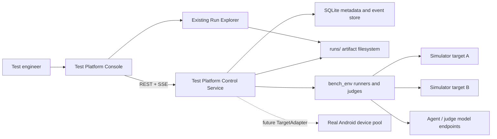
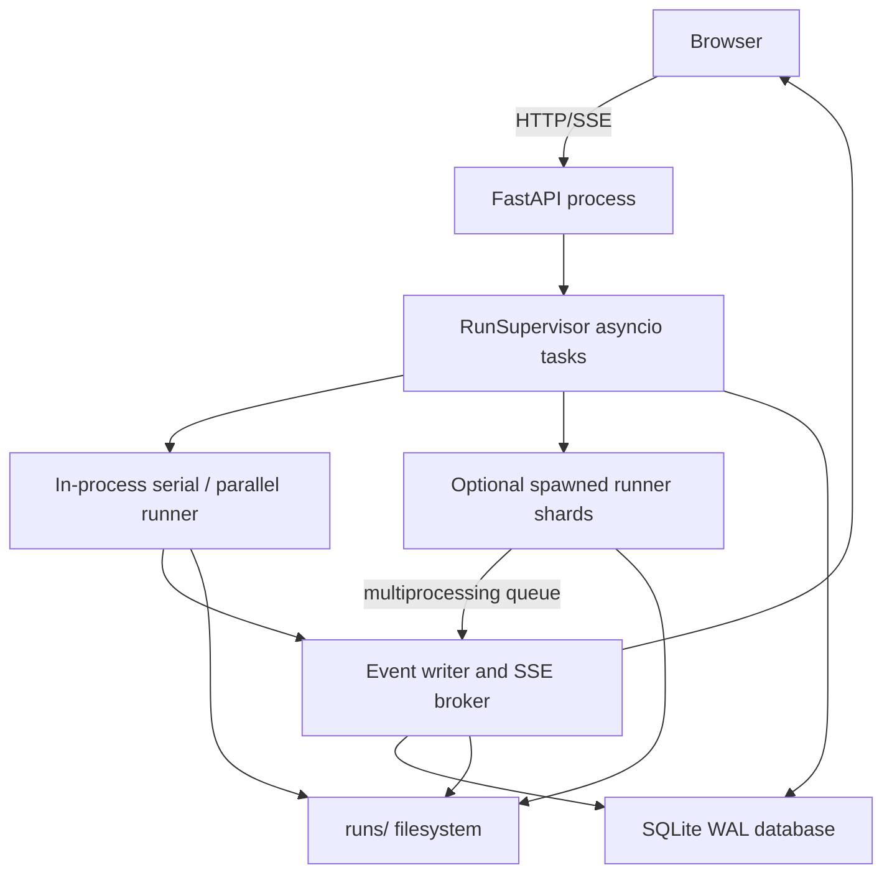
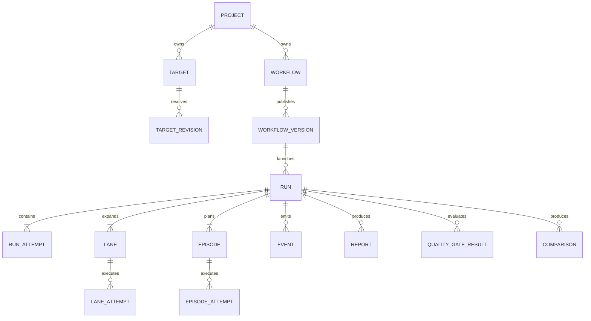
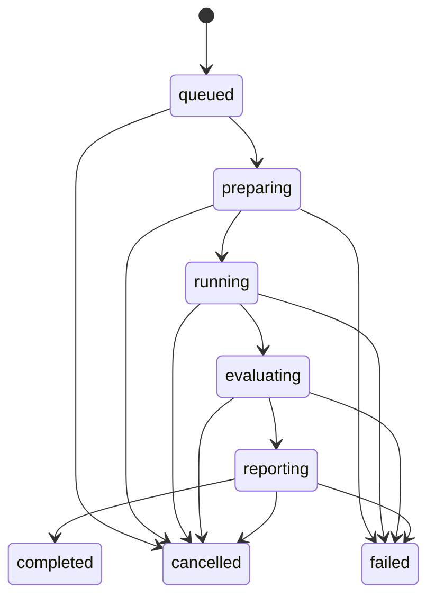
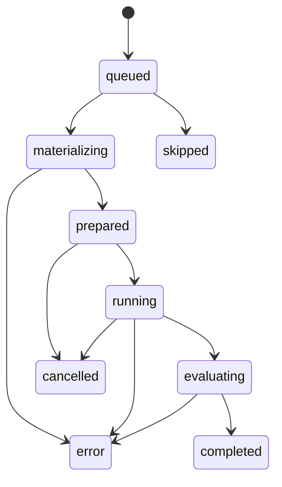
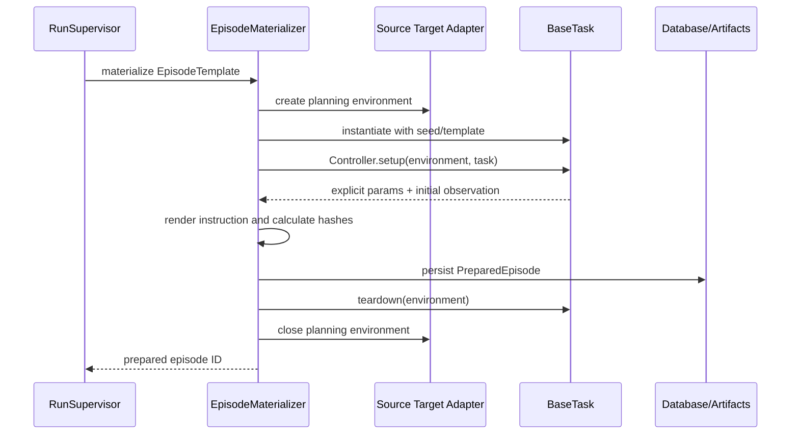

# MobileGym Test Platform Technical Architecture

## Document status

| Field | Value |
|---|---|
| Status | Implemented reference architecture; hardening accepted 2026-07-13 |
| Product phase | Simulator-first MVP, hardened |
| Source requirements | [`PRD.md`](PRD.md) |
| Primary execution engine | `bench_env` |
| Deployment model | Single-host modular monolith |
| Control service | Python, FastAPI, Pydantic, SQLite |
| Console | React 19, Vite, TypeScript |
| Real-device execution | Contract reserved, disabled in MVP |

## 1. Purpose

This document defines the implementation architecture for the MobileGym Test
Platform. It turns the PRD into concrete service boundaries, data contracts,
state machines, persistence schemas, runner integration points, API shapes, and
frontend flows.

The architecture is intentionally additive:

- existing `BaseTask` classes remain the test catalog;
- `RunnerConfig` remains the effective benchmark configuration;
- `BaseRunner.run_episode()` remains the execution and evaluation path;
- existing CLI commands continue to work without the platform service;
- existing recorder files remain the raw execution artifacts;
- platform metadata, events, comparison data, and reports are layered around
  the benchmark rather than replacing it.

## 2. Architecture decisions

| ID | Decision | Rationale |
|---|---|---|
| ADR-001 | Build a single-host modular monolith for the MVP. | It matches the current local execution model and avoids distributed coordination before it is needed. |
| ADR-002 | Keep the Python control service in a new top-level `test_platform` package that imports `bench_env`. | Product orchestration is separate from benchmark primitives, while remaining close enough for direct Python integration. |
| ADR-003 | Use FastAPI, Pydantic v2, `aiosqlite`, and SQL migration files. | The stack provides typed REST/SSE contracts and non-blocking SQLite access with limited framework overhead. |
| ADR-004 | Use the existing repository Vite project for the console, with a separate HTML entry and TypeScript config. | This preserves the repository's single-Vite-project structure and reuses React, Tailwind, Lucide, and build tooling. |
| ADR-005 | Compile every workflow version into an immutable `RunPlan`. | Execution must not depend on mutable workflow, target, or project records. |
| ADR-006 | Materialize state-dependent task parameters once into immutable `PreparedEpisode` records before lane execution. | Current task parameters are sampled during `task.setup()` from simulator state; paired lanes need one shared sampled result. |
| ADR-007 | Give each lane attempt its own bench-compatible artifact root. | Baseline and candidate can contain identical task IDs without file collisions, and each lane remains readable by existing tooling. |
| ADR-008 | Use an append-only durable event log plus SSE. | Database state remains recoverable after refresh or service restart, and clients can reconnect by event sequence. |
| ADR-009 | Add a non-throwing `EventSink` and cooperative `CancellationToken` to runner internals. | Progress and cancellation must use Python APIs rather than console parsing. |
| ADR-010 | Resolve simulator metadata from the running target through `__SIM__.getMetadata()`. | App and build provenance must not rely on user-entered labels. |
| ADR-011 | Model retry and resume as additional attempts under one logical run. | Original results and artifacts remain immutable and auditable. |
| ADR-012 | Keep secrets outside workflow versions, run plans, events, and report exports. | Reproducibility metadata must be safe to persist and share. |

## 3. Architectural drivers

### 3.1 Required capabilities

- One-target functional and performance runs.
- Baseline/candidate paired runs across two simulator targets.
- Same App revision on different simulator profiles.
- Different App revisions on equivalent simulator profiles.
- Deterministic task selection, seeds, parameters, fixtures, model settings, and
  judge settings.
- Live run, lane, worker, episode, artifact, metric, and error events.
- Cancellation, retry, resume, and service-restart recovery.
- Functional, reliability, performance, comparison, and quality-gate reports.
- Existing CLI and artifact compatibility.
- A target adapter boundary that can later execute real devices.

### 3.2 Pre-implementation constraints

The table below records the constraints observed before this architecture was
implemented and is retained as design rationale, not as a current capability
statement. The implemented compensating boundaries and hardening results are
described in the later sections and in the
[`TP-H16 release acceptance record`](evidence/2026-07-13-tp-h16-release-acceptance.md).

| Pre-implementation constraint | Design consequence |
|---|---|
| `RunnerConfig` has one `env_url`. | One runner instance addresses one target. A multi-target run must coordinate separate lane runners. |
| `EnvPool` has one URL and one device profile. | Workers within a lane share a target revision and profile. |
| `ParallelRunner` can emit only completed `EpisodeResult` callbacks. | Step, worker, error, and lifecycle events need a broader event hook. |
| `MultiProcessRunner` rejects external progress callbacks. | Its internal `ProgressEvent` queue must become a generic child-to-parent event bridge. |
| Task sampling occurs inside `BaseTask.setup()`. | A paired run cannot rely only on loading two task lists with the same seed. |
| One simulator bundle contains one implementation per App ID. | App-version comparison requires separate target endpoints. |
| `__SIM__.getState().os.installedApps` omits versions. | A dedicated immutable metadata snapshot is required. |
| Recorder paths use task IDs and trial IDs. | Baseline and candidate need separate artifact roots. |
| Browser errors are written to per-worker log files. | Structured browser diagnostics need an additive callback while preserving logs. |
| Monitor writes CSV samples. | The platform should emit references and optionally mirror samples into live events. |

## 4. System context



The browser console never talks directly to simulator targets, model endpoints,
SQLite, or arbitrary artifact paths. The control service validates and mediates
all access.

## 5. Runtime topology

### 5.1 MVP processes



The API process owns orchestration state. Serial and normal parallel runs execute
as asyncio tasks in that process. Multi-process mode uses the existing spawned
child-process model, with the parent remaining the only writer to the platform
database and SSE stream.

### 5.2 Deployment modes

| Mode | Console | API | Simulator | Intended use |
|---|---|---|---|---|
| Development | Vite dev server | Uvicorn | Vite dev/preview or nginx target | Local implementation |
| Local production | Static Vite build | Uvicorn serving API and static console, or reverse proxy | Prepared simulator endpoints | MVP operation |
| Future distributed | Static CDN/reverse proxy | Multiple API/control components | Remote target and worker pools | Deferred |

## 6. Source package layout

```text
test_platform/
  __init__.py
  main.py
  config.py
  api/
    app.py
    dependencies.py
    errors.py
    routes/
      projects.py
      tasks.py
      targets.py
      workflows.py
      runs.py
      reports.py
      artifacts.py
      events.py
    schemas/
      common.py
      targets.py
      workflows.py
      runs.py
      reports.py
  application/
    project_service.py
    target_service.py
    workflow_service.py
    run_service.py
    report_service.py
  domain/
    ids.py
    enums.py
    models.py
    run_plan.py
    state_machines.py
    errors.py
  execution/
    supervisor.py
    compiler.py
    materializer.py
    lane_executor.py
    event_sink.py
    cancellation.py
    error_classifier.py
    recovery.py
  targets/
    base.py
    simulator.py
    real_device.py
  persistence/
    database.py
    repositories.py
    unit_of_work.py
    migrations/
      0001_initial.sql
      0002_indexes.sql
  reporting/
    functional.py
    reliability.py
    performance.py
    comparison.py
    gates.py
    export.py
  artifacts/
    paths.py
    indexer.py
    importer.py
  tests/
    unit/
    integration/
    contract/

web/test-platform/
  main.tsx
  App.tsx
  api/
  components/
  features/
    runs/
    workflows/
    tasks/
    targets/
    reports/
    settings/
  routes/
  styles/

test-platform.html
tsconfig.test-platform.json
```

`test_platform` has a separate dependency file so basic `bench_env` CLI users do
not need the web-service stack:

```text
test_platform/requirements.txt
```

The initial dependency set is:

- `fastapi`;
- `uvicorn`;
- `pydantic>=2`;
- `aiosqlite`;
- `python-multipart` only if later report imports require uploads.

An ORM is not required for the MVP. Repositories use explicit SQL and Pydantic
domain mappings so migrations and query behavior remain visible.

## 7. Component responsibilities

| Component | Responsibility | Must not do |
|---|---|---|
| API routes | Validate transport input, authorize local actions, return DTOs. | Contain runner or report logic. |
| Application services | Coordinate transactions and domain operations. | Directly manipulate Playwright pages. |
| Workflow compiler | Validate DAGs and produce immutable run plans. | Execute episodes. |
| Target service | Store target configs, test health, resolve immutable revisions. | Trust labels as provenance. |
| Run supervisor | Enforce concurrency, own run tasks, cancellation, and recovery. | Calculate report metrics. |
| Episode materializer | Resolve state-dependent task parameters once. | Execute the Agent loop. |
| Lane executor | Convert prepared episodes into runner inputs and invoke `bench_env`. | Mutate workflow versions. |
| Event writer | Assign event sequence numbers, persist events, publish SSE. | Block runner callbacks. |
| Error classifier | Map raw exceptions and results to stable product error codes. | Remove raw diagnostic context. |
| Report builders | Deterministically derive reports from persisted attempts and artifacts. | Change raw results. |
| Artifact indexer | Validate, index, and serve paths below a run root. | Store screenshot blobs in SQLite. |
| Console | Author workflows, operate runs, inspect results. | Access arbitrary local files or secrets. |

## 8. Domain model

### 8.1 Aggregate relationships



`RunAttempt`, `LaneAttempt`, and `EpisodeAttempt` are implementation-level
entities added to preserve retry and resume history. The user-facing `Run`,
`Lane`, and `Episode` identities remain stable.

### 8.2 Identifier rules

- IDs are opaque lowercase UUIDv7 strings when the runtime library is
  available; otherwise UUID4.
- Human-readable names are mutable and never used as foreign keys.
- `episode_key` is deterministic within a run:

```text
<task_base_id>|i<instance_id>|s<instance_seed>|t<trial_id>|r<instruction_revision>
```

- `pair_key` excludes the lane and is identical for baseline and candidate.
- Artifact directory names use safe generated IDs, not raw user names.

### 8.3 Core immutable records

| Record | Immutable after |
|---|---|
| Target revision | Health resolution succeeds |
| Workflow version | Publication |
| Run plan | Run creation transaction |
| Prepared episode | Materialization succeeds |
| Episode attempt result | Attempt reaches a terminal state |
| Report payload | Report version is published |
| Gate result | Gate evaluation completes |

## 9. State machines

### 9.1 Run lifecycle



Rules:

- `cancel_requested_at` is an orthogonal flag set before the terminal
  `cancelled` state.
- A run is `failed` only when orchestration cannot produce the required result.
  Functional assertion failures are completed episode outcomes, not failed run
  states.
- Service restart changes active run attempts to `failed` with
  `SERVICE_RESTARTED`; the logical run remains eligible for resume.
- A resumed run creates a new `RunAttempt` and executes only eligible missing or
  errored episode attempts.

### 9.2 Episode attempt lifecycle



`completed` has a separate outcome:

```text
PASS | FAIL | ERROR | CANCELLED | SKIPPED
```

`FAIL` means the runner and judge completed correctly but the functional verdict
did not pass. `ERROR` means execution or judging could not produce a valid
functional verdict.

### 9.3 Workflow version lifecycle

```text
draft -> published -> archived
```

A published version cannot return to draft. Editing creates a new draft version.

## 10. Workflow definition and compilation

### 10.1 Stored workflow schema

Workflow versions store a canonical JSON document:

```json
{
  "schema_version": 1,
  "name": "WeChat App version regression",
  "nodes": [
    {
      "id": "tasks",
      "type": "task_selection",
      "depends_on": [],
      "config": {
        "suites": ["wechat"],
        "difficulty": ["L1", "L2", "L3"]
      }
    },
    {
      "id": "matrix",
      "type": "matrix",
      "depends_on": ["tasks"],
      "config": {
        "lanes": {
          "baseline": {"target_id": "target_a"},
          "candidate": {"target_id": "target_b"}
        },
        "sample_seed": 42,
        "repeat_n": 3
      }
    },
    {
      "id": "execute",
      "type": "execute",
      "depends_on": ["matrix"],
      "config": {
        "parallel": 8,
        "processes": 1,
        "isolation": "pages"
      }
    },
    {
      "id": "compare",
      "type": "compare",
      "depends_on": ["execute"],
      "config": {}
    },
    {
      "id": "gate",
      "type": "quality_gate",
      "depends_on": ["compare"],
      "config": {
        "max_regressions": 0
      }
    },
    {
      "id": "report",
      "type": "publish_report",
      "depends_on": ["compare", "gate"],
      "config": {}
    }
  ]
}
```

### 10.2 Validation stages

The compiler performs validation without side effects:

1. Parse and schema-check the document.
2. Check unique node IDs and supported node types.
3. Check dependency references and detect cycles.
4. Enforce required node relationships.
5. Resolve task selectors against the current task catalog.
6. Validate target references and target kinds.
7. Validate runner limits and model configuration references.
8. Validate comparison constraints.
9. Estimate task, episode, worker, and artifact counts.
10. Produce structured node and field errors.

Run creation performs side-effecting resolution:

1. Revalidate the published workflow version.
2. Resolve and persist target revisions.
3. Resolve the task source revision.
4. Resolve secret references without serializing secret values.
5. Expand matrices into lanes and episode seeds.
6. Produce and persist the immutable `RunPlan`.

### 10.3 Workflow execution

The MVP does not implement a general-purpose arbitrary DAG runtime. It uses typed
node handlers and compiles valid DAGs into these ordered stages:

```text
resolve tasks
-> expand matrix
-> materialize episodes
-> execute lanes
-> calculate comparisons
-> evaluate gates
-> publish reports
```

The original node graph and each node's state remain persisted for UI display
and future extension.

## 11. Immutable run plan

### 11.1 Run plan schema

```json
{
  "schema_version": 1,
  "run_id": "run_id",
  "workflow_version_id": "workflow_version_id",
  "created_at": "2026-07-03T12:00:00Z",
  "task_source": {
    "repository_revision": "git-sha",
    "registry_digest": "sha256:...",
    "selection": {
      "suites": ["wechat"],
      "difficulty": ["L1", "L2"]
    }
  },
  "lanes": [
    {
      "lane_id": "baseline",
      "role": "baseline",
      "target_id": "target_a",
      "target_revision_id": "target_revision_a",
      "runner_config": {
        "device": "sim",
        "env_url": "http://localhost:4173",
        "parallel": 8,
        "processes": 1,
        "isolation": "pages",
        "headless": true
      }
    },
    {
      "lane_id": "candidate",
      "role": "candidate",
      "target_id": "target_b",
      "target_revision_id": "target_revision_b",
      "runner_config": {
        "device": "sim",
        "env_url": "http://localhost:5173",
        "parallel": 8,
        "processes": 1,
        "isolation": "pages",
        "headless": true
      }
    }
  ],
  "episode_templates": [
    {
      "episode_key": "wechat.ReadMyWxid|i0|s123|t0|r1",
      "task_base_id": "wechat.ReadMyWxid",
      "instance_id": 0,
      "instance_seed": 123,
      "template_index": 0,
      "trial_id": 0,
      "max_steps": 30
    }
  ],
  "materialization": {
    "source_lane_id": "baseline",
    "policy": "shared_explicit_params",
    "strict_data_revision": true,
    "strict_time_location": true
  },
  "comparison": {
    "enabled": true,
    "require_same_app_revision": false,
    "require_same_device_profile": true,
    "require_same_data_revision": true
  },
  "reproducibility_fingerprint": "sha256:..."
}
```

Secret fields are replaced by secret reference IDs or redacted presence flags.
The canonical JSON form uses sorted object keys, stable list ordering, UTF-8,
and no insignificant whitespace before hashing.

The `RunPlan` is persisted before execution worker pools are allocated.
Materialization may use a small preparation environment, but it only creates
immutable `PreparedEpisode` children. It cannot change lanes, target revisions,
task identities, seeds, trial counts, budgets, or effective runner settings in
the plan.

### 11.2 Runner configuration resolution

The platform creates one effective `RunnerConfig` per lane. Target-controlled
fields override workflow defaults:

| Source | Fields |
|---|---|
| Target revision | `device`, `env_url`, viewport, physical size, DPR, proxy reference, runtime scenario |
| Workflow execute node | parallelism, processes, isolation, delays, budgets, trajectory settings, monitor |
| Agent configuration | agent class, model name, model endpoint reference, generation settings |
| Evaluation configuration | judge mode, judge endpoint reference, evaluation mode |
| Prepared episode | explicit task ID, parameters, seed, template index, trial ID, max steps |

The following additions are required in `RunnerConfig`:

```python
viewport_size: tuple[int, int] = (360, 800)
device_scale_factor: float = 3.0
```

`factory.create_env()` and `EnvPool` construction must use these fields. The
current parallel path otherwise always uses its built-in Pixel 7 defaults and
cannot faithfully execute target profiles.

## 12. Paired episode materialization

### 12.1 Why materialization is required

`bench_env.task.registry.load_tasks()` deterministically creates task instances
and seeds, but many parameter values are sampled later in `BaseTask.setup()`
from live simulator state. Loading two task lists with the same seed is
necessary but not sufficient when target data or App state differs.

The platform therefore separates:

- `EpisodeTemplate`: deterministic class, instance, seed, template, trial, and
  budget resolved during run-plan compilation;
- `PreparedEpisode`: explicit parameters, rendered instruction, fixture
  references, and integrity hashes resolved once before lane execution.

### 12.2 Materialization sequence



The materializer may reuse a small planning environment pool, but it is separate
from execution worker pools. All `PreparedEpisode` rows must be terminal before
baseline or candidate workers start.

### 12.3 Prepared episode schema

```json
{
  "schema_version": 1,
  "episode_key": "wechat.SendMessage|i0|s123|t0|r1",
  "task_base_id": "wechat.SendMessage",
  "instance_id": 0,
  "instance_seed": 123,
  "template_index": 0,
  "trial_id": 0,
  "params": {
    "contact": "contact_42",
    "message": "hello"
  },
  "instruction": "Send hello to Alice",
  "max_steps": 30,
  "fixture": {
    "source_target_revision_id": "target_revision_a",
    "data_revision": "data-revision",
    "scenario_hash": "sha256:...",
    "initial_state_artifact": "platform/prepared/.../initial-state.json",
    "initial_state_hash": "sha256:..."
  },
  "prepared_fingerprint": "sha256:..."
}
```

### 12.4 Execution on each lane

For every lane, the executor:

1. Instantiates the task class with `_seed=instance_seed` and explicit
   `params`.
2. Restores `_instance_id` and `_template_index`.
3. Applies the same instruction override, time, location, and scenario inputs.
4. Runs normal task setup. Explicit parameters are retained because they are
   user parameters and are not overwritten by the sampler.
5. Captures the lane's actual initial state hash and materialization diagnostics.
6. Executes the normal Agent loop and judge.

If a lane cannot honor the prepared parameters or fixture policy, the episode is
classified as `PAIRING_VIOLATION` and excluded from paired delta calculations.
It remains visible as an error rather than being silently aggregated.

### 12.5 Initial-state policy

Exact full-state equality is not always valid across App versions because a new
version may legitimately add fields. The comparison configuration supports:

| Policy | Behavior |
|---|---|
| `strict_snapshot` | Restore and compare the complete canonical initial state. Appropriate for identical builds and profiles. |
| `task_projection` | Compare task Apps, OS scenario, providers, and task-declared relevant paths. Default for App-version comparison. |
| `fixture_only` | Require equal data revision, explicit params, scenario, time, and location, but record state differences. Requires explicit opt-in. |

The MVP implements `strict_snapshot` and `task_projection`. `fixture_only` is
reserved for diagnostic workflows and cannot pass a release gate by default.

## 13. Target adapter architecture

### 13.1 Interface

```python
from typing import Protocol

class TargetAdapter(Protocol):
    kind: str

    async def health(self, target: "TargetConfig") -> "TargetHealth": ...
    async def resolve_metadata(
        self,
        target: "TargetConfig",
    ) -> "TargetRevisionData": ...
    async def prepare_run(self, context: "TargetRunContext") -> None: ...
    async def create_environment(
        self,
        context: "WorkerContext",
    ) -> "BaseMobileEnv": ...
    async def collect_diagnostics(
        self,
        environment: "BaseMobileEnv",
        context: "DiagnosticContext",
    ) -> list["ArtifactRef"]: ...
    async def close_environment(self, environment: "BaseMobileEnv") -> None: ...
    async def cleanup_run(self, context: "TargetRunContext") -> None: ...
```

`reset`, observation, actions, and state collection remain methods of the
returned `BaseMobileEnv`; they are not duplicated on the adapter.

### 13.2 Simulator adapter

`SimulatorTargetAdapter`:

- validates URL and allowed scheme;
- launches a short-lived Playwright health context;
- waits for `window.__SIM__`;
- calls `__SIM__.getMetadata()` and a lightweight readiness check;
- verifies requested App IDs are installed;
- constructs `MobileGymEnv` or `EnvPool` settings from the target revision;
- injects time, location, OS build, telephony, and scenario overrides;
- exposes browser diagnostics through structured events and existing logs.

### 13.3 Reserved real-device adapter

`RealDeviceTargetAdapter` validates configuration and returns:

```text
TARGET_KIND_NOT_EXECUTABLE
```

from `prepare_run()` while the feature flag is disabled. Its schema and
interface remain identical to the future ADB implementation.

## 14. Simulator metadata contract

### 14.1 Runtime API

Add this read-only API:

```typescript
window.__SIM__.getMetadata(): SimMetadata
```

```typescript
type SimMetadata = {
  schemaVersion: 1;
  simulator: {
    product: 'mobile-gym';
    version: string;
    buildId: string;
    sourceRevision?: string;
    bundleHash?: string;
  };
  apps: Array<{
    id: string;
    packageName: string;
    displayName: string;
    displayNameEn?: string;
    version: string;
    versionCode: number;
    type: string;
  }>;
  data: {
    revision?: string;
    bundleHash?: string;
  };
  capabilities: string[];
};
```

### 14.2 Source changes

The metadata implementation is additive to:

- `os/OSContext.tsx`;
- `os/types/globals.d.ts`;
- `os/simState.ts`;
- build-time constants exposed through Vite.

`getState().os.installedApps` should also add `packageName`, `version`, and
`versionCode` for diagnostic visibility, but target revision resolution uses
`getMetadata()` as its authoritative contract.

### 14.3 Revision validation

Required metadata for comparison:

- simulator build ID or source revision;
- App ID, package name, version, and version code for all task Apps;
- data revision;
- device profile and runtime scenario hash from the target configuration.

Missing required fields fail closed with `TARGET_METADATA_INVALID`.

## 15. Runner integration

### 15.1 Additive extension points

The following protocols are added under `bench_env`:

```python
class EventSink(Protocol):
    def emit(self, event: "ExecutionEvent") -> None:
        """Non-blocking, thread-safe where documented, and never raises."""

class CancellationToken(Protocol):
    @property
    def cancelled(self) -> bool: ...
    def raise_if_cancelled(self) -> None: ...
```

Runners accept optional:

```python
event_sink: EventSink | None = None
cancellation_token: CancellationToken | None = None
tasks: list[BaseTask] | None = None
```

Defaults preserve current CLI behavior.

### 15.2 Event emission points

| Location | Events |
|---|---|
| Runner start/finally | lane and worker lifecycle |
| Worker queue | episode queued and assigned |
| `Controller.setup()` | setup phases and materialization diagnostics |
| Agent loop | episode step references, action errors, model errors |
| Evaluator | evaluating and judge errors |
| Recorder | artifact created |
| Monitor | metric sample |
| Multi-process parent | shard started, health, fatal, stopped |

Event callbacks carry references to large payloads. Screenshots, prompts,
responses, state snapshots, and stack traces remain in artifacts.

### 15.3 Multi-process bridge

The current `ProgressEvent` becomes a serializable `ExecutionEventEnvelope`.
Child processes write envelopes to the existing multiprocessing queue. The
parent:

1. drains bounded batches;
2. maps shard worker IDs to lane worker IDs;
3. sends envelopes to the platform `EventSink`;
4. continues top-level result tailing for compatibility;
5. emits a normalized `WORKER_CRASH` event for missing shard results.

Only the parent writes SQLite.

### 15.4 Planned task injection

`SerialRunner`, `ParallelRunner`, and `MultiProcessRunner` gain constructors or
factory methods that accept prepared task specifications rather than always
calling `factory.load_tasks(config)`.

The CLI path still calls `load_tasks(config)`. The platform path:

```text
PreparedEpisode records
-> instantiate task objects with explicit parameters
-> pass ordered task/trial work items to the runner
```

This prevents retries, resumes, and lane B from resampling task parameters.

### 15.5 Recorder integration

`RunRecorder` already supports a fixed run directory and shared trajectory
overrides. The platform supplies the lane-attempt artifact root before starting
the runner.

Required additive recorder behavior:

- accept an `EventSink`;
- emit artifact references only after files are flushed;
- include `episode_key`, `lane_id`, and `attempt_no` as optional result fields;
- preserve all current fields and file names for CLI consumers.

## 16. Cancellation, retry, and resume

### 16.1 Cancellation

Cancellation sequence:

1. API atomically sets `cancel_requested_at`.
2. `run.cancel_requested` is persisted and published.
3. The supervisor cancels queued episode work and signals all lane tokens.
4. Controller checks the token before setup, inference, action execution, and
   evaluation.
5. Parallel workers finish their current cleanup block and close environments.
6. Multi-process children receive a grace period, then `terminate()`, then
   `kill()` only if still alive.
7. Monitor tasks stop and flush.
8. Terminal cancellation events and states are committed.

An in-flight model request may remain blocked until its configured timeout if
the underlying client cannot cancel it. The UI displays `cancelling` from the
request flag while the persisted lifecycle remains `running`.

### 16.2 Retry

Retry creates a new run attempt and a selected set of episode attempts:

- all `ERROR` outcomes;
- all `FAIL` outcomes;
- explicitly selected episodes;
- a whole lane.

Prepared episodes and target revisions are reused by default. A retry requiring
new target metadata is a new run, not a retry, because it changes provenance.

### 16.3 Resume

Resume selects episodes without a terminal attempt in the interrupted run
attempt. It is allowed only when:

- workflow version is unchanged;
- prepared episode fingerprints are available;
- target revision constraints still validate;
- task source revision is available;
- required model and secret references still resolve.

Otherwise the API returns a structured incompatibility list.

## 17. Event architecture

### 17.1 Event envelope

```json
{
  "event_id": 1024,
  "run_id": "run_id",
  "run_attempt_id": "attempt_id",
  "sequence": 1024,
  "type": "episode.completed",
  "timestamp": "2026-07-03T12:00:00.000Z",
  "lane_id": "candidate",
  "lane_attempt_id": "lane_attempt_id",
  "episode_id": "episode_id",
  "episode_attempt_id": "episode_attempt_id",
  "worker_id": "candidate-p00-w03",
  "payload_version": 1,
  "payload": {}
}
```

### 17.2 Event writer

Runner callbacks push events into an in-memory bounded queue. A single async
writer:

- batches events for up to 50 milliseconds or 100 records;
- starts one SQLite transaction;
- allocates monotonically increasing per-run sequence values;
- inserts events and applies denormalized state updates;
- commits;
- appends the same committed envelopes to `platform/events.jsonl`;
- publishes committed events to the in-memory SSE broker.

Critical lifecycle events use backpressure when the queue is full. High-volume
step and metric producers may be throttled, but a throttle decision emits a
`stream.events_coalesced` event with counts and time range.

### 17.3 Event durability and replay

- SQLite is authoritative for event sequence and current UI state.
- `events.jsonl` is a portable export and recovery aid.
- SSE sends only committed events.
- A reconnect with `Last-Event-ID` queries `sequence > last_id`.
- Old events are paginated through REST.
- In-memory subscribers are not authoritative.

### 17.4 SSE contract

Endpoint:

```text
GET /api/platform/v1/runs/{run_id}/events/stream
```

Frames:

```text
id: 1024
event: episode.completed
data: {"run_id":"...","sequence":1024,...}
```

The server sends a comment heartbeat every 15 seconds. If the requested event is
older than retained events, the server emits `stream.reset_required` and the
client reloads run snapshots through REST.

## 18. Error normalization

### 18.1 Error record

```json
{
  "code": "MODEL_TIMEOUT",
  "category": "model",
  "message": "Inference exceeded 300 seconds",
  "phase": "agent.inference",
  "retryable": true,
  "run_id": "run_id",
  "lane_id": "candidate",
  "episode_key": "episode_key",
  "worker_id": "candidate-p00-w03",
  "raw_type": "TimeoutError",
  "raw_message": "...",
  "artifact_refs": [
    "lanes/candidate/attempts/0001/console.log"
  ]
}
```

### 18.2 Classification order

1. Explicit platform exception types.
2. Runner stop reason and structured `EpisodeResult`.
3. Known exception types and phases.
4. Browser diagnostic event types.
5. Conservative fallback to `WORKER_CRASH` or `ENV_START_ERROR` based on phase.

Raw exceptions, stack traces, browser messages, and HTTP details are preserved
in artifacts. Classification never replaces raw diagnostics.

Add these architecture-level codes to the PRD taxonomy:

| Code | Use |
|---|---|
| `PAIRING_VIOLATION` | A lane could not honor the prepared episode or comparison constraints. |
| `SERVICE_RESTARTED` | An active local run attempt lost its owning service process. |
| `ARTIFACT_IO_ERROR` | Required artifact persistence or indexing failed. |
| `REPORT_ERROR` | Deterministic report generation failed after execution. |

## 19. SQLite design

### 19.1 Database configuration

- SQLite WAL mode.
- Foreign keys enabled.
- Busy timeout of 5 seconds.
- One application writer task for high-frequency events.
- Short explicit transactions.
- Read connections may serve API queries concurrently.
- Timestamps stored as UTC RFC 3339 text with millisecond precision.
- JSON stored as canonical UTF-8 text.
- Migrations recorded in `schema_migrations`.

### 19.2 Tables

#### Configuration and catalog

| Table | Important columns |
|---|---|
| `projects` | `id`, `name`, `slug`, `archived_at`, timestamps |
| `targets` | `id`, `project_id`, `name`, `kind`, `enabled`, `config_json`, timestamps |
| `target_secrets` | `target_id`, encrypted or external secret reference metadata; no secret value in API DTOs |
| `target_revisions` | `id`, `target_id`, `metadata_json`, `metadata_hash`, `health_status`, `resolved_at` |
| `workflows` | `id`, `project_id`, `name`, `archived_at`, timestamps |
| `workflow_versions` | `id`, `workflow_id`, `version_no`, `status`, `definition_json`, `definition_hash`, `created_at`, `published_at` |

#### Run control

| Table | Important columns |
|---|---|
| `runs` | `id`, `project_id`, `workflow_version_id`, `state`, `run_plan_json`, `run_plan_hash`, `artifact_root`, `cancel_requested_at`, timestamps |
| `run_attempts` | `id`, `run_id`, `attempt_no`, `reason`, `state`, `started_at`, `ended_at`, `error_code` |
| `workflow_node_runs` | `id`, `run_attempt_id`, `node_id`, `node_type`, `state`, input/output refs, timestamps |
| `lanes` | `id`, `run_id`, `lane_key`, `role`, `target_revision_id`, `reproducibility_fingerprint` |
| `lane_attempts` | `id`, `lane_id`, `run_attempt_id`, `state`, `artifact_root`, timestamps |
| `episodes` | `id`, `run_id`, `episode_key`, `pair_key`, task identity, seed, trial, prepared payload/hash |
| `episode_attempts` | `id`, `episode_id`, `lane_attempt_id`, `attempt_no`, lifecycle state, outcome, error code, result JSON, artifact root, timestamps |
| `workers` | `id`, `lane_attempt_id`, `process_rank`, `worker_index`, `state`, `pid`, heartbeat timestamp |

#### Events, artifacts, and output

| Table | Important columns |
|---|---|
| `events` | `id`, `run_id`, `sequence`, type, entity IDs, timestamp, payload JSON |
| `errors` | `id`, run/lane/episode attempt IDs, code, category, phase, retryable, message, raw fields, artifact refs |
| `artifacts` | `id`, entity IDs, kind, relative path, media type, size, hash, created_at |
| `metric_samples` | `id`, `run_attempt_id`, optional lane/worker IDs, timestamp, domain, values JSON |
| `reports` | `id`, `run_id`, `run_attempt_id`, type, version, status, summary JSON, artifact path, hash |
| `comparisons` | `id`, `run_id`, baseline/candidate lane IDs, policy JSON, summary JSON |
| `comparison_pairs` | `comparison_id`, `pair_key`, baseline/candidate episode attempt IDs, classification, delta JSON |
| `quality_gate_results` | `id`, `run_id`, node ID, verdict, thresholds JSON, reasons JSON, created_at |
| `baselines` | `id`, `project_id`, `name`, `run_id`, `report_id`, created_at, archived_at |

### 19.3 Constraints and indexes

Required uniqueness:

```text
workflow_versions(workflow_id, version_no)
target_revisions(target_id, metadata_hash)
run_attempts(run_id, attempt_no)
lanes(run_id, lane_key)
episodes(run_id, episode_key)
episode_attempts(episode_id, lane_attempt_id, attempt_no)
events(run_id, sequence)
comparison_pairs(comparison_id, pair_key)
baselines(project_id, name) WHERE archived_at IS NULL
```

Required query indexes:

- runs by project and creation time;
- runs by state;
- episode attempts by lane attempt and outcome;
- errors by run, code, and retryability;
- events by run and sequence;
- artifacts by episode attempt and kind;
- reports by project, type, and creation time.

### 19.4 Transaction boundaries

| Operation | Transaction content |
|---|---|
| Publish workflow | Validate draft, allocate version number, insert immutable version, update workflow pointer |
| Create run | Resolve references, insert run plan, lanes, episodes, initial attempt, and `run.created` |
| Persist event batch | Insert events, update affected snapshots, commit before SSE |
| Complete episode | Store terminal result, error/artifact indexes, and completion event atomically |
| Publish report | Insert report index, comparison/gate summaries, and report completion event |

## 20. Artifact layout

### 20.1 Platform run root

```text
runs/<run-id>/
  platform/
    run-plan.json
    target-revisions.json
    prepared-episodes.jsonl
    events.jsonl
    reports/
      functional-report.json
      reliability-report.json
      performance-report.json
      comparison-report.json
      gate-result.json
      printable-report.html
  lanes/
    baseline/
      attempts/
        0001/
          meta.json
          results.jsonl
          summary.json
          errors.jsonl
          monitor.csv
          console.log
          browser_logs/
          trajectory/
    candidate/
      attempts/
        0001/
          meta.json
          results.jsonl
          summary.json
          errors.jsonl
          monitor.csv
          console.log
          browser_logs/
          trajectory/
```

Each lane attempt directory is a normal bench run root. This avoids task and
trajectory collisions and allows the Run Explorer to inspect each lane.

The existing Vite `runsExplorerPlugin` must be updated to discover run roots
recursively rather than assuming one or two directory levels. It still serves
legacy run directories unchanged.

### 20.2 Path security

All artifact APIs:

1. resolve the persisted run root;
2. join only normalized relative paths;
3. call `resolve()` on the candidate;
4. require the candidate to remain below the resolved run root;
5. reject symlinks that escape the root;
6. use an allowlist for inline media types;
7. set attachment disposition for unknown binary files.

The browser never submits an absolute filesystem path.

## 21. REST API

### 21.1 Conventions

Base path:

```text
/api/platform/v1
```

Conventions:

- JSON uses `snake_case`.
- Resource IDs are opaque strings.
- Pagination uses `limit` and opaque `cursor`.
- Mutations return the updated resource.
- Validation errors use stable codes and JSON pointers.
- `ETag` or `version` is used for optimistic draft updates.
- Run creation and cancellation accept an `Idempotency-Key`.
- Secret values are write-only.

Error envelope:

```json
{
  "error": {
    "code": "WORKFLOW_VALIDATION_FAILED",
    "message": "Workflow contains invalid nodes",
    "details": [
      {
        "pointer": "/nodes/2/config/parallel",
        "code": "VALUE_OUT_OF_RANGE",
        "message": "parallel must be at least 1"
      }
    ],
    "request_id": "request_id"
  }
}
```

### 21.2 Resource endpoints

#### Projects

```text
GET    /projects
POST   /projects
GET    /projects/{project_id}
PATCH  /projects/{project_id}
POST   /projects/{project_id}/archive
```

#### Task catalog

```text
GET    /tasks
GET    /tasks/{task_base_id}
GET    /task-catalog/revision
```

The task catalog is generated from `TaskRegistry`; task definitions are not
copied into mutable database rows.

#### Targets

```text
GET    /projects/{project_id}/targets
POST   /projects/{project_id}/targets
GET    /targets/{target_id}
PATCH  /targets/{target_id}
POST   /targets/{target_id}/clone
POST   /targets/{target_id}/health
GET    /targets/{target_id}/revisions
```

#### Workflows

```text
GET    /projects/{project_id}/workflows
POST   /projects/{project_id}/workflows
GET    /workflows/{workflow_id}
PATCH  /workflows/{workflow_id}/draft
POST   /workflows/{workflow_id}/validate
POST   /workflows/{workflow_id}/publish
POST   /workflows/{workflow_id}/duplicate
GET    /workflow-versions/{workflow_version_id}
POST   /workflow-versions/{workflow_version_id}/compile-preview
```

#### Runs

```text
GET    /projects/{project_id}/runs
POST   /runs
GET    /runs/{run_id}
GET    /runs/{run_id}/episodes
GET    /runs/{run_id}/errors
GET    /runs/{run_id}/metrics
GET    /runs/{run_id}/events
GET    /runs/{run_id}/events/stream
POST   /runs/{run_id}/cancel
POST   /runs/{run_id}/retry
POST   /runs/{run_id}/resume
POST   /runs/{run_id}/baseline
```

#### Reports and artifacts

```text
GET    /reports/{report_id}
GET    /reports/{report_id}/export
GET    /runs/{run_id}/artifacts
GET    /runs/{run_id}/artifacts/{artifact_id}/content
GET    /episode-attempts/{episode_attempt_id}
GET    /comparison-pairs/{pair_id}
```

### 21.3 Run creation request

```json
{
  "workflow_version_id": "workflow_version_id",
  "name": "Optional run label",
  "overrides": {
    "sample_seed": 42,
    "monitor": true
  }
}
```

Only explicitly allowed runtime overrides are accepted. Overrides that change
the workflow's semantic task selection, comparison policy, or target lanes
require a new workflow version.

## 22. Reporting architecture

### 22.1 Input model

Report builders read:

- immutable run plan;
- target revisions;
- prepared episodes;
- latest selected episode attempts;
- raw `EpisodeResult` payloads;
- stopwatch fields;
- monitor samples;
- normalized errors;
- artifact indexes.

They do not reread mutable workflow or target records.

### 22.2 Functional report

Calculations reuse `bench_env.metrics` where semantics already exist. New report
code adds:

- taxonomy breakdowns;
- false completion and overdue termination;
- unexpected side effects;
- goal issues and warnings;
- excluded/error denominators;
- lane and target-revision summaries.

### 22.3 Reliability report

Episodes group by task instance across `trial_id`. Error trials are shown
separately from valid pass@k trials. Flakiness requires at least two valid
trials with inconsistent outcomes.

### 22.4 Performance report

Stopwatch phases are normalized into metric domains:

| Domain | Example phases |
|---|---|
| Harness | setup, recording, state collection, judge dispatch |
| Agent | inference queue, inference execution |
| Simulator | reset, readiness, action execution, stable-render delay |
| Infrastructure | host, process, GPU, TCP, vLLM samples |

Percentiles use deterministic nearest-rank or an explicitly versioned method.
The method and sample count are included in every report.

### 22.5 Comparison report

Pairing joins on `pair_key`, never task list position. A pair is eligible only
when both attempts are terminal and the pairing integrity policy passes.

Classification order:

1. unpaired;
2. pairing violation;
3. baseline error;
4. candidate error;
5. regression/fixed/stable pass/stable fail;
6. flaky annotation from repeated trials.

Performance deltas include absolute and relative values and suppress percentage
deltas when the baseline is zero or sample counts are insufficient.

### 22.6 Quality gates

Gate evaluation consumes versioned report fields and stores:

- exact threshold configuration;
- observed values;
- pass/fail verdict;
- human-readable reasons;
- report IDs and hashes used.

A report-generation error causes the gate to error, not pass.

## 23. Frontend architecture

### 23.1 Application shell

The first screen is the Runs workspace. The shell contains:

- compact project switcher;
- left navigation for Runs, Workflows, Tasks, Targets, Reports, Settings;
- global run-status indicator;
- content area with route-level loading and error boundaries.

The console is operational and dense. It does not use a marketing landing page,
oversized hero, or decorative card grid.

### 23.2 Route map

```text
/test-platform/runs
/test-platform/runs/:runId
/test-platform/runs/:runId/episodes/:episodeAttemptId
/test-platform/workflows
/test-platform/workflows/:workflowId
/test-platform/tasks
/test-platform/tasks/:taskId
/test-platform/targets
/test-platform/targets/:targetId
/test-platform/reports
/test-platform/reports/:reportId
/test-platform/settings
```

### 23.3 Run list

The default run table shows:

- state and live progress;
- workflow version;
- lane targets and resolved App versions;
- passed, failed, errored, and remaining counts;
- start time and duration;
- gate verdict;
- actions for open, cancel, retry, resume, and baseline promotion.

### 23.4 Run detail

Tabs:

| Tab | Content |
|---|---|
| Overview | Run state, workflow stages, lane health, counts, target provenance |
| Episodes | Virtualized/filterable episode table |
| Errors | Normalized errors grouped by code and phase |
| Performance | Episode phase and infrastructure charts |
| Comparison | Pair classifications and deltas |
| Artifacts | Indexed logs, JSON, screenshots, and Run Explorer links |

SSE updates a normalized client cache. Reconnection first replays events, then
falls back to a snapshot reload when required.

### 23.5 Workflow editor

The MVP editor is a structured form with an adjacent read-only DAG summary:

- task selection filters and explicit task preview;
- lane and target matrix;
- Agent and judge settings;
- concurrency, isolation, monitoring, and artifact controls;
- comparison constraints;
- quality gates;
- compiled episode and storage estimate.

This is more reliable than a free-form canvas for the constrained MVP node set.
The stored workflow still uses the DAG schema.

### 23.6 Episode comparison

The comparison drill-down uses synchronized baseline/candidate columns:

- instruction and prepared parameters;
- target and App revision;
- result and judge details;
- step timeline;
- screenshots and actions;
- browser errors and network failures;
- phase timing deltas;
- state-diff issues and unexpected changes.

Large trajectories are lazy-loaded. Tables and timelines use virtualization.

### 23.7 Frontend state and API layer

- React Router handles route state.
- A small typed fetch layer owns request cancellation and error envelopes.
- Server state is cached by resource key.
- SSE events update cached run summaries and episode rows.
- Draft workflow form state is local to the workflow feature.
- No secrets are retained in browser persistence.

The implementation may add TanStack Query if its cache and invalidation behavior
materially reduces custom code; it is not required by this architecture.

## 24. Security and local trust model

The MVP is local single-user software, but it still enforces:

- loopback binding by default;
- explicit configuration to bind non-loopback interfaces;
- Origin validation for mutating requests;
- optional local bearer token when exposed beyond loopback;
- write-only secrets and redacted logs;
- URL scheme validation for targets and model endpoints;
- no arbitrary workflow shell or Python nodes;
- artifact path containment;
- maximum request body sizes;
- no simulator or model credentials in exported plans or reports.

Target and model secrets should use environment variables or a local secret
provider. SQLite stores only a reference and non-sensitive metadata.

## 25. Configuration

Environment variables:

```text
MOBILEGYM_PLATFORM_HOST=127.0.0.1
MOBILEGYM_PLATFORM_PORT=8787
MOBILEGYM_PLATFORM_DB=runs/platform.sqlite3
MOBILEGYM_PLATFORM_RUNS_DIR=runs
MOBILEGYM_PLATFORM_MAX_ACTIVE_RUNS=1
MOBILEGYM_PLATFORM_MAX_ACTIVE_LANES=2
MOBILEGYM_PLATFORM_EVENT_QUEUE_SIZE=10000
MOBILEGYM_PLATFORM_CANCEL_GRACE_SECONDS=10
MOBILEGYM_PLATFORM_SECRET_PROVIDER=env
MOBILEGYM_PLATFORM_LOG_LEVEL=INFO
```

Project settings can define defaults below these host-level safety limits.

## 26. Recovery and reconciliation

### 26.1 Startup recovery

At service startup:

1. apply database migrations;
2. find attempts in non-terminal states;
3. mark their active workers stopped;
4. mark active episode attempts `ERROR/SERVICE_RESTARTED`;
5. mark run attempts failed;
6. reconcile artifact files written before the last database commit;
7. emit recovery events;
8. expose resume eligibility.

The service does not assume spawned processes survived its own restart. A future
external worker architecture may use leases and heartbeats instead.

### 26.2 Artifact reconciliation

The artifact indexer can rebuild indexes from:

- lane `results.jsonl`;
- `errors.jsonl`;
- trajectory directories;
- browser logs;
- monitor CSV;
- platform `events.jsonl`.

Files never silently overwrite terminal database results. A hash mismatch is
reported as an artifact integrity error.

### 26.3 Legacy run import

A legacy run importer:

1. locates bench-compatible run roots;
2. reads `meta.json`, results, summary, errors, and trajectories;
3. creates an imported logical run with one lane and one attempt;
4. marks unavailable workflow or target provenance as unknown;
5. does not rewrite raw artifacts.

Imported runs cannot be used as strict comparison baselines when required
provenance is missing.

## 27. Observability

The control service writes structured logs with:

- request ID;
- run and attempt IDs;
- lane and episode IDs;
- event sequence;
- error code;
- elapsed time.

Health endpoints:

```text
GET /health/live
GET /health/ready
```

Readiness checks database access, artifact root writability, migration status,
and supervisor initialization. It does not require every configured target to be
healthy.

Internal metrics for the MVP can be exposed as JSON:

- active and queued runs;
- event queue depth;
- event write latency;
- SSE subscriber count;
- database transaction latency;
- artifact write errors;
- runner worker counts.

Prometheus output is deferred unless operational deployment requires it.

## 28. Testing strategy

### 28.1 Unit tests

- Workflow schema and DAG validation.
- State-machine transition guards.
- Canonical JSON hashing and secret redaction.
- Run-plan matrix expansion.
- Episode key and pair key generation.
- Error classification.
- Report and gate calculations.
- Artifact path containment.
- SQLite repository mappings.

### 28.2 Integration tests

- API plus temporary SQLite database.
- Migration from an empty database.
- Run creation transaction.
- Event ordering, batching, replay, and SSE reconnection.
- Cancellation cleanup with fake environments.
- Retry and resume attempt selection.
- Artifact indexing and legacy import.
- Simulator target adapter with a controlled test page.

### 28.3 Runner compatibility tests

- Existing CLI runner tests pass without an `EventSink`.
- Serial, parallel, and multi-process modes emit equivalent terminal events.
- Prepared task injection does not resample explicit parameters.
- Multi-process cancellation terminates children and writes missing-result errors.
- Lane artifact roots remain readable by Run Explorer.

### 28.4 Simulator contract tests

- `__SIM__.getMetadata()` returns the declared schema.
- Every discovered manifest contributes version and version code.
- Metadata remains available before opening an App.
- Build and data revision fields are stable within one deployment.

### 28.5 End-to-end tests

Using Playwright against the console:

1. Create two simulator targets.
2. Resolve and compare target revisions.
3. Publish a workflow.
4. Start a one-lane run and observe SSE progress.
5. Cancel a run and verify cleanup.
6. Start a paired run with frozen prepared episodes.
7. Open comparison drill-down and report export.
8. Restart the service and verify run state recovery.

## 29. Implementation sequence

### Phase 0A: contracts

- Add domain enums and Pydantic schemas.
- Add SQL migration framework and initial schema.
- Add `TargetAdapter`, `EventSink`, and `CancellationToken` protocols.
- Add simulator `getMetadata()` contract.
- Add viewport and DPR fields to effective runner configuration.

### Phase 0B: runner hooks

- Add lifecycle and episode events to serial and parallel runners.
- Generalize the multi-process child event queue.
- Add cooperative cancellation checks.
- Add prepared task injection.
- Add recorder artifact events.
- Verify all existing CLI tests and artifacts.

### Phase 1A: service foundation

- FastAPI application and configuration.
- Project, target, task catalog, and workflow repositories.
- Target health and immutable target revisions.
- Workflow validation, publication, and compile preview.
- Run creation and immutable `RunPlan`.

### Phase 1B: one-lane execution

- Run supervisor and concurrency limits.
- One-lane serial/parallel/multi-process execution.
- Durable events and SSE.
- Cancellation and startup recovery.
- Artifact API and Run Explorer recursive discovery.
- Functional and performance reports.

### Phase 2: paired comparison

- Episode materializer.
- Baseline/candidate lane coordinator.
- Pair integrity validation.
- Comparison reports and side-by-side episode view.
- Quality gates.

### Phase 3: operational features

- Retry and resume attempts.
- Named baselines.
- Legacy run import.
- Retention and storage controls.
- Printable HTML export and CI-facing API stabilization.

## 30. Required changes to existing modules

| Existing module | Change |
|---|---|
| `bench_env/config.py` | Add viewport and DPR fields; preserve serialization compatibility. |
| `bench_env/factory.py` | Pass full target profile to environments; accept prepared task creation helpers. |
| `bench_env/runner/base.py` | Add event and cancellation hooks around setup, loop, and evaluation. |
| `bench_env/runner/serial.py` | Accept prepared work items and emit lifecycle events. |
| `bench_env/runner/parallel.py` | Replace result-only callback with additive event sink while preserving callback compatibility. |
| `bench_env/runner/multiprocess.py` | Generalize child progress envelopes, expose parent event sink, and keep bounded draining. |
| `bench_env/env/pool.py` | Use target viewport, physical size, and DPR from `RunnerConfig`. |
| `bench_env/env/mobile_gym.py` | Emit structured browser diagnostics in addition to log files. |
| `bench_env/env/recorder.py` | Emit flushed artifact events and persist optional platform identity fields. |
| `bench_env/monitor.py` | Optionally mirror samples to the event sink while retaining CSV. |
| `os/OSContext.tsx` | Expose immutable simulator and App metadata. |
| `os/simState.ts` | Extend installed App diagnostic fields. |
| `os/types/globals.d.ts` | Type the metadata runtime API. |
| `vite.config.ts` | Add console entry/proxy support and recursive Run Explorer run discovery. |
| `package.json` | Add test-platform development/build/type-check scripts. |

## 31. Compatibility guarantees

- Existing CLI entry points do not require the control service.
- New runner parameters are optional.
- Existing `RunnerConfig.from_meta()` accepts old metadata without new fields.
- Existing result and judge semantics remain unchanged.
- Existing recorder files retain their names and required fields.
- Platform-only fields are additive.
- Existing run directories remain discoverable.
- Existing Run Explorer behavior for legacy runs remains unchanged.
- Real-device CLI behavior is not removed by the reserved platform adapter.

## 32. Acceptance mapping

| PRD acceptance area | Architectural mechanism |
|---|---|
| Two simulator targets and revisions | Target repository plus `SimulatorTargetAdapter.resolve_metadata()` |
| App version provenance | `__SIM__.getMetadata()` and immutable target revisions |
| Published workflows | Immutable workflow versions and canonical hashes |
| Live one-target runs | Run supervisor, event writer, SSE, lane artifact root |
| Deterministic paired runs | Run plan, prepared episodes, pair keys, integrity policy |
| Different profiles, same App | Target revision constraint `require_same_app_revision` |
| Equivalent profiles, different Apps | Separate endpoints plus `require_same_device_profile` |
| Regression classifications | Comparison pairs joined by `pair_key` |
| Functional and performance reports | Deterministic report builders over persisted attempts |
| Stable errors | Error classifier and normalized error table |
| Restart persistence | SQLite state, event replay, startup reconciliation |
| CLI and Run Explorer compatibility | Optional hooks and bench-compatible lane attempt roots |
| Reserved real device | Stored target schema and disabled adapter implementation |

## 33. Deferred decisions

The following are intentionally deferred until MVP measurements exist:

- PostgreSQL or distributed metadata storage.
- External worker queues and leases.
- Object storage.
- Multi-user authentication and authorization.
- A general workflow canvas or arbitrary DAG runtime.
- Cross-host target scheduling.
- Secret encryption provider selection beyond local references.
- Automatic simulator deployment and App build installation.
- Browser rendering instrumentation beyond existing stopwatch and monitor data.
- Real-device leasing, ADB collection, and Android performance metrics.

These decisions do not require changing the workflow, run-plan, target-adapter,
event, or report identities defined in this architecture.
